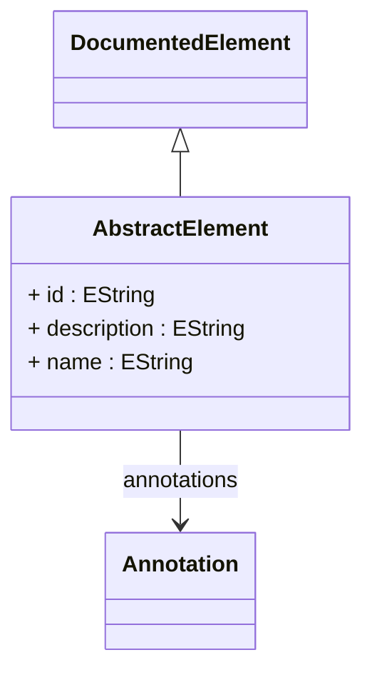

# AbstractElement

The fundamental base class for all named elements in the ROLAP mapping model. This abstract class provides the essential identity, naming, and extensibility infrastructure that all OLAP schema components require. It establishes the core patterns for element identification, user-friendly naming, descriptive content, custom annotations, and documentation integration. Every major schema component (Catalog, Cube, Dimension, Hierarchy, Level, Measure, etc.) inherits from this class, ensuring consistent identity management and extensibility across the entire OLAP framework.
## Extends
- DocumentedElement [🔗](./class-DocumentedElement)
## Attributes

<table>
  <thead>
    <tr>
      <th>Name</th>
      <th>Id</th>
      <th>Typ</th>
      <th>Lower</th>
      <th>Upper</th>
    </tr>
  </thead>
  <tbody>
    <tr>
      <td><strong>id</strong></td>
      <td>true</td>
      <td><em>EString</em></td>
      <td>1</td>
      <td>1</td>
    </tr>
    <tr>
      <td colspan="5"><em>Unique identifier for this element within the scope of its containing model. This ID serves as the primary key for object references, cross-references between elements, and internal system operations. The ID must be unique and eigther should follow consistent naming conventions (e.g., '_cube_sales', '_dim_product'),or may uses UUIDs. This identifier is used by the OLAP engine for object lookup, caching keys, and maintaining referential integrity during schema transformations.</em></td>
    </tr>
    <tr>
      <td><strong>description</strong></td>
      <td>false</td>
      <td><em>EString</em></td>
      <td>0</td>
      <td>1</td>
    </tr>
    <tr>
      <td colspan="5"><em>Human-readable description that provides additional context and explanation for this element. This field supports detailed explanations of the element's purpose, business meaning, usage guidelines, or implementation notes. Unlike formal documentation, this is typically a single paragraph or brief text that appears in development tools, schema browsers, or administrative interfaces to help users understand the element's role and usage.</em></td>
    </tr>
    <tr>
      <td><strong>name</strong></td>
      <td>false</td>
      <td><em>EString</em></td>
      <td>0</td>
      <td>1</td>
    </tr>
    <tr>
      <td colspan="5"><em>Display name for this element that appears in user interfaces, reports, MDX queries, and XMLA metadata. This should be a user-friendly name that business users will recognize and understand. Unlike the ID, this name doesn't need to be unique across the entire schema and can contain spaces, special characters, and international characters. For example, a dimension might have id='_dim_product' and name='Product Catalog'.</em></td>
    </tr>
  </tbody>
</table>

## References

<table>
  <thead>
    <tr>
      <th>Name</th>
      <th>Typ</th>
      <th>Lower</th>
      <th>Upper</th>
      <th>Containment</th>
    </tr>
  </thead>
  <tbody>
    <tr>
      <td><strong>annotations</strong></td>
      <td>Annotation<a href="./class-Annotation">🔗</a></td>
      <td>0</td>
      <td>&infin;</td>
      <td>true</td>
    </tr>
    <tr>
      <td colspan="5"><em>Collection of custom annotations that provide extensibility and additional metadata for this element. Annotations allow for vendor-specific extensions, optimization hints, caching directives, security policies, display formatting rules, or integration parameters without modifying the core model. This enables customization for specific OLAP engines, reporting tools, or business requirements while maintaining schema portability.</em></td>
    </tr>
  </tbody>
</table>

## Used by

## ClassDiagramm

