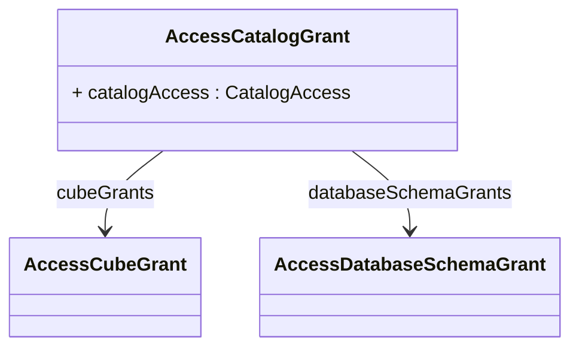

# AccessCatalogGrant

Represents a catalog-level security grant that defines the foundational access permissions for an OLAP catalog and serves as the root of the hierarchical access control evaluation process. AccessCatalogGrant establishes the primary security boundary that determines whether a role can access any resources within a specific catalog, and when custom access is specified, it provides the container for more granular cube-level and database schema-level grants that define precisely which catalog resources are accessible. The catalog grant operates at the highest level of the OLAP security hierarchy and its permissions cascade down to influence all contained elements including cubes, dimensions, hierarchies, levels, members, and database objects. This grant type supports multiple access patterns ranging from complete catalog access for administrative users, selective access to shared dimensions only for metadata consumers, complete denial for restricted user groups, and fine-grained custom access that enables complex multi-user scenarios where different roles need access to different subsets of the catalog's analytical resources. Catalog grants are essential for implementing multi-tenant architectures where different organizations or departments share the same OLAP infrastructure but require complete isolation of their analytical data and metadata, for regulatory compliance scenarios where certain user groups are prohibited from accessing entire categories of business data, and for performance optimization where access restrictions can be applied early in the query processing pipeline to avoid unnecessary resource consumption on restricted content.
## Extends

## Attributes

<table>
  <thead>
    <tr>
      <th>Name</th>
      <th>Id</th>
      <th>Typ</th>
      <th>Lower</th>
      <th>Upper</th>
    </tr>
  </thead>
  <tbody>
    <tr>
      <td><strong>catalogAccess</strong></td>
      <td>false</td>
      <td><em>CatalogAccess<a href="./enum-CatalogAccess">🔗</a></em></td>
      <td>1</td>
      <td>1</td>
    </tr>
    <tr>
      <td colspan="5"><em>Enumerated value that specifies the level of access this role has to the catalog and all its contained resources, serving as the primary access control decision point for catalog-level operations. The access level determines the overall scope of permissions and influences how sub-grants are evaluated and applied. When set to ALL, the role receives complete unrestricted access to the entire catalog including all cubes, dimensions, hierarchies, members, and database objects, effectively granting administrative privileges for the catalog scope. When set to NONE, the role is completely denied access to the catalog and all its contents, preventing any interaction with catalog resources regardless of any sub-grants that might be defined. When set to ALL_DIMENSIONS, the role receives access to shared dimensions and their metadata but is denied access to cubes and fact data, enabling metadata browsing and dimension exploration scenarios without exposing sensitive measure data. When set to CUSTOM, the role's access is determined by the explicit cubeGrants and databaseSchemaGrants collections, enabling fine-grained security policies where specific permissions are granted only for explicitly authorized resources. The CUSTOM setting is most commonly used in enterprise scenarios where complex security requirements necessitate selective access to different parts of the catalog based on business roles, organizational hierarchies, regulatory requirements, or multi-tenant isolation needs.</em></td>
    </tr>
  </tbody>
</table>

## References

<table>
  <thead>
    <tr>
      <th>Name</th>
      <th>Typ</th>
      <th>Lower</th>
      <th>Upper</th>
      <th>Containment</th>
    </tr>
  </thead>
  <tbody>
    <tr>
      <td><strong>cubeGrants</strong></td>
      <td>AccessCubeGrant<a href="./class-AccessCubeGrant">🔗</a></td>
      <td>1</td>
      <td>&infin;</td>
      <td>true</td>
    </tr>
    <tr>
      <td colspan="5"><em>Collection of cube-level access grants that define specific permissions for individual cubes within the catalog when the catalogAccess is set to CUSTOM, enabling fine-grained control over which analytical resources are accessible to the role. Each AccessCubeGrant specifies whether the role has complete access to a cube (ALL), no access to the cube (NONE), or selective access that requires additional dimension and hierarchy grants (CUSTOM). Cube grants are essential for implementing business-oriented security models where different user groups need access to different analytical domains such as sales cubes for sales teams, financial cubes for finance departments, and operational cubes for operations managers. This granular approach supports complex enterprise scenarios including multi-departmental organizations where users should only see cubes relevant to their business function, regulatory compliance requirements where certain cubes contain sensitive data that must be restricted to authorized personnel, performance optimization where access restrictions reduce the scope of metadata loading and query processing, and multi-tenant deployments where different customer organizations require access to different analytical content. The cube grant level is particularly important because cubes represent complete analytical contexts with their associated dimensions, measures, and calculated members, making cube-level security an effective way to implement business-domain-based access control that aligns with organizational structures and analytical usage patterns.</em></td>
    </tr>
    <tr>
      <td><strong>databaseSchemaGrants</strong></td>
      <td>AccessDatabaseSchemaGrant<a href="./class-AccessDatabaseSchemaGrant">🔗</a></td>
      <td>1</td>
      <td>&infin;</td>
      <td>true</td>
    </tr>
    <tr>
      <td colspan="5"><em>Collection of database schema-level access grants that define permissions for accessing the underlying database structures that support the OLAP catalog, extending security control beyond the logical OLAP model to the physical data layer. Each AccessDatabaseSchemaGrant specifies access permissions for database schemas, tables, and columns, enabling comprehensive data governance that covers both analytical access through OLAP operations and potential direct data access through SQL queries or data integration processes. Database schema grants are crucial for implementing defense-in-depth security strategies where access control is enforced at multiple layers of the data architecture, for regulatory compliance scenarios where data access must be auditable and restrictable at the database level regardless of the access method, for supporting hybrid analytical environments where users might access data through both OLAP tools and direct SQL interfaces, and for enabling administrative scenarios where technical users need access to underlying database structures for maintenance, optimization, or troubleshooting purposes. The database-level security integration ensures that OLAP security policies are consistent with broader enterprise data governance frameworks and provides additional protection against unauthorized data access that might bypass the OLAP layer entirely.</em></td>
    </tr>
  </tbody>
</table>

## Used by

- AccessRole[🔗](./class-AccessRole) → accessCatalogGrants

## ClassDiagramm

