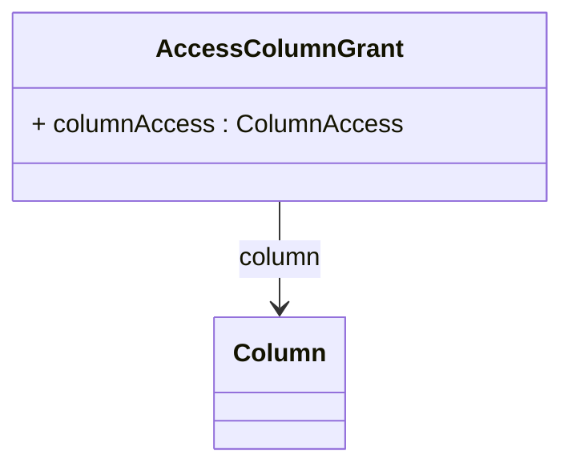

# AccessColumnGrant

Provides the most granular level of database security control by defining access permissions for individual database columns, enabling extremely precise data governance policies that can restrict access to specific data elements based on sensitivity, regulatory requirements, privacy concerns, or business confidentiality needs. AccessColumnGrant represents the finest grain of the comprehensive security model, allowing organizations to implement column-level data protection that goes beyond traditional OLAP security to address specific data elements that may require special handling due to personally identifiable information (PII) concerns, financial sensitivity, competitive intelligence, regulatory compliance requirements, or contractual data sharing restrictions. This level of security control is essential for industries with strict data protection requirements such as healthcare (HIPAA compliance), financial services (PCI DSS, SOX compliance), government and defense (classified information handling), and international business (GDPR and other privacy regulations) where specific data fields must be protected from unauthorized access regardless of the analytical context or business justification. Column grants enable sophisticated data masking and filtering scenarios where users can access aggregate analytical results while being prevented from seeing the underlying detailed data that contributed to those calculations, support data anonymization strategies where identifying information is selectively hidden while preserving analytical utility, and facilitate complex data sharing agreements where external partners or third-party analysts can access specific analytical capabilities without gaining access to sensitive operational data. The column-level security model integrates seamlessly with OLAP query processing to automatically filter and protect sensitive data elements while maintaining the performance and usability of analytical operations.
## Extends

## Attributes

<table>
  <thead>
    <tr>
      <th>Name</th>
      <th>Id</th>
      <th>Typ</th>
      <th>Lower</th>
      <th>Upper</th>
    </tr>
  </thead>
  <tbody>
    <tr>
      <td><strong>columnAccess</strong></td>
      <td>false</td>
      <td><em>ColumnAccess<a href="./enum-ColumnAccess">🔗</a></em></td>
      <td>1</td>
      <td>1</td>
    </tr>
    <tr>
      <td colspan="5"><em>Specifies the access level for the column using ColumnAccess enumeration values, providing the finest-grained control over data access at the individual column level.</em></td>
    </tr>
  </tbody>
</table>

## References

<table>
  <thead>
    <tr>
      <th>Name</th>
      <th>Typ</th>
      <th>Lower</th>
      <th>Upper</th>
      <th>Containment</th>
    </tr>
  </thead>
  <tbody>
    <tr>
      <td><strong>column</strong></td>
      <td>Column<a href="./class-Column">🔗</a></td>
      <td>1</td>
      <td>1</td>
      <td>false</td>
    </tr>
    <tr>
      <td colspan="5"><em>References the specific column to which this access grant applies, establishing the security boundary at the individual column level.</em></td>
    </tr>
  </tbody>
</table>

## Used by

- AccessTableGrant[🔗](./class-AccessTableGrant) → columnGrants

## ClassDiagramm

