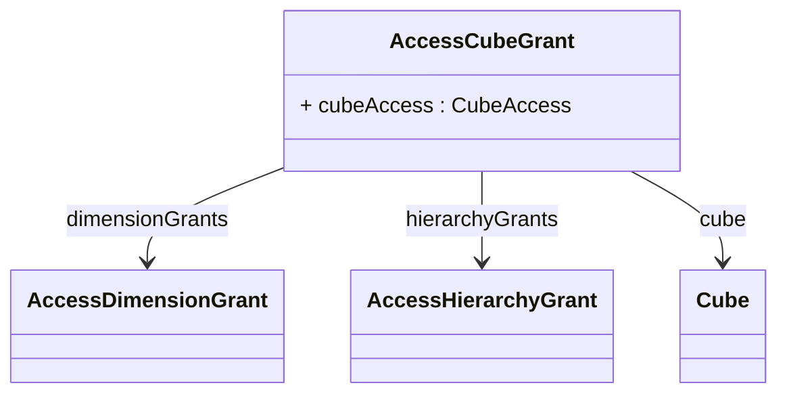

# AccessCubeGrant

Defines cube-level security permissions that control access to a specific OLAP cube and provide the foundation for more granular dimension, hierarchy, and member-level access controls within that analytical context. AccessCubeGrant operates as the primary business-domain security boundary, since cubes typically represent complete analytical subjects such as Sales Analysis, Financial Reporting, or Operations Management that align with organizational responsibilities and business processes. 

## Extends

## Attributes

<table>
  <thead>
    <tr>
      <th>Name</th>
      <th>Id</th>
      <th>Typ</th>
      <th>Lower</th>
      <th>Upper</th>
    </tr>
  </thead>
  <tbody>
    <tr>
      <td><strong>cubeAccess</strong></td>
      <td>false</td>
      <td><em>CubeAccess<a href="./enum-CubeAccess">🔗</a></em></td>
      <td>1</td>
      <td>1</td>
    </tr>
    <tr>
      <td colspan="5"><em>Specifies the access level for the cube using the CubeAccess enumeration values (all, none, custom), determining whether role members can view cube data and structure.</em></td>
    </tr>
  </tbody>
</table>

## References

<table>
  <thead>
    <tr>
      <th>Name</th>
      <th>Typ</th>
      <th>Lower</th>
      <th>Upper</th>
      <th>Containment</th>
    </tr>
  </thead>
  <tbody>
    <tr>
      <td><strong>dimensionGrants</strong></td>
      <td>AccessDimensionGrant<a href="./class-AccessDimensionGrant">🔗</a></td>
      <td>0</td>
      <td>&infin;</td>
      <td>true</td>
    </tr>
    <tr>
      <td colspan="5"><em>Collection of dimension-level access grants that provide fine-grained security control over specific dimensions within the cube's multidimensional space.</em></td>
    </tr>
    <tr>
      <td><strong>hierarchyGrants</strong></td>
      <td>AccessHierarchyGrant<a href="./class-AccessHierarchyGrant">🔗</a></td>
      <td>0</td>
      <td>&infin;</td>
      <td>true</td>
    </tr>
    <tr>
      <td colspan="5"><em>Collection of hierarchy-level access grants that define granular security permissions for specific hierarchies within the cube's dimensional structure.</em></td>
    </tr>
    <tr>
      <td><strong>cube</strong></td>
      <td>Cube<a href="./class-Cube">🔗</a></td>
      <td>1</td>
      <td>1</td>
      <td>false</td>
    </tr>
    <tr>
      <td colspan="5"><em>References the specific cube instance to which this access grant applies, establishing the security boundary for the targeted analytical domain.</em></td>
    </tr>
  </tbody>
</table>

## Used by

- AccessCatalogGrant[🔗](./class-AccessCatalogGrant) → cubeGrants

## ClassDiagramm

