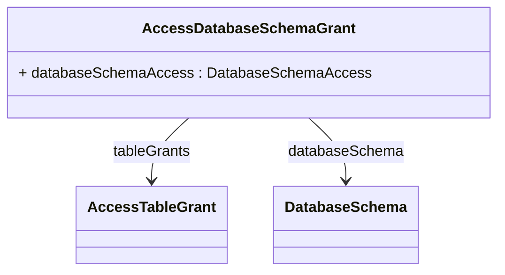

# AccessDatabaseSchemaGrant

Extends the OLAP security model to the database level by controlling access to database schemas, tables, and columns that underlie the OLAP analytical structures, providing comprehensive data governance that enforces security policies regardless of how data is accessed. AccessDatabaseSchemaGrant is essential for implementing defense-in-depth security strategies where access control must be enforced at multiple layers of the data architecture to prevent unauthorized data access through alternative channels such as direct SQL queries, ETL processes, reporting tools, or administrative interfaces that bypass the OLAP layer. This database-level security integration ensures that OLAP security policies are consistent with broader enterprise data governance frameworks and provides protection against sophisticated security threats that might attempt to circumvent analytical access controls by accessing underlying data sources directly. Database schema grants support complex enterprise scenarios including hybrid analytical environments where users access data through multiple tools and interfaces, regulatory compliance requirements where data access must be auditable and controllable at the database level regardless of the access method, administrative security models where technical personnel need differentiated access to database structures for maintenance and optimization purposes, and multi-tenant deployments where database-level isolation is required to ensure complete separation of different organizations' data. The database security model operates in coordination with OLAP-level security to provide seamless user experiences while maintaining comprehensive protection across all potential data access vectors.
## Extends

## Attributes

<table>
  <thead>
    <tr>
      <th>Name</th>
      <th>Id</th>
      <th>Typ</th>
      <th>Lower</th>
      <th>Upper</th>
    </tr>
  </thead>
  <tbody>
    <tr>
      <td><strong>databaseSchemaAccess</strong></td>
      <td>false</td>
      <td><em>DatabaseSchemaAccess<a href="./enum-DatabaseSchemaAccess">🔗</a></em></td>
      <td>1</td>
      <td>1</td>
    </tr>
    <tr>
      <td colspan="5"><em>Defines the access level for the database schema using DatabaseSchemaAccess enumeration values, controlling whether role members can interact with schema structures.</em></td>
    </tr>
  </tbody>
</table>

## References

<table>
  <thead>
    <tr>
      <th>Name</th>
      <th>Typ</th>
      <th>Lower</th>
      <th>Upper</th>
      <th>Containment</th>
    </tr>
  </thead>
  <tbody>
    <tr>
      <td><strong>tableGrants</strong></td>
      <td>AccessTableGrant<a href="./class-AccessTableGrant">🔗</a></td>
      <td>1</td>
      <td>&infin;</td>
      <td>true</td>
    </tr>
    <tr>
      <td colspan="5"><em>Collection of table-level access grants that provide granular security control over specific tables within the database schema.</em></td>
    </tr>
    <tr>
      <td><strong>databaseSchema</strong></td>
      <td>DatabaseSchema<a href="./class-DatabaseSchema">🔗</a></td>
      <td>1</td>
      <td>1</td>
      <td>false</td>
    </tr>
    <tr>
      <td colspan="5"><em>References the specific database schema to which this access grant applies, establishing the security boundary at the database level.</em></td>
    </tr>
  </tbody>
</table>

## Used by

- AccessCatalogGrant[🔗](./class-AccessCatalogGrant) → databaseSchemaGrants

## ClassDiagramm

