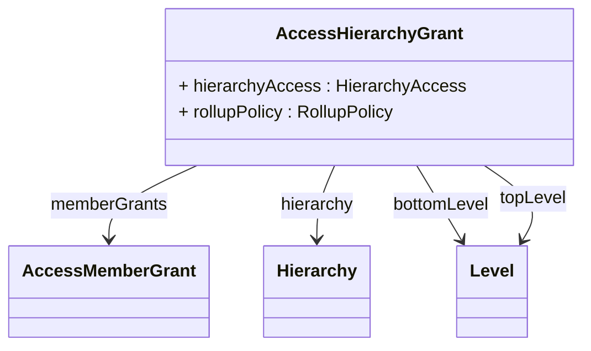

# AccessHierarchyGrant

Provides sophisticated hierarchy-level access control that enables fine-grained security policies for dimensional navigation, member visibility, and aggregation behavior within a specific hierarchy. AccessHierarchyGrant represents one of the most powerful and complex aspects of the OLAP security model, supporting advanced scenarios including member-level restrictions, level-based access boundaries, dynamic security expressions, and rollup policy controls that determine how aggregate values are calculated when some members are inaccessible.
## Extends

## Attributes

<table>
  <thead>
    <tr>
      <th>Name</th>
      <th>Id</th>
      <th>Typ</th>
      <th>Lower</th>
      <th>Upper</th>
    </tr>
  </thead>
  <tbody>
    <tr>
      <td><strong>hierarchyAccess</strong></td>
      <td>false</td>
      <td><em>HierarchyAccess<a href="./enum-HierarchyAccess">🔗</a></em></td>
      <td>1</td>
      <td>1</td>
    </tr>
    <tr>
      <td colspan="5"><em>Specifies the access level for the hierarchy using HierarchyAccess enumeration values, controlling overall hierarchy visibility and navigation permissions.</em></td>
    </tr>
    <tr>
      <td><strong>rollupPolicy</strong></td>
      <td>false</td>
      <td><em>RollupPolicy<a href="./enum-RollupPolicy">🔗</a></em></td>
      <td>1</td>
      <td>1</td>
    </tr>
    <tr>
      <td colspan="5"><em>Defines how aggregate values are calculated when some hierarchy members are inaccessible, ensuring data consistency and security in partial access scenarios.</em></td>
    </tr>
  </tbody>
</table>

## References

<table>
  <thead>
    <tr>
      <th>Name</th>
      <th>Typ</th>
      <th>Lower</th>
      <th>Upper</th>
      <th>Containment</th>
    </tr>
  </thead>
  <tbody>
    <tr>
      <td><strong>memberGrants</strong></td>
      <td>AccessMemberGrant<a href="./class-AccessMemberGrant">🔗</a></td>
      <td>0</td>
      <td>&infin;</td>
      <td>true</td>
    </tr>
    <tr>
      <td colspan="5"><em>Collection of member-level access grants that provide the finest level of control over individual members within the hierarchy.</em></td>
    </tr>
    <tr>
      <td><strong>hierarchy</strong></td>
      <td>Hierarchy<a href="./class-Hierarchy">🔗</a></td>
      <td>1</td>
      <td>1</td>
      <td>false</td>
    </tr>
    <tr>
      <td colspan="5"><em>References the specific hierarchy to which this access grant applies, establishing the security boundary at the hierarchy level.</em></td>
    </tr>
    <tr>
      <td><strong>bottomLevel</strong></td>
      <td>Level<a href="./class-Level">🔗</a></td>
      <td>0</td>
      <td>1</td>
      <td>false</td>
    </tr>
    <tr>
      <td colspan="5"><em>Optional reference to the deepest level in the hierarchy that role members can access, establishing a floor for dimensional navigation.</em></td>
    </tr>
    <tr>
      <td><strong>topLevel</strong></td>
      <td>Level<a href="./class-Level">🔗</a></td>
      <td>0</td>
      <td>1</td>
      <td>false</td>
    </tr>
    <tr>
      <td colspan="5"><em>Optional reference to the highest level in the hierarchy that role members can access, establishing a ceiling for dimensional navigation.</em></td>
    </tr>
  </tbody>
</table>

## Used by

- AccessCubeGrant[🔗](./class-AccessCubeGrant) → hierarchyGrants

## ClassDiagramm

