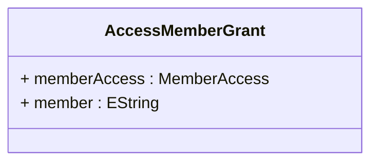

# AccessMemberGrant

Implements the most granular level of OLAP security control by defining access permissions for individual members within dimensional hierarchies, enabling precise business-driven security policies that reflect real-world organizational boundaries, customer relationships, geographic territories, product ownership, and regulatory restrictions. AccessMemberGrant represents the foundation of advanced security scenarios where analytical access must be controlled at the level of specific customers, products, geographic regions, time periods, or other business entities that correspond to dimensional members. This fine-grained approach supports sophisticated enterprise security requirements including sales territory management where representatives can only see data for their assigned customers or regions, product line management where managers have access only to their specific product categories, hierarchical organizational security where users can access data only for their organizational unit and subordinate units, compliance-driven restrictions where access to specific customers or products is regulated by legal or contractual requirements, and dynamic security implementations where member access is determined by user attributes, organizational relationships, or external authorization systems. Member grants handle complex inheritance and cascading scenarios where denying access to a parent member automatically restricts access to all descendant members, where granting access to a child member may require making parent members visible with restricted access levels, and where the visibility of members affects both query results and dimensional navigation capabilities in client tools. The member-level security system integrates seamlessly with the OLAP query processing engine to provide automatic filtering and aggregation adjustment while maintaining query performance and analytical coherence.
## Extends

## Attributes

<table>
  <thead>
    <tr>
      <th>Name</th>
      <th>Id</th>
      <th>Typ</th>
      <th>Lower</th>
      <th>Upper</th>
    </tr>
  </thead>
  <tbody>
    <tr>
      <td><strong>memberAccess</strong></td>
      <td>false</td>
      <td><em>MemberAccess<a href="./enum-MemberAccess">🔗</a></em></td>
      <td>1</td>
      <td>1</td>
    </tr>
    <tr>
      <td colspan="5"><em>Specifies the access level for the member using MemberAccess enumeration values, providing the most granular control over individual member visibility.</em></td>
    </tr>
    <tr>
      <td><strong>member</strong></td>
      <td>false</td>
      <td><em>EString</em></td>
      <td>0</td>
      <td>1</td>
    </tr>
    <tr>
      <td colspan="5"><em>Identifies the specific member within the hierarchy by its unique name or path, establishing the exact target of this granular access control.</em></td>
    </tr>
  </tbody>
</table>

## References

<table>
  <thead>
    <tr>
      <th>Name</th>
      <th>Typ</th>
      <th>Lower</th>
      <th>Upper</th>
      <th>Containment</th>
    </tr>
  </thead>
  <tbody>
  </tbody>
</table>

## Used by

- AccessHierarchyGrant[🔗](./class-AccessHierarchyGrant) → memberGrants

## ClassDiagramm

