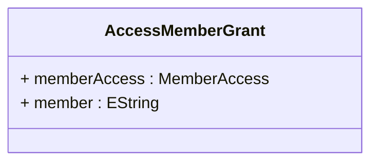

# AccessMemberGrant

Implements the most granular level of OLAP security control by defining access permissions for individual members within dimensional hierarchies, enabling precise business-driven security policies that reflect real-world organizational boundaries, customer relationships, geographic territories, product ownership, and regulatory restrictions.

## Extends

## Attributes

<table>
  <thead>
    <tr>
      <th>Name</th>
      <th>Id</th>
      <th>Typ</th>
      <th>Lower</th>
      <th>Upper</th>
    </tr>
  </thead>
  <tbody>
    <tr>
      <td><strong>memberAccess</strong></td>
      <td>false</td>
      <td><em>MemberAccess<a href="./enum-MemberAccess">🔗</a></em></td>
      <td>1</td>
      <td>1</td>
    </tr>
    <tr>
      <td colspan="5"><em>Specifies the access level for the member using MemberAccess enumeration values, providing the most granular control over individual member visibility.</em></td>
    </tr>
    <tr>
      <td><strong>member</strong></td>
      <td>false</td>
      <td><em>EString</em></td>
      <td>0</td>
      <td>1</td>
    </tr>
    <tr>
      <td colspan="5"><em>Identifies the specific member within the hierarchy by its unique name or path, establishing the exact target of this granular access control.</em></td>
    </tr>
  </tbody>
</table>

## References

<table>
  <thead>
    <tr>
      <th>Name</th>
      <th>Typ</th>
      <th>Lower</th>
      <th>Upper</th>
      <th>Containment</th>
    </tr>
  </thead>
  <tbody>
  </tbody>
</table>

## Used by

- AccessHierarchyGrant[🔗](./class-AccessHierarchyGrant) → memberGrants

## ClassDiagramm

