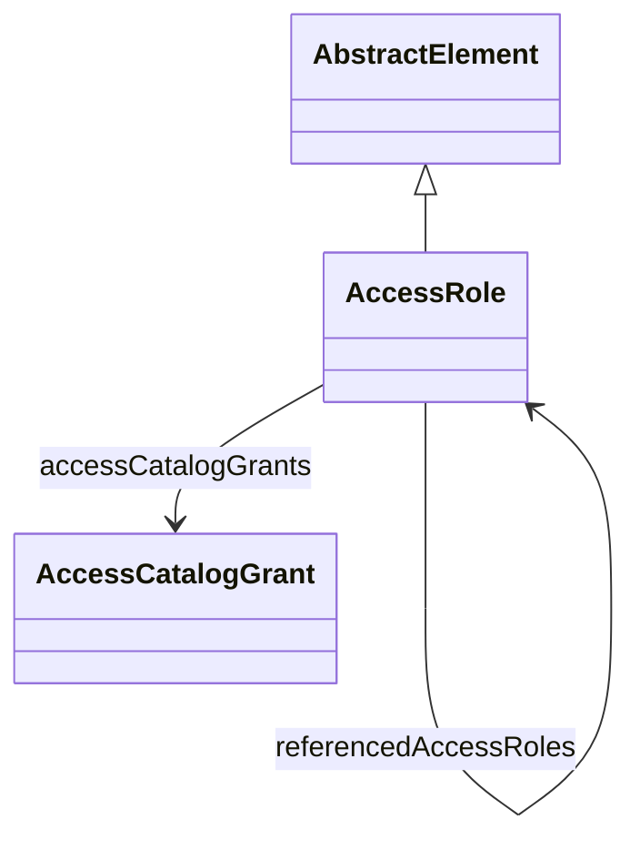

# AccessRole

Defines a comprehensive role-based access control (RBAC) entity that encapsulates all security permissions and restrictions for accessing OLAP resources at multiple hierarchical levels of granularity. AccessRole serves as the fundamental security principal in the OLAP framework, implementing a sophisticated multi-level security model that operates from the catalog level down to individual members, columns, and database objects. Each role defines explicit access permissions through a collection of grants that specify whether access is completely allowed (ALL), completely denied (NONE), or selectively controlled (CUSTOM) with fine-grained sub-permissions. The role system supports complex enterprise security scenarios including multi-tenant architectures, organizational hierarchies, dynamic security expressions, context-sensitive access control, and integration with external authentication and authorization systems. Roles can be composed through union semantics to create complex permission combinations, inherited through organizational structures, and applied at query execution time to automatically filter data and restrict navigation based on the current user's security context. The access control model extends beyond traditional OLAP elements to include database-level security for tables, columns, and schemas, enabling comprehensive data governance and compliance with regulatory requirements for data access auditing and restriction.
## Extends
- AbstractElement [🔗](./class-AbstractElement)
## Attributes

<table>
  <thead>
    <tr>
      <th>Name</th>
      <th>Id</th>
      <th>Typ</th>
      <th>Lower</th>
      <th>Upper</th>
    </tr>
  </thead>
  <tbody>
  </tbody>
</table>

## References

<table>
  <thead>
    <tr>
      <th>Name</th>
      <th>Typ</th>
      <th>Lower</th>
      <th>Upper</th>
      <th>Containment</th>
    </tr>
  </thead>
  <tbody>
    <tr>
      <td><strong>accessCatalogGrants</strong></td>
      <td>AccessCatalogGrant<a href="./class-AccessCatalogGrant">🔗</a></td>
      <td>0</td>
      <td>&infin;</td>
      <td>true</td>
    </tr>
    <tr>
      <td colspan="5"><em>Collection of catalog-level access grants that define the top-level permissions for accessing OLAP catalogs and their contained resources. Each AccessCatalogGrant specifies whether the role has comprehensive access to an entire catalog (ALL), no access whatsoever (NONE), selective access to only shared dimensions without cube access (ALL_DIMENSIONS), or fine-grained custom access that requires explicit sub-grants for individual cubes, dimensions, and other catalog resources (CUSTOM). Catalog grants serve as the primary entry point for role-based security evaluation, determining the overall scope of access before more granular permissions are evaluated. The catalog level is particularly important for multi-tenant scenarios where different user groups need access to completely different analytical contexts, for organizational security where departments have access to different business areas, and for regulatory compliance where certain data categories must be completely isolated from specific user groups. Multiple catalog grants within a single role enable cross-catalog access scenarios and support complex enterprise architectures where analytical resources are distributed across multiple OLAP catalogs for performance, governance, or organizational reasons.</em></td>
    </tr>
    <tr>
      <td><strong>referencedAccessRoles</strong></td>
      <td>AccessRole<a href="./class-AccessRole">🔗</a></td>
      <td>0</td>
      <td>&infin;</td>
      <td>true</td>
    </tr>
    <tr>
      <td colspan="5"><em>Collection of other AccessRole objects that should be combined with this role using union semantics, creating composite roles that aggregate permissions from multiple sources. This role composition mechanism enables sophisticated organizational security models where user permissions are derived from multiple overlapping sources such as department-based roles, project-based roles, geographic roles, and temporary access grants. The union operation combines permissions using the most permissive access level from any contributing role, ensuring that users receive the maximum access available from any of their assigned roles while maintaining security boundaries. Referenced roles support hierarchical organizational structures where users inherit permissions from organizational units, enable delegation scenarios where managers can grant subsets of their permissions to team members, facilitate temporary access elevation for specific projects or time periods, and implement complex matrix organizational structures where users have multiple reporting relationships. The composition mechanism also supports role template patterns where common permission sets are defined once and reused across multiple specific roles, reducing administrative overhead and ensuring consistency in security policy implementation across large enterprise deployments.</em></td>
    </tr>
  </tbody>
</table>

## Used by

- Catalog[🔗](./class-Catalog) → accessRoles
- Catalog[🔗](./class-Catalog) → defaultAccessRole

## ClassDiagramm

