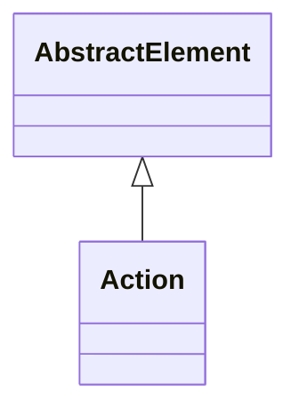

# Action

Abstract base class for interactive actions that provide sophisticated user engagement capabilities within OLAP applications, enabling context-sensitive operations that can launch external applications, navigate to related content, execute business processes, or provide additional analytical functionality based on the user's current analytical context. Action represents a fundamental component of modern interactive business intelligence, transforming passive analytical consumption into dynamic, action-oriented user experiences that enable users to seamlessly transition from analytical insight to business action. This action framework supports advanced interactive scenarios including drill-through operations that provide access to underlying detailed data, URL actions that can navigate to related web applications or external resources, report actions that can launch parameterized reports based on current analytical context, command actions that can trigger business processes or system operations, and custom actions that can integrate with external systems or execute specialized business logic. Actions are context-aware, meaning they can adapt their behavior based on the current analytical selection, user permissions, data values, or other environmental factors, enabling sophisticated interactive experiences that provide relevant, timely capabilities exactly when and where users need them. The action framework integrates seamlessly with client tools to provide intuitive user interfaces including context menus, toolbar buttons, and other interactive elements that make analytical applications more engaging and productive for business users.
## Extends
- AbstractElement [🔗](./class-AbstractElement)
## Attributes

<table>
  <thead>
    <tr>
      <th>Name</th>
      <th>Id</th>
      <th>Typ</th>
      <th>Lower</th>
      <th>Upper</th>
    </tr>
  </thead>
  <tbody>
  </tbody>
</table>

## References

<table>
  <thead>
    <tr>
      <th>Name</th>
      <th>Typ</th>
      <th>Lower</th>
      <th>Upper</th>
      <th>Containment</th>
    </tr>
  </thead>
  <tbody>
  </tbody>
</table>

## Used by

- PhysicalCube[🔗](./class-PhysicalCube) → action

## ClassDiagramm

