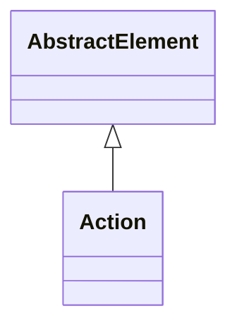

# Action

Abstract base class for interactive actions that provide sophisticated user engagement capabilities within OLAP applications, enabling context-sensitive operations that can launch external applications, navigate to related content, execute business processes, or provide additional analytical functionality based on the user's current analytical context.

## Extends
- AbstractElement [🔗](./class-AbstractElement)
## Attributes

<table>
  <thead>
    <tr>
      <th>Name</th>
      <th>Id</th>
      <th>Typ</th>
      <th>Lower</th>
      <th>Upper</th>
    </tr>
  </thead>
  <tbody>
  </tbody>
</table>

## References

<table>
  <thead>
    <tr>
      <th>Name</th>
      <th>Typ</th>
      <th>Lower</th>
      <th>Upper</th>
      <th>Containment</th>
    </tr>
  </thead>
  <tbody>
  </tbody>
</table>

## Used by

- PhysicalCube[🔗](./class-PhysicalCube) → action

## ClassDiagramm

