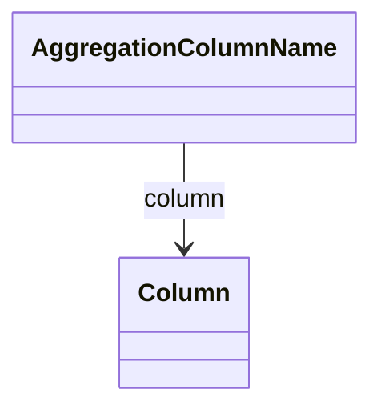

# AggregationColumnName

Specifies the column that stores fact count data in an aggregation table, enabling ROLAP engines to determine the number of base fact table rows that were aggregated into each summary row.
## Extends

## Attributes

<table>
  <thead>
    <tr>
      <th>Name</th>
      <th>Id</th>
      <th>Typ</th>
      <th>Lower</th>
      <th>Upper</th>
    </tr>
  </thead>
  <tbody>
  </tbody>
</table>

## References

<table>
  <thead>
    <tr>
      <th>Name</th>
      <th>Typ</th>
      <th>Lower</th>
      <th>Upper</th>
      <th>Containment</th>
    </tr>
  </thead>
  <tbody>
    <tr>
      <td><strong>column</strong></td>
      <td>Column<a href="./class-Column">🔗</a></td>
      <td>1</td>
      <td>1</td>
      <td>false</td>
    </tr>
    <tr>
      <td colspan="5"><em>References the physical database column containing the aggregated fact count values used by the ROLAP engine for query optimization and result validation.</em></td>
    </tr>
  </tbody>
</table>

## Used by

- AggregationTable[🔗](./class-AggregationTable) → aggregationFactCount
- AggregationTable[🔗](./class-AggregationTable) → aggregationIgnoreColumns

## ClassDiagramm

