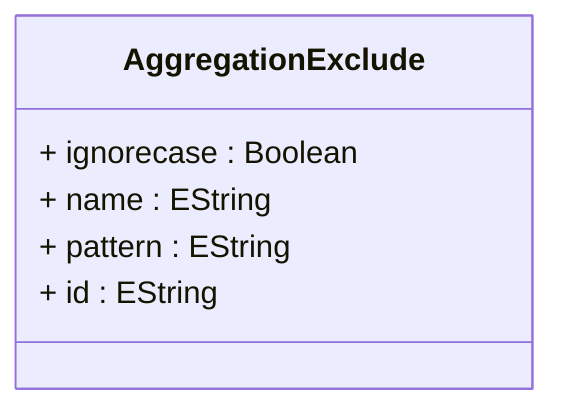

# AggregationExclude

Defines exclusion rules that prevent specific tables from being used as aggregation tables, even if they would otherwise match aggregation patterns or be considered suitable for aggregation optimization. AggregationExclude is essential for maintaining aggregation accuracy and system reliability by providing explicit control over which tables should be avoided during aggregation table discovery and selection. This mechanism handles various scenarios including tables with data quality issues, incomplete aggregations that could produce incorrect results, tables under maintenance or reconstruction, temporary tables that might match naming patterns, and special-purpose tables that follow similar naming conventions but are not intended for OLAP aggregation use. Exclusion rules support both exact name matching for specific table exclusions and pattern-based matching for excluding categories of tables, with configurable case sensitivity to accommodate different database and naming convention requirements.
## Extends

## Attributes

<table>
  <thead>
    <tr>
      <th>Name</th>
      <th>Id</th>
      <th>Typ</th>
      <th>Lower</th>
      <th>Upper</th>
    </tr>
  </thead>
  <tbody>
    <tr>
      <td><strong>ignorecase</strong></td>
      <td>false</td>
      <td><em>Boolean</em></td>
      <td>0</td>
      <td>1</td>
    </tr>
    <tr>
      <td colspan="5"><em>Boolean flag that controls whether table name matching for this exclusion rule should be case-sensitive or case-insensitive. When set to true, the exclusion matching will ignore case differences, making exclusion rules more robust in environments with inconsistent case usage in table names or when working with databases that have varying case sensitivity behaviors. Case-insensitive matching is particularly useful in heterogeneous environments where table names might be created with different case conventions by various ETL tools, database administrators, or automated processes. This setting should align with the database system's case sensitivity behavior and the organization's naming conventions to ensure exclusion rules work reliably across all deployment scenarios.</em></td>
    </tr>
    <tr>
      <td><strong>name</strong></td>
      <td>false</td>
      <td><em>EString</em></td>
      <td>0</td>
      <td>1</td>
    </tr>
    <tr>
      <td colspan="5"><em>Exact table name that should be excluded from aggregation table consideration. When specified, this provides precise exclusion control for specific known tables that should never be used for aggregation, regardless of whether they match aggregation patterns or appear to contain suitable aggregation data. Name-based exclusion is ideal for handling specific problematic tables, tables with known data quality issues, or tables that are reserved for other purposes but might otherwise be mistaken for aggregation tables. This exact matching approach complements pattern-based exclusion by providing surgical control over individual tables while maintaining the broader pattern-based approach for categories of tables.</em></td>
    </tr>
    <tr>
      <td><strong>pattern</strong></td>
      <td>false</td>
      <td><em>EString</em></td>
      <td>0</td>
      <td>1</td>
    </tr>
    <tr>
      <td colspan="5"><em>Regular expression pattern that defines categories of tables that should be excluded from aggregation table consideration. Pattern-based exclusion enables efficient handling of multiple related tables that share common naming characteristics but should not be used for aggregation purposes. Common exclusion patterns include temporary table prefixes like 'TEMP_.*', backup table suffixes like '.*_BACKUP', or version-specific patterns like '.*_V[0-9]+' for excluding older versions of aggregation tables. The pattern approach is particularly valuable in dynamic environments where problematic tables are created regularly with predictable naming conventions, enabling proactive exclusion without requiring individual configuration for each new table. Pattern matching respects the ignorecase setting for consistent behavior across the exclusion rule.</em></td>
    </tr>
    <tr>
      <td><strong>id</strong></td>
      <td>true</td>
      <td><em>EString</em></td>
      <td>1</td>
      <td>1</td>
    </tr>
    <tr>
      <td colspan="5"><em>Unique identifier for the writeback table that enables unambiguous reference and management within the cube schema and database persistence layer.</em></td>
    </tr>
  </tbody>
</table>

## References

<table>
  <thead>
    <tr>
      <th>Name</th>
      <th>Typ</th>
      <th>Lower</th>
      <th>Upper</th>
      <th>Containment</th>
    </tr>
  </thead>
  <tbody>
  </tbody>
</table>

## Used by

- TableQuery[🔗](./class-TableQuery) → aggregationExcludes
- AggregationPattern[🔗](./class-AggregationPattern) → excludes

## ClassDiagramm

