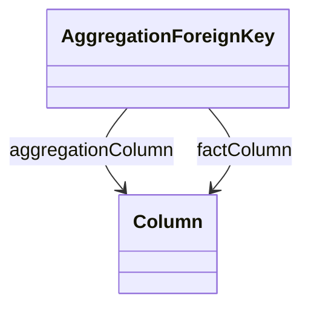

# AggregationForeignKey

Defines column relationships between aggregation tables and fact tables that enable query optimization through transparent fact-to-aggregation table substitution. Maps foreign key columns in aggregation tables to their corresponding columns in fact tables, maintaining referential integrity and dimensional relationships for performance-optimized OLAP query processing.
## Extends

## Attributes

<table>
  <thead>
    <tr>
      <th>Name</th>
      <th>Id</th>
      <th>Typ</th>
      <th>Lower</th>
      <th>Upper</th>
    </tr>
  </thead>
  <tbody>
  </tbody>
</table>

## References

<table>
  <thead>
    <tr>
      <th>Name</th>
      <th>Typ</th>
      <th>Lower</th>
      <th>Upper</th>
      <th>Containment</th>
    </tr>
  </thead>
  <tbody>
    <tr>
      <td><strong>aggregationColumn</strong></td>
      <td>Column<a href="./class-Column">🔗</a></td>
      <td>1</td>
      <td>1</td>
      <td>false</td>
    </tr>
    <tr>
      <td colspan="5"><em>Required reference to the foreign key column in the aggregation table that corresponds to a dimension key. This column maintains dimensional relationships in the pre-aggregated data, enabling proper joins with dimension tables during query processing and supporting transparent substitution of fact table queries with optimized aggregation table queries.</em></td>
    </tr>
    <tr>
      <td><strong>factColumn</strong></td>
      <td>Column<a href="./class-Column">🔗</a></td>
      <td>1</td>
      <td>1</td>
      <td>false</td>
    </tr>
    <tr>
      <td colspan="5"><em>Required reference to the original foreign key column in the fact table that this aggregation column represents. This mapping enables the OLAP engine to understand the correspondence between fact and aggregation table structures, supporting query rewriting where fact table foreign key references are substituted with their aggregation table equivalents while maintaining proper dimensional relationships and join semantics.</em></td>
    </tr>
  </tbody>
</table>

## Used by

- AggregationTable[🔗](./class-AggregationTable) → aggregationForeignKeys

## ClassDiagramm

