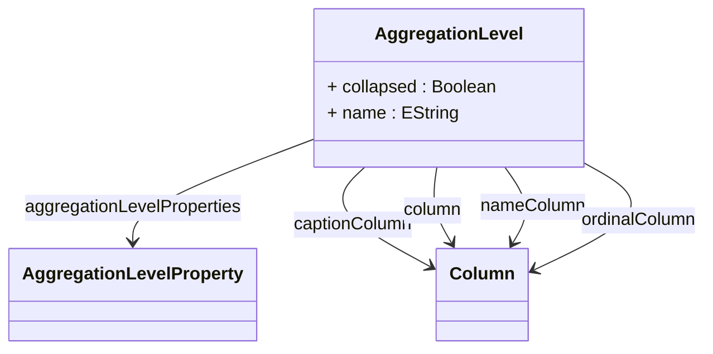

# AggregationLevel

Maps a dimension level to a column in an aggregation table, defining how dimensional data is represented in pre-computed aggregation structures. AggregationLevel is fundamental to the aggregation matching algorithm, enabling the OLAP engine to determine whether a specific aggregation table contains the appropriate dimensional granularity to satisfy query requirements. Each mapping specifies the relationship between a logical dimension level (such as Product Category, Time Month, or Customer Region) and the physical column in the aggregation table that stores the corresponding dimension key values. This mapping supports various advanced scenarios including collapsed hierarchies where intermediate levels are omitted, caption columns for improved display formatting, level properties for additional dimensional attributes, and rollup operations where aggregations can satisfy queries requiring less detailed levels than what the aggregation contains. The level mapping is critical for constraint propagation, ensuring that filters and selections applied to dimension levels are correctly translated to aggregation table columns during query processing.
## Extends

## Attributes

<table>
  <thead>
    <tr>
      <th>Name</th>
      <th>Id</th>
      <th>Typ</th>
      <th>Lower</th>
      <th>Upper</th>
    </tr>
  </thead>
  <tbody>
    <tr>
      <td><strong>collapsed</strong></td>
      <td>false</td>
      <td><em>Boolean</em></td>
      <td>0</td>
      <td>1</td>
    </tr>
    <tr>
      <td colspan="5"><em>Boolean flag indicating whether this aggregation level represents a collapsed hierarchy level. When true, intermediate hierarchy levels are omitted in the aggregation table, allowing queries to roll up directly to higher levels without requiring intermediate level data.</em></td>
    </tr>
    <tr>
      <td><strong>name</strong></td>
      <td>false</td>
      <td><em>EString</em></td>
      <td>1</td>
      <td>1</td>
    </tr>
    <tr>
      <td colspan="5"><em>Required name identifier for the dimension level that this aggregation level represents. This name must correspond to a level defined in the cube schema, enabling the aggregation matching algorithm to identify appropriate aggregations for queries involving this level.</em></td>
    </tr>
  </tbody>
</table>

## References

<table>
  <thead>
    <tr>
      <th>Name</th>
      <th>Typ</th>
      <th>Lower</th>
      <th>Upper</th>
      <th>Containment</th>
    </tr>
  </thead>
  <tbody>
    <tr>
      <td><strong>aggregationLevelProperties</strong></td>
      <td>AggregationLevelProperty<a href="./class-AggregationLevelProperty">🔗</a></td>
      <td>0</td>
      <td>&infin;</td>
      <td>true</td>
    </tr>
    <tr>
      <td colspan="5"><em>Collection of property mappings that define how level properties are represented in the aggregation table. Each AggregationLevelProperty maps a level property (such as member captions, descriptions, or custom attributes) to its corresponding column in the aggregation table, enabling rich dimensional data access in aggregated queries.</em></td>
    </tr>
    <tr>
      <td><strong>captionColumn</strong></td>
      <td>Column<a href="./class-Column">🔗</a></td>
      <td>0</td>
      <td>1</td>
      <td>false</td>
    </tr>
    <tr>
      <td colspan="5"><em>Optional reference to the column in the aggregation table that contains member caption values for this level. Caption columns provide user-friendly display names that can be shown in analytical interfaces instead of the technical key values.</em></td>
    </tr>
    <tr>
      <td><strong>column</strong></td>
      <td>Column<a href="./class-Column">🔗</a></td>
      <td>1</td>
      <td>1</td>
      <td>false</td>
    </tr>
    <tr>
      <td colspan="5"><em>Required reference to the column in the aggregation table that stores the key values for this dimension level. This column contains the dimension member keys that correspond to the level definition, enabling proper aggregation matching and query optimization.</em></td>
    </tr>
    <tr>
      <td><strong>nameColumn</strong></td>
      <td>Column<a href="./class-Column">🔗</a></td>
      <td>0</td>
      <td>1</td>
      <td>false</td>
    </tr>
    <tr>
      <td colspan="5"><em>Optional reference to the column in the aggregation table that contains member name values for this level. Name columns provide alternative identification for dimension members beyond the primary key column.</em></td>
    </tr>
    <tr>
      <td><strong>ordinalColumn</strong></td>
      <td>Column<a href="./class-Column">🔗</a></td>
      <td>0</td>
      <td>1</td>
      <td>false</td>
    </tr>
    <tr>
      <td colspan="5"><em>Optional reference to the column in the aggregation table that contains ordinal values for level members. Ordinal columns provide explicit sort ordering for dimension members, enabling consistent member ordering in analytical results and user interfaces.</em></td>
    </tr>
  </tbody>
</table>

## Used by

- AggregationTable[🔗](./class-AggregationTable) → aggregationLevels

## ClassDiagramm

