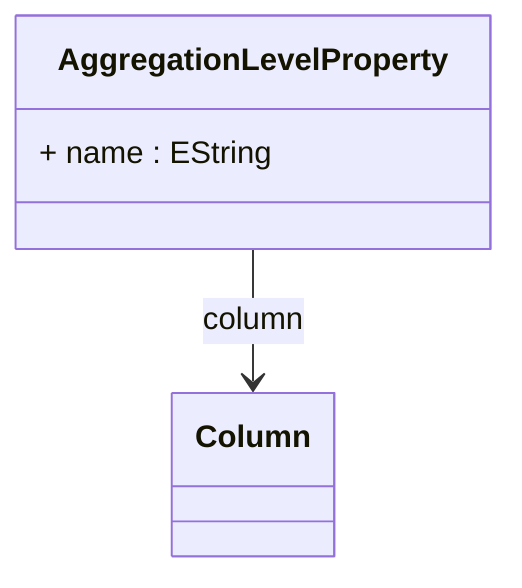

# AggregationLevelProperty

Maps a level property to its corresponding column in an aggregation table, enabling access to dimensional member properties in aggregated queries. Level properties provide additional descriptive information about dimension members beyond their keys and names, such as member descriptions, custom attributes, or categorization data.
## Extends

## Attributes

<table>
  <thead>
    <tr>
      <th>Name</th>
      <th>Id</th>
      <th>Typ</th>
      <th>Lower</th>
      <th>Upper</th>
    </tr>
  </thead>
  <tbody>
    <tr>
      <td><strong>name</strong></td>
      <td>false</td>
      <td><em>EString</em></td>
      <td>1</td>
      <td>1</td>
    </tr>
    <tr>
      <td colspan="5"><em>Required name identifier for the level property that this aggregation level property represents. This name must correspond to a property defined in the level schema, enabling proper property access in aggregated queries.</em></td>
    </tr>
  </tbody>
</table>

## References

<table>
  <thead>
    <tr>
      <th>Name</th>
      <th>Typ</th>
      <th>Lower</th>
      <th>Upper</th>
      <th>Containment</th>
    </tr>
  </thead>
  <tbody>
    <tr>
      <td><strong>column</strong></td>
      <td>Column<a href="./class-Column">🔗</a></td>
      <td>0</td>
      <td>1</td>
      <td>false</td>
    </tr>
    <tr>
      <td colspan="5"><em>Reference to the column in the aggregation table that stores the property values. This column contains the actual property data that corresponds to the level property definition in the cube schema.</em></td>
    </tr>
  </tbody>
</table>

## Used by

- AggregationLevel[🔗](./class-AggregationLevel) → aggregationLevelProperties

## ClassDiagramm

