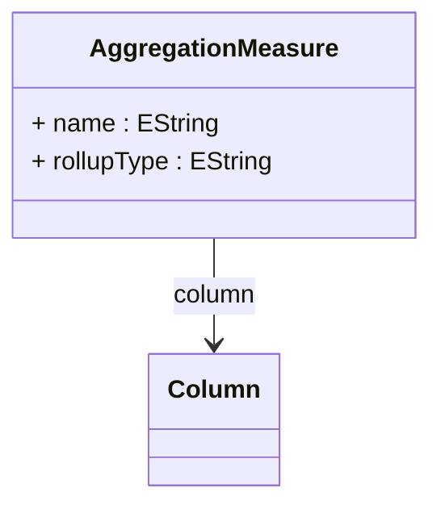

# AggregationMeasure

Maps a cube measure to a column in an aggregation table that contains pre-computed aggregated values for that measure. AggregationMeasure is central to the performance optimization provided by aggregation tables, enabling the OLAP engine to substitute pre-calculated summary values for expensive fact table aggregations. Each mapping defines the relationship between a logical measure (such as Sales Amount, Quantity Sold, or Profit Margin) and the physical column in the aggregation table that stores the corresponding aggregated values. The mapping includes critical information about rollup behavior, specifying how aggregated values can be further combined when rolling up to higher levels of granularity. This supports complex aggregation scenarios including additive measures that use SUM rollup, semi-additive measures that require special handling across time dimensions, non-additive measures like ratios that need weighted averaging, and distinct count measures that have strict rollup requirements to maintain accuracy.
## Extends

## Attributes

<table>
  <thead>
    <tr>
      <th>Name</th>
      <th>Id</th>
      <th>Typ</th>
      <th>Lower</th>
      <th>Upper</th>
    </tr>
  </thead>
  <tbody>
    <tr>
      <td><strong>name</strong></td>
      <td>false</td>
      <td><em>EString</em></td>
      <td>1</td>
      <td>1</td>
    </tr>
    <tr>
      <td colspan="5"><em>Name of the cube measure that this aggregation measure mapping represents, typically specified in MDX notation such as '[Measures].[Sales Amount]' or '[Measures].[Unit Sales]'. This name must exactly match the measure name defined in the cube's measure group to ensure proper correlation between the logical measure definition and the aggregated data stored in the aggregation table. The name serves as the key for the aggregation matching algorithm to determine whether this aggregation table contains pre-computed values for measures required by a query, enabling the OLAP engine to substitute aggregation table access for fact table aggregation operations.</em></td>
    </tr>
    <tr>
      <td><strong>rollupType</strong></td>
      <td>false</td>
      <td><em>EString</em></td>
      <td>0</td>
      <td>1</td>
    </tr>
    <tr>
      <td colspan="5"><em>Specifies the aggregation function that should be used when rolling up this measure to higher levels of granularity, determining how pre-aggregated values can be further combined when the aggregation table contains more detailed data than required by a query. Common rollup types include 'Sum' for additive measures like sales amounts and quantities, 'Avg' for measures that should be averaged when rolled up, 'Min' and 'Max' for measures where extreme values are meaningful, and 'Count' for counting measures. The rollup type must be compatible with the measure's semantic meaning and the aggregation function originally used to create the aggregated values. Special handling is required for distinct count measures and complex calculated measures that may not support standard rollup operations.</em></td>
    </tr>
  </tbody>
</table>

## References

<table>
  <thead>
    <tr>
      <th>Name</th>
      <th>Typ</th>
      <th>Lower</th>
      <th>Upper</th>
      <th>Containment</th>
    </tr>
  </thead>
  <tbody>
    <tr>
      <td><strong>column</strong></td>
      <td>Column<a href="./class-Column">🔗</a></td>
      <td>1</td>
      <td>1</td>
      <td>false</td>
    </tr>
    <tr>
      <td colspan="5"><em>Reference to the aggregation table column that contains the pre-computed aggregated values for this measure. The column must contain numeric data that represents the measure values aggregated according to the granularity defined by the aggregation table's level mappings. The data type and precision of this column should be appropriate for the measure's value range and the aggregation function used, ensuring that no precision is lost during aggregation operations and that the values can be further aggregated if rollup operations are required. The column should be indexed appropriately to support efficient querying when the aggregation table is used in place of fact table scans.</em></td>
    </tr>
  </tbody>
</table>

## Used by

- AggregationTable[🔗](./class-AggregationTable) → aggregationMeasures

## ClassDiagramm

