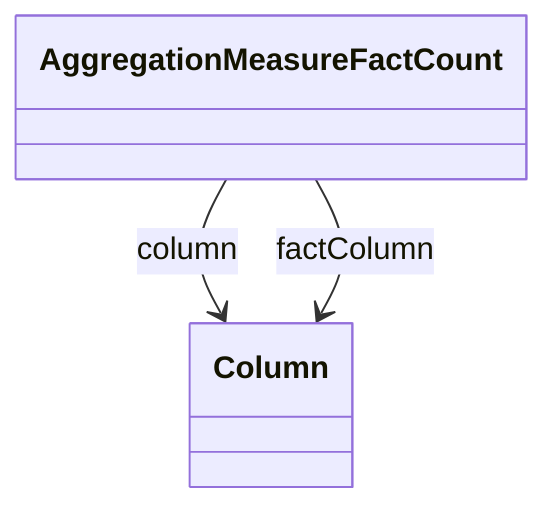

# AggregationMeasureFactCount

Defines the fact count measure in an aggregation table that tracks the number of fact table rows contributing to each aggregated row. The fact count is essential for computing accurate averages, weighted calculations, and other statistical operations that require knowledge of the underlying data density.
## Extends

## Attributes

<table>
  <thead>
    <tr>
      <th>Name</th>
      <th>Id</th>
      <th>Typ</th>
      <th>Lower</th>
      <th>Upper</th>
    </tr>
  </thead>
  <tbody>
  </tbody>
</table>

## References

<table>
  <thead>
    <tr>
      <th>Name</th>
      <th>Typ</th>
      <th>Lower</th>
      <th>Upper</th>
      <th>Containment</th>
    </tr>
  </thead>
  <tbody>
    <tr>
      <td><strong>column</strong></td>
      <td>Column<a href="./class-Column">🔗</a></td>
      <td>1</td>
      <td>1</td>
      <td>false</td>
    </tr>
    <tr>
      <td colspan="5"><em>Required reference to the column in the aggregation table that stores the fact count values. This column contains the number of fact table rows that were aggregated to produce each aggregated row.</em></td>
    </tr>
    <tr>
      <td><strong>factColumn</strong></td>
      <td>Column<a href="./class-Column">🔗</a></td>
      <td>1</td>
      <td>1</td>
      <td>false</td>
    </tr>
    <tr>
      <td colspan="5"><em>Required reference to a column in the fact table that is used as the basis for counting fact table rows. Typically references a non-null column in the fact table to ensure accurate row counting.</em></td>
    </tr>
  </tbody>
</table>

## Used by

- AggregationTable[🔗](./class-AggregationTable) → aggregationMeasureFactCounts

## ClassDiagramm

