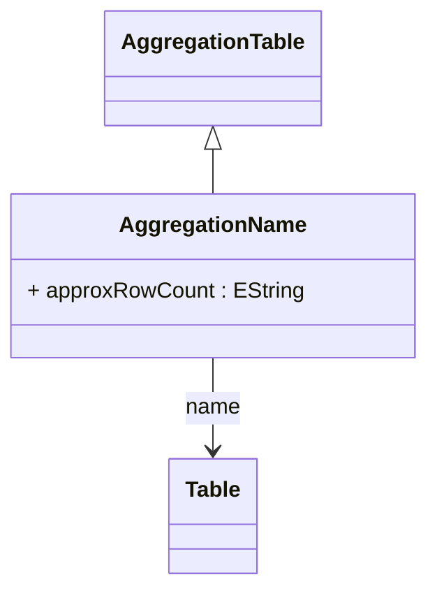

# AggregationName

Concrete aggregation table implementation that explicitly specifies a named database table containing pre-computed aggregation data. AggregationName provides direct, deterministic mapping to a specific aggregation table, making it ideal for environments with well-defined, stable aggregation strategies where table names are known in advance. This approach offers maximum control and predictability in aggregation table usage, enabling precise performance tuning and explicit aggregation maintenance workflows. AggregationName is commonly used in enterprise data warehousing scenarios where aggregation tables are created through ETL processes, have standardized naming conventions, and require explicit management for data freshness and consistency. The named approach also supports detailed monitoring and administration since each aggregation table is explicitly declared and can be individually managed, validated, and optimized.
## Extends
- AggregationTable [🔗](./class-AggregationTable)
## Attributes

<table>
  <thead>
    <tr>
      <th>Name</th>
      <th>Id</th>
      <th>Typ</th>
      <th>Lower</th>
      <th>Upper</th>
    </tr>
  </thead>
  <tbody>
    <tr>
      <td><strong>approxRowCount</strong></td>
      <td>false</td>
      <td><em>EString</em></td>
      <td>0</td>
      <td>1</td>
    </tr>
    <tr>
      <td colspan="5"><em>Approximate number of rows contained in this aggregation table, providing a size hint that helps the OLAP engine's cost-based optimizer make intelligent decisions about aggregation table selection and query execution strategies. This estimate is used for comparing the relative costs of different aggregation options, predicting memory requirements for caching aggregation data, and determining whether using an aggregation table is likely to be more efficient than scanning the fact table. The value can be specified as a numeric string and should be updated periodically to reflect changes in aggregation table size as underlying data grows. Accurate row count estimates are particularly important in environments with multiple overlapping aggregation tables where the optimizer must choose the most efficient option.</em></td>
    </tr>
  </tbody>
</table>

## References

<table>
  <thead>
    <tr>
      <th>Name</th>
      <th>Typ</th>
      <th>Lower</th>
      <th>Upper</th>
      <th>Containment</th>
    </tr>
  </thead>
  <tbody>
    <tr>
      <td><strong>name</strong></td>
      <td>Table<a href="./class-Table">🔗</a></td>
      <td>1</td>
      <td>1</td>
      <td>false</td>
    </tr>
    <tr>
      <td colspan="5"><em>Reference to the specific database table that contains the pre-computed aggregation data. This table reference must point to an existing physical table within the database schema that has been populated with aggregated measures and dimension keys according to the mappings defined in the parent AggregationTable. The referenced table should have appropriate indexes for the dimensional columns and measure columns to ensure optimal query performance when the OLAP engine substitutes this aggregation for fact table access. The table structure must be compatible with the aggregation mappings defined in aggregationMeasures, aggregationLevels, and other aggregation configuration elements.</em></td>
    </tr>
  </tbody>
</table>

## Used by

## ClassDiagramm

