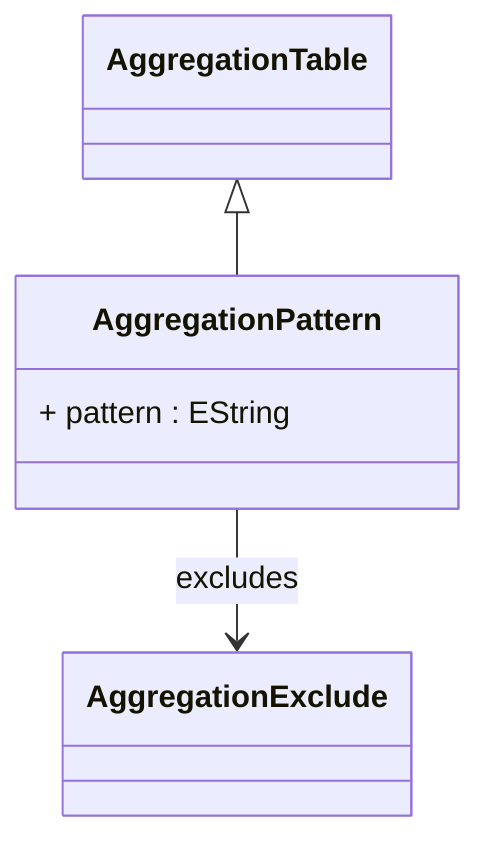

# AggregationPattern

Concrete aggregation table implementation that uses regular expression patterns to automatically discover and utilize aggregation tables that follow consistent naming conventions. AggregationPattern provides a scalable, dynamic approach to aggregation table management that is ideal for environments with automated aggregation table creation, standardized naming schemes, and large numbers of aggregation tables that would be impractical to manage individually. This pattern-based discovery mechanism enables the OLAP system to automatically adapt to newly created aggregation tables without requiring manual configuration updates, making it particularly valuable in environments with frequent aggregation table maintenance, automated ETL processes that generate aggregation tables, or data warehouse architectures that create aggregation tables programmatically based on usage patterns and performance requirements.
## Extends
- AggregationTable [🔗](./class-AggregationTable)
## Attributes

<table>
  <thead>
    <tr>
      <th>Name</th>
      <th>Id</th>
      <th>Typ</th>
      <th>Lower</th>
      <th>Upper</th>
    </tr>
  </thead>
  <tbody>
    <tr>
      <td><strong>pattern</strong></td>
      <td>false</td>
      <td><em>EString</em></td>
      <td>1</td>
      <td>1</td>
    </tr>
    <tr>
      <td colspan="5"><em>Regular expression pattern that defines the naming convention for aggregation tables that should be automatically discovered and utilized by this aggregation configuration. The pattern is matched against database table names during aggregation table discovery, enabling the OLAP engine to dynamically identify and incorporate new aggregation tables without manual configuration changes. Patterns should be designed to accurately identify aggregation tables while avoiding false matches with fact tables, dimension tables, or other non-aggregation database objects. Common patterns include prefixes like 'AGG_.*', suffixes like '.*_SUMMARY', or more complex expressions that encode aggregation level information within table names. The pattern matching respects the ignorecase setting inherited from the parent AggregationTable for case-sensitive or case-insensitive matching behavior.</em></td>
    </tr>
  </tbody>
</table>

## References

<table>
  <thead>
    <tr>
      <th>Name</th>
      <th>Typ</th>
      <th>Lower</th>
      <th>Upper</th>
      <th>Containment</th>
    </tr>
  </thead>
  <tbody>
    <tr>
      <td><strong>excludes</strong></td>
      <td>AggregationExclude<a href="./class-AggregationExclude">🔗</a></td>
      <td>0</td>
      <td>&infin;</td>
      <td>false</td>
    </tr>
    <tr>
      <td colspan="5"><em>Collection of exclusion rules that specify which tables should be ignored even if they match the aggregation pattern, providing fine-grained control over pattern-based aggregation discovery. Exclusions are essential for handling exceptional cases where tables match the naming pattern but are not suitable for aggregation use due to data quality issues, incomplete aggregations, or special-purpose tables that happen to follow similar naming conventions. Each AggregationExclude can specify exact table names to exclude or additional patterns that define categories of tables to avoid. This exclusion mechanism enables robust pattern-based aggregation discovery that can handle complex database environments with mixed table types and naming conventions while maintaining aggregation accuracy and performance.</em></td>
    </tr>
  </tbody>
</table>

## Used by

## ClassDiagramm

