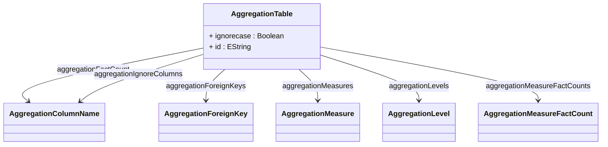

# AggregationTable

Abstract base class for pre-computed aggregation tables that dramatically improve OLAP query performance by storing pre-calculated summary data at various levels of granularity. Aggregation tables contain rolled-up measures and dimension keys that enable the OLAP engine to answer analytical queries from summary data rather than scanning millions of fact table rows. The aggregation system uses sophisticated matching algorithms to automatically select the most appropriate aggregation table based on query requirements, constraint compatibility, and rollup capabilities. Aggregations support superset matching where tables containing more detailed data than required can be used with additional rollup operations, and they handle complex scenarios including distinct count measures, foreign key relationships, and column mappings between fact and aggregation tables.
## Extends

## Attributes

<table>
  <thead>
    <tr>
      <th>Name</th>
      <th>Id</th>
      <th>Typ</th>
      <th>Lower</th>
      <th>Upper</th>
    </tr>
  </thead>
  <tbody>
    <tr>
      <td><strong>ignorecase</strong></td>
      <td>false</td>
      <td><em>Boolean</em></td>
      <td>0</td>
      <td>1</td>
    </tr>
    <tr>
      <td colspan="5"><em>Boolean flag that controls whether string comparisons during aggregation table matching and name resolution should be case-sensitive or case-insensitive. When set to true, the aggregation matching algorithm will treat table names, column names, and string-based identifiers in a case-insensitive manner, which is particularly useful in environments with inconsistent naming conventions or when working with databases that have varying case sensitivity behaviors. This setting affects how aggregation patterns match table names, how column mappings are resolved, and how the OLAP engine correlates aggregation table elements with fact table and cube definitions. Case-insensitive matching can improve robustness in heterogeneous environments but should be used carefully to avoid ambiguous matches.</em></td>
    </tr>
    <tr>
      <td><strong>id</strong></td>
      <td>true</td>
      <td><em>EString</em></td>
      <td>1</td>
      <td>1</td>
    </tr>
    <tr>
      <td colspan="5"><em>Unique identifier for this aggregation table within the catalog scope, serving as the primary key for referencing this aggregation definition from other OLAP model elements and internal system operations. The ID is used by the aggregation matching algorithm to track which aggregations have been evaluated, by logging and debugging systems to identify specific aggregation tables in performance analysis, and by administrative tools for aggregation management and monitoring. A well-chosen ID should be descriptive enough to identify the aggregation's purpose and scope while remaining concise for system efficiency, such as 'ProductMonthlySales' or 'CustomerRegionSummary'.</em></td>
    </tr>
  </tbody>
</table>

## References

<table>
  <thead>
    <tr>
      <th>Name</th>
      <th>Typ</th>
      <th>Lower</th>
      <th>Upper</th>
      <th>Containment</th>
    </tr>
  </thead>
  <tbody>
    <tr>
      <td><strong>aggregationFactCount</strong></td>
      <td>AggregationColumnName<a href="./class-AggregationColumnName">🔗</a></td>
      <td>1</td>
      <td>1</td>
      <td>true</td>
    </tr>
    <tr>
      <td colspan="5"><em>Required column that contains the count of fact table rows that were aggregated to produce each summary row in the aggregation table. The fact count is essential for data validation, debugging aggregation correctness, and enabling proper rollup operations when combining data from multiple aggregation levels. This count helps verify that aggregation calculations are accurate and provides metadata for understanding the density and coverage of aggregated data.</em></td>
    </tr>
    <tr>
      <td><strong>aggregationIgnoreColumns</strong></td>
      <td>AggregationColumnName<a href="./class-AggregationColumnName">🔗</a></td>
      <td>0</td>
      <td>&infin;</td>
      <td>true</td>
    </tr>
    <tr>
      <td colspan="5"><em>Collection of columns in the aggregation table that should be ignored during aggregation matching and query processing. These columns may contain metadata, audit information, or derived values that are not relevant for OLAP operations but exist in the aggregation table for administrative purposes. Ignoring irrelevant columns helps the aggregation matching algorithm focus on the essential data columns and prevents spurious match failures.</em></td>
    </tr>
    <tr>
      <td><strong>aggregationForeignKeys</strong></td>
      <td>AggregationForeignKey<a href="./class-AggregationForeignKey">🔗</a></td>
      <td>0</td>
      <td>&infin;</td>
      <td>true</td>
    </tr>
    <tr>
      <td colspan="5"><em>Collection of foreign key mappings that define the relationships between columns in the aggregation table and corresponding columns in the fact table. These mappings are crucial for ensuring that the OLAP engine can correctly correlate aggregated data with fact table structures, validate constraint compatibility, and generate proper SQL joins when aggregation tables are used in query processing. Foreign key mappings enable complex aggregation scenarios where dimension keys may be stored differently in aggregation tables compared to fact tables.</em></td>
    </tr>
    <tr>
      <td><strong>aggregationMeasures</strong></td>
      <td>AggregationMeasure<a href="./class-AggregationMeasure">🔗</a></td>
      <td>1</td>
      <td>&infin;</td>
      <td>true</td>
    </tr>
    <tr>
      <td colspan="5"><em>Collection of measure mappings that define how pre-aggregated measure values in the aggregation table correspond to measures in the fact table and cube definition. Each AggregationMeasure specifies the measure name, the aggregation table column containing the pre-computed values, and the rollup type (SUM, AVG, COUNT, etc.) that determines how values can be further aggregated when rolling up to higher levels. This mapping is critical for enabling the OLAP engine to substitute aggregation table data for fact table scans, with measures like Sales Amount typically using SUM rollup, while distinct count measures require special handling to maintain accuracy across aggregation levels. The system supports complex measure scenarios including calculated measures, currency conversions, and weighted averages through appropriate rollup type specifications.</em></td>
    </tr>
    <tr>
      <td><strong>aggregationLevels</strong></td>
      <td>AggregationLevel<a href="./class-AggregationLevel">🔗</a></td>
      <td>0</td>
      <td>&infin;</td>
      <td>true</td>
    </tr>
    <tr>
      <td colspan="5"><em>Collection of dimension level mappings that specify which dimensional granularities are represented in this aggregation table and how they map to aggregation table columns. Each AggregationLevel defines the connection between a dimension level (such as Product Category, Time Month, or Geography State) and the corresponding column in the aggregation table that contains the level's key values. These mappings enable the OLAP engine's aggregation matching algorithm to determine whether a given aggregation table can satisfy a query's dimensional requirements, support proper constraint propagation, and enable rollup operations when the aggregation contains more detailed levels than required by the query. Level mappings also support collapsed hierarchies where intermediate levels are skipped, caption columns for display purposes, and level properties for additional dimensional attributes stored in the aggregation table.</em></td>
    </tr>
    <tr>
      <td><strong>aggregationMeasureFactCounts</strong></td>
      <td>AggregationMeasureFactCount<a href="./class-AggregationMeasureFactCount">🔗</a></td>
      <td>0</td>
      <td>&infin;</td>
      <td>true</td>
    </tr>
    <tr>
      <td colspan="5"><em>Collection of specialized fact count mappings for individual measures that require separate counting logic or validation. While the main aggregationFactCount provides an overall row count for the aggregation, AggregationMeasureFactCount entries enable measure-specific fact counting scenarios such as handling null values, distinct count validation, or weighted fact counting for complex measures. This is particularly important for aggregations containing multiple measures with different data availability patterns, where each measure may have been calculated from a different number of source fact records due to null value handling, data filtering, or conditional aggregation logic. These specialized counts support advanced aggregation validation, debugging, and rollup accuracy verification.</em></td>
    </tr>
  </tbody>
</table>

## Used by

- TableQuery[🔗](./class-TableQuery) → aggregationTables

## ClassDiagramm

