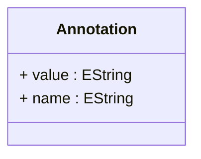

# Annotation

Represents a custom annotation that can be attached to any AbstractElement to provide additional metadata, configuration hints, or processing instructions. Annotations enable extensibility of the OLAP schema without modifying the core model, allowing for vendor-specific extensions, optimization hints, caching directives, or integration parameters. These are commonly used for custom aggregation rules, display formatting, security policies, or ETL processing instructions.
## Extends

## Attributes

<table>
  <thead>
    <tr>
      <th>Name</th>
      <th>Id</th>
      <th>Typ</th>
      <th>Lower</th>
      <th>Upper</th>
    </tr>
  </thead>
  <tbody>
    <tr>
      <td><strong>value</strong></td>
      <td>false</td>
      <td><em>EString</em></td>
      <td>0</td>
      <td>1</td>
    </tr>
    <tr>
      <td colspan="5"><em>The content or payload of the annotation. This contains the actual data, configuration values, or instructions associated with the annotation. For example, this might contain JSON configuration, XML settings, SQL hints, or simple string values that guide processing behavior. The interpretation of this value depends on the annotation name and the consuming system.</em></td>
    </tr>
    <tr>
      <td><strong>name</strong></td>
      <td>false</td>
      <td><em>EString</em></td>
      <td>0</td>
      <td>1</td>
    </tr>
    <tr>
      <td colspan="5"><em>The name or key that identifies the type and purpose of this annotation. This serves as a namespace identifier that determines how the annotation value should be interpreted. Common examples include 'cache.timeout', 'security.policy', 'display.formatter', or 'aggregation.hint'. The name should follow a hierarchical naming convention to avoid conflicts between different annotation providers.</em></td>
    </tr>
  </tbody>
</table>

## References

<table>
  <thead>
    <tr>
      <th>Name</th>
      <th>Typ</th>
      <th>Lower</th>
      <th>Upper</th>
      <th>Containment</th>
    </tr>
  </thead>
  <tbody>
  </tbody>
</table>

## Used by

- AbstractElement[🔗](./class-AbstractElement) → annotations
- Translation[🔗](./class-Translation) → annotations

## ClassDiagramm

