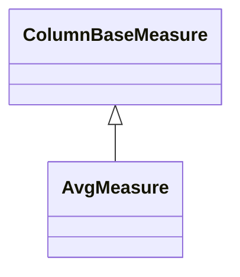

# AvgMeasure

A measure that calculates the arithmetic mean (average) of all values from the referenced column across the aggregated data set. AvgMeasure uses the SQL AVG() aggregate function and is ideal for metrics like average price, mean rating, typical duration, or average temperature. The measure provides semi-additive behavior - averages cannot be simply summed across dimensions but must be recalculated using the underlying sum and count values. This measure type is commonly used for performance indicators, quality metrics, and statistical analysis in business intelligence scenarios.
## Extends
- ColumnBaseMeasure [🔗](./class-ColumnBaseMeasure)
## Attributes

<table>
  <thead>
    <tr>
      <th>Name</th>
      <th>Id</th>
      <th>Typ</th>
      <th>Lower</th>
      <th>Upper</th>
    </tr>
  </thead>
  <tbody>
  </tbody>
</table>

## References

<table>
  <thead>
    <tr>
      <th>Name</th>
      <th>Typ</th>
      <th>Lower</th>
      <th>Upper</th>
      <th>Containment</th>
    </tr>
  </thead>
  <tbody>
  </tbody>
</table>

## Used by

## ClassDiagramm

