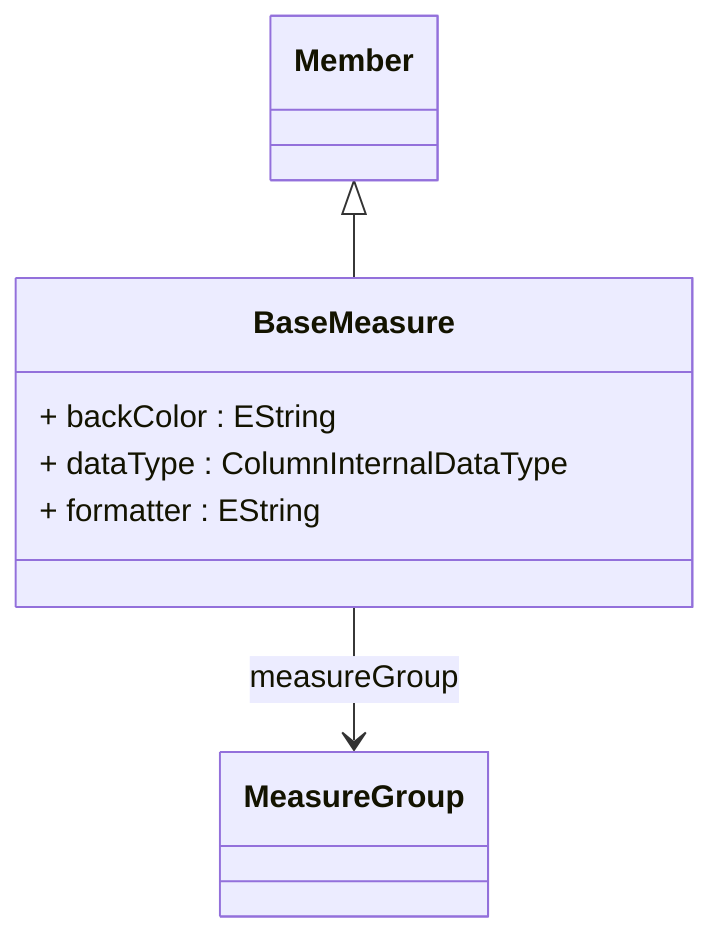

# BaseMeasure

Abstract base class for all measure types in the OLAP model, representing quantitative facts that can be analyzed and aggregated in multidimensional queries. BaseMeasure extends Member to leverage the OLAP member infrastructure while adding measure-specific capabilities like data type specification, formatting rules, and aggregation behavior. All concrete measure implementations (SumMeasure, CountMeasure, etc.) inherit from this class, ensuring consistent measure behavior and enabling polymorphic measure handling throughout the OLAP framework. Measures are special members that belong to the [Measures] dimension and provide the numeric values for analytical operations.
## Extends
- Member [🔗](./class-Member)
## Attributes

<table>
  <thead>
    <tr>
      <th>Name</th>
      <th>Id</th>
      <th>Typ</th>
      <th>Lower</th>
      <th>Upper</th>
    </tr>
  </thead>
  <tbody>
    <tr>
      <td><strong>backColor</strong></td>
      <td>false</td>
      <td><em>EString</em></td>
      <td>0</td>
      <td>1</td>
    </tr>
    <tr>
      <td colspan="5"><em>Background color specification for this measure when displayed in OLAP clients and reporting tools. The color value should follow standard color notation (e.g., hex colors like '#FF0000', RGB values, or color names). This visual formatting helps users quickly identify and differentiate measures in pivot tables, charts, and other analytical displays, particularly useful for highlighting important KPIs or categorizing related measures.</em></td>
    </tr>
    <tr>
      <td><strong>dataType</strong></td>
      <td>false</td>
      <td><em>ColumnInternalDataType<a href="./enum-ColumnInternalDataType">🔗</a></em></td>
      <td>0</td>
      <td>1</td>
    </tr>
    <tr>
      <td colspan="5"><em>Data type specification for this measure that determines how values are processed, stored, and displayed. The data type affects aggregation behavior, formatting options, and client tool integration. Common types include INTEGER for counts, NUMERIC for monetary amounts, DECIMAL for precise calculations, and DOUBLE for statistical measures. This information is used by the OLAP engine for type validation, optimization, and proper value handling across different database systems.</em></td>
    </tr>
    <tr>
      <td><strong>formatter</strong></td>
      <td>false</td>
      <td><em>EString</em></td>
      <td>0</td>
      <td>1</td>
    </tr>
    <tr>
      <td colspan="5"><em>Formatter specification that controls how this measure's values are displayed in client applications. The formatter can reference predefined format patterns, custom formatting functions, or specific formatting rules. This ensures consistent presentation of measure values across different analytical tools and reports, handling aspects like decimal places, currency symbols, percentage notation, and locale-specific formatting.</em></td>
    </tr>
  </tbody>
</table>

## References

<table>
  <thead>
    <tr>
      <th>Name</th>
      <th>Typ</th>
      <th>Lower</th>
      <th>Upper</th>
      <th>Containment</th>
    </tr>
  </thead>
  <tbody>
    <tr>
      <td><strong>measureGroup</strong></td>
      <td>MeasureGroup<a href="./class-MeasureGroup">🔗</a></td>
      <td>1</td>
      <td>1</td>
      <td>false</td>
    </tr>
    <tr>
      <td colspan="5"><em>Reference to the measure group that contains and organizes this measure. Every measure must belong to exactly one measure group, which provides logical organization, metadata management, and context for the measure within its cube. The measure group relationship enables proper measure categorization, shared properties, and structured navigation in OLAP client tools.</em></td>
    </tr>
  </tbody>
</table>

## Used by

- VirtualCube[🔗](./class-VirtualCube) → referencedMeasures
- MeasureGroup[🔗](./class-MeasureGroup) → measures
- DrillThroughAction[🔗](./class-DrillThroughAction) → drillThroughMeasure

## ClassDiagramm

