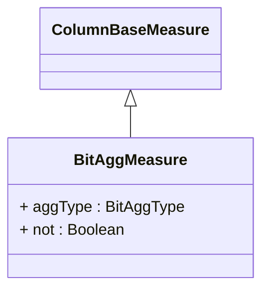

# BitAggMeasure

A specialized measure that performs bitwise operations (AND, OR, XOR) on integer values from the referenced column across the aggregated data set. BitAggMeasure is designed for scenarios involving flag combinations, permission masks, feature toggles, or binary state aggregations. The measure supports different bitwise operations and optional negation (NOT) to create complex boolean logic evaluations. Common use cases include combining user permissions, aggregating feature flags, analyzing system status bits, or creating composite boolean indicators from multiple binary conditions.
## Extends
- ColumnBaseMeasure [🔗](./class-ColumnBaseMeasure)
## Attributes

<table>
  <thead>
    <tr>
      <th>Name</th>
      <th>Id</th>
      <th>Typ</th>
      <th>Lower</th>
      <th>Upper</th>
    </tr>
  </thead>
  <tbody>
    <tr>
      <td><strong>aggType</strong></td>
      <td>false</td>
      <td><em>BitAggType<a href="./enum-BitAggType">🔗</a></em></td>
      <td>0</td>
      <td>1</td>
    </tr>
    <tr>
      <td colspan="5"><em>Specifies the type of bitwise operation to perform during aggregation. Supported operations include AND (all bits must be set), OR (any bit can be set), and XOR (exclusive or for detecting unique combinations). The choice of operation determines how individual bit values are combined across the aggregated data set, enabling different logical interpretations of the binary data.</em></td>
    </tr>
    <tr>
      <td><strong>not</strong></td>
      <td>false</td>
      <td><em>Boolean</em></td>
      <td>0</td>
      <td>1</td>
    </tr>
    <tr>
      <td colspan="5"><em>Boolean flag that applies logical negation (NOT operation) to the result of the bitwise aggregation. When set to true, the final result is inverted, creating operations like NAND, NOR, or NXOR. This enables complex boolean logic scenarios and inverted conditions without requiring separate calculated members or custom expressions.</em></td>
    </tr>
  </tbody>
</table>

## References

<table>
  <thead>
    <tr>
      <th>Name</th>
      <th>Typ</th>
      <th>Lower</th>
      <th>Upper</th>
      <th>Containment</th>
    </tr>
  </thead>
  <tbody>
  </tbody>
</table>

## Used by

## ClassDiagramm

