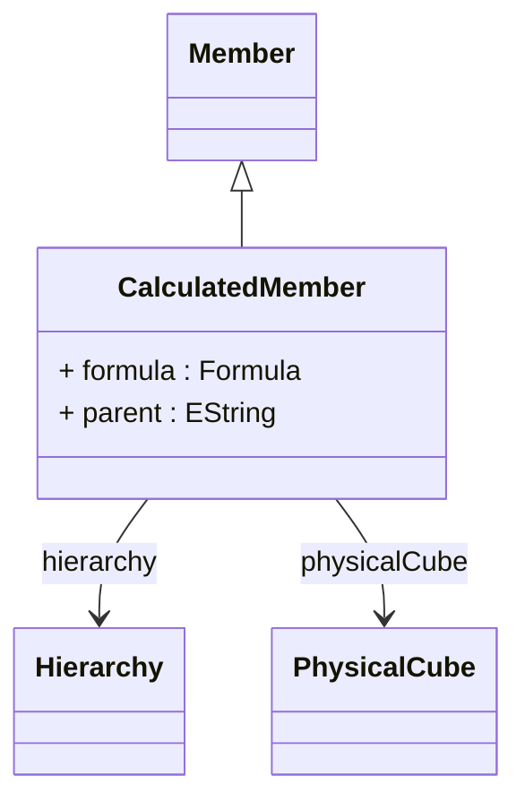

# CalculatedMember

Represents sophisticated computed members that are dynamically calculated using MDX expressions, enabling powerful analytical capabilities including complex business logic, mathematical computations, conditional calculations, and cross-dimensional analysis that extend far beyond the capabilities of standard dimensional members stored in database tables. CalculatedMember provides the foundation for advanced analytical modeling where business requirements necessitate dynamic member creation based on complex formulas, business rules, or computational logic that cannot be pre-calculated and stored in traditional dimensional tables. This capability is essential for sophisticated business intelligence applications that require flexible, formula-driven analytical constructs including financial analysis where calculated members can implement complex financial ratios, variance calculations, and performance indicators that combine multiple underlying measures with sophisticated mathematical relationships, time-based analysis where calculated members can implement period-over-period comparisons, year-to-date calculations, moving averages, and other temporal analytical patterns, comparative analysis where calculated members can create dynamic groupings, rankings, and statistical measures that adapt to current data conditions and filtering contexts, and business process modeling where calculated members can encapsulate complex business rules, approval workflows, and decision logic that reflects organizational policies and procedures. Calculated members integrate seamlessly with the MDX query processing engine to provide optimal performance through intelligent caching, support hierarchical placement within existing dimensional structures, and enable sophisticated analytical scenarios where computed business logic can coexist with traditional dimensional navigation and member selection capabilities.
## Extends
- Member [🔗](./class-Member)
## Attributes

<table>
  <thead>
    <tr>
      <th>Name</th>
      <th>Id</th>
      <th>Typ</th>
      <th>Lower</th>
      <th>Upper</th>
    </tr>
  </thead>
  <tbody>
    <tr>
      <td><strong>formula</strong></td>
      <td>false</td>
      <td><em>Formula</em></td>
      <td>0</td>
      <td>1</td>
    </tr>
    <tr>
      <td colspan="5"><em>MDX expression that defines the calculation logic for this computed member, encapsulating sophisticated business rules, mathematical formulations, and analytical computations that determine the member's value based on other measures, members, and dimensional context. The formula serves as the computational heart of the calculated member, enabling complex analytical scenarios including financial ratio calculations that combine multiple measures with mathematical operations, time-based calculations that implement period-over-period comparisons and trend analysis, conditional logic that applies different calculation rules based on dimensional attributes or member properties, and cross-dimensional calculations that aggregate or transform data across multiple analytical perspectives. This formula specification supports the full range of MDX capabilities including set operations for member selection and filtering, statistical functions for advanced analytical computations, hierarchical navigation for parent-child calculations and drill-up operations, and temporal functions for time-based analysis and forecasting scenarios. The formula enables sophisticated business intelligence applications where calculated members serve as reusable analytical building blocks that encapsulate complex business logic, ensure consistent calculation methodologies across analytical applications, and provide performance optimization through intelligent caching and query optimization strategies that enable real-time analytical computations across large data volumes and complex multidimensional structures.</em></td>
    </tr>
    <tr>
      <td><strong>parent</strong></td>
      <td>false</td>
      <td><em>EString</em></td>
      <td>0</td>
      <td>1</td>
    </tr>
    <tr>
      <td colspan="5"><em>MDX expression that identifies the parent member within the dimensional hierarchy where this calculated member should be positioned, establishing the hierarchical context and navigational placement that determines how the calculated member appears in dimensional browsers, OLAP client tools, and analytical applications. The parent specification enables sophisticated calculated member organization where computed members can be logically grouped with related dimensional concepts, positioned at appropriate hierarchical levels for intuitive user navigation, and integrated seamlessly with existing dimensional structures to provide cohesive analytical experiences. This hierarchical positioning is crucial for enterprise business intelligence deployments where calculated members must be organized in meaningful ways that reflect business logic and user mental models, supporting scenarios such as financial calculated members that are grouped under appropriate account hierarchies, performance indicators that are positioned within relevant organizational or product hierarchies, and analytical ratios that are placed alongside related operational or strategic metrics. The parent specification also enables sophisticated calculated member inheritance and scoping behaviors where calculated members can access parent-level context, participate in hierarchical aggregation patterns, and maintain proper analytical relationships with both stored and computed members throughout the dimensional structure while ensuring optimal query performance and user experience consistency across complex multidimensional analytical applications.</em></td>
    </tr>
  </tbody>
</table>

## References

<table>
  <thead>
    <tr>
      <th>Name</th>
      <th>Typ</th>
      <th>Lower</th>
      <th>Upper</th>
      <th>Containment</th>
    </tr>
  </thead>
  <tbody>
    <tr>
      <td><strong>hierarchy</strong></td>
      <td>Hierarchy<a href="./class-Hierarchy">🔗</a></td>
      <td>0</td>
      <td>1</td>
      <td>false</td>
    </tr>
    <tr>
      <td colspan="5"><em>Reference to the Hierarchy within which this calculated member should be positioned, establishing the dimensional context that determines the member's analytical scope, navigational placement, and integration with existing hierarchical structures. The hierarchy reference defines the analytical domain where the calculated member will be available for selection, filtering, and navigation operations, ensuring that computed members integrate seamlessly with dimensional browsing, member selection, and hierarchical drill-down capabilities provided by OLAP client applications and business intelligence tools. This hierarchical association is essential for sophisticated analytical modeling where calculated members must participate in dimensional analysis patterns, support hierarchical aggregation behaviors, and maintain proper analytical relationships with stored members throughout the dimensional structure. The hierarchy reference enables complex analytical scenarios including cross-hierarchical calculated members that can reference members from multiple hierarchies, hierarchical calculated member families where related computed members are organized within specific dimensional contexts, and dynamic calculated member placement where computed members can be positioned at different hierarchical levels based on analytical requirements and business logic. Enterprise implementations leverage the hierarchy reference for advanced analytical architectures including calculated member security integration where access controls are applied at the hierarchical level, calculated member caching strategies that optimize performance based on hierarchical usage patterns, and calculated member federation scenarios where computed members are distributed across multiple hierarchical contexts while maintaining unified analytical behavior and consistent user experience across complex multidimensional business intelligence environments.</em></td>
    </tr>
    <tr>
      <td><strong>physicalCube</strong></td>
      <td>PhysicalCube<a href="./class-PhysicalCube">🔗</a></td>
      <td>1</td>
      <td>1</td>
      <td>false</td>
    </tr>
    <tr>
      <td colspan="5"><em>Required reference to the PhysicalCube that contains and manages this calculated member, establishing the analytical context and data scope within which the calculated member operates and ensuring proper integration with the cube's dimensional structure, measure definitions, and query processing capabilities. The physical cube reference defines the analytical environment where the calculated member can access fact data, reference other measures and members, and participate in multidimensional analysis operations including slicing, dicing, drilling, and pivoting across the cube's dimensional space. This containment relationship is fundamental to the calculated member's functionality and performance, providing access to the cube's optimization strategies, caching mechanisms, and query processing infrastructure that enable efficient evaluation of complex calculated member expressions across large data volumes and sophisticated analytical scenarios. The physical cube reference supports advanced analytical architectures where calculated members can leverage cube-specific aggregation tables, dimensional hierarchies, and security contexts to provide optimal performance and appropriate access control while maintaining analytical consistency and business logic integrity. Enterprise implementations utilize the physical cube reference for sophisticated calculated member management including cube-level calculated member libraries that provide reusable analytical components, calculated member versioning strategies that enable analytical evolution while maintaining backward compatibility, and calculated member federation patterns where computed members can be shared across related cubes while maintaining proper analytical context and performance optimization characteristics specific to each cube's data structure and usage patterns.</em></td>
    </tr>
  </tbody>
</table>

## Used by

- Cube[🔗](./class-Cube) → calculatedMembers
- VirtualCube[🔗](./class-VirtualCube) → referencedCalculatedMembers

## ClassDiagramm

