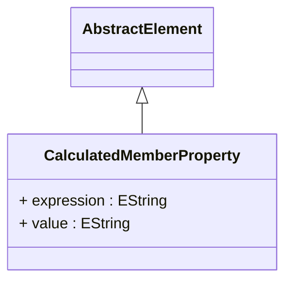

# CalculatedMemberProperty

Defines additional metadata properties and behavioral characteristics for calculated members, providing sophisticated customization capabilities that control how computed members appear, behave, and integrate within analytical applications and business intelligence tools. CalculatedMemberProperty enables advanced calculated member configuration where computed members can be enhanced with specialized attributes, formatting rules, display characteristics, and behavioral modifiers that optimize their presentation and functionality within different analytical contexts and user interface environments. This property system is essential for enterprise OLAP deployments where calculated members must be precisely configured to provide optimal user experiences, support complex business requirements, and integrate seamlessly with diverse analytical applications and reporting tools that have varying presentation and functional requirements. The property framework supports sophisticated calculated member management scenarios including visual formatting properties that control how calculated members appear in client applications, behavioral properties that modify calculated member interaction patterns and query behavior, metadata properties that provide additional descriptive information for documentation and administrative purposes, and integration properties that enable calculated members to work optimally with specific analytical tools and business intelligence platforms. Advanced implementations leverage calculated member properties for comprehensive member lifecycle management including property inheritance patterns where calculated members can inherit characteristics from parent members or hierarchical contexts, dynamic property evaluation where property values can be computed based on runtime conditions and analytical context, and property federation scenarios where calculated member characteristics can be shared and synchronized across distributed analytical environments while maintaining consistent behavior and appearance standards.
## Extends
- AbstractElement [🔗](./class-AbstractElement)
## Attributes

<table>
  <thead>
    <tr>
      <th>Name</th>
      <th>Id</th>
      <th>Typ</th>
      <th>Lower</th>
      <th>Upper</th>
    </tr>
  </thead>
  <tbody>
    <tr>
      <td><strong>expression</strong></td>
      <td>false</td>
      <td><em>EString</em></td>
      <td>0</td>
      <td>1</td>
    </tr>
    <tr>
      <td colspan="5"><em>MDX expression that dynamically calculates the value of this calculated member property based on analytical context, dimensional relationships, and computational logic that can adapt to different query scenarios and data conditions. The expression provides sophisticated property value determination where calculated member properties can be computed based on current member context, related dimensional attributes, measure values, and complex business rules that reflect organizational policies and analytical requirements. This dynamic expression capability is essential for advanced calculated member implementations where property values must adapt to different analytical scenarios, supporting use cases such as conditional formatting properties that change based on performance thresholds, contextual display properties that adapt to user roles or dimensional filters, calculated descriptive properties that combine multiple data elements into meaningful business descriptions, and dynamic behavioral properties that modify calculated member interaction patterns based on current analytical context. The expression supports the full range of MDX computational capabilities including string manipulation functions for descriptive property generation, conditional logic for context-aware property values, mathematical operations for computed property calculations, and dimensional navigation for accessing related member attributes and hierarchical context. Advanced implementations leverage the expression system for sophisticated property management scenarios including property inheritance where calculated properties can be derived from parent members or hierarchical context, property composition where multiple expressions combine to create complex property values, and property federation where calculated properties can access distributed data sources while maintaining optimal query performance and analytical consistency across enterprise business intelligence environments.</em></td>
    </tr>
    <tr>
      <td><strong>value</strong></td>
      <td>false</td>
      <td><em>EString</em></td>
      <td>0</td>
      <td>1</td>
    </tr>
    <tr>
      <td colspan="5"><em>Static string value for this calculated member property when dynamic expression evaluation is not required, providing a simple and efficient mechanism for setting fixed property values that do not change based on analytical context or computational logic. The static value approach is optimal for calculated member properties that have predetermined, unchanging characteristics such as fixed formatting specifications, constant display attributes, static descriptive text, or invariant behavioral flags that apply consistently across all analytical scenarios and usage contexts. This static specification is essential for performance-critical scenarios where property evaluation overhead must be minimized while still providing essential calculated member customization and configuration capabilities. The value specification supports sophisticated calculated member management where static properties can be combined with dynamic expressions to create hybrid property systems that balance performance optimization with analytical flexibility, enabling scenarios such as base property values that can be overridden by contextual expressions, default property settings that apply when dynamic calculations are not available, and fallback property values that ensure consistent calculated member behavior across different analytical environments and application contexts. Advanced implementations utilize static property values for comprehensive calculated member configuration including property templating where standard property sets can be applied to multiple calculated members, property inheritance where static values can be propagated through calculated member hierarchies, and property standardization where consistent property values ensure uniform calculated member behavior and appearance across enterprise business intelligence deployments while maintaining optimal query performance and system efficiency.</em></td>
    </tr>
  </tbody>
</table>

## References

<table>
  <thead>
    <tr>
      <th>Name</th>
      <th>Typ</th>
      <th>Lower</th>
      <th>Upper</th>
      <th>Containment</th>
    </tr>
  </thead>
  <tbody>
  </tbody>
</table>

## Used by

- Member[🔗](./class-Member) → calculatedMemberProperties

## ClassDiagramm

