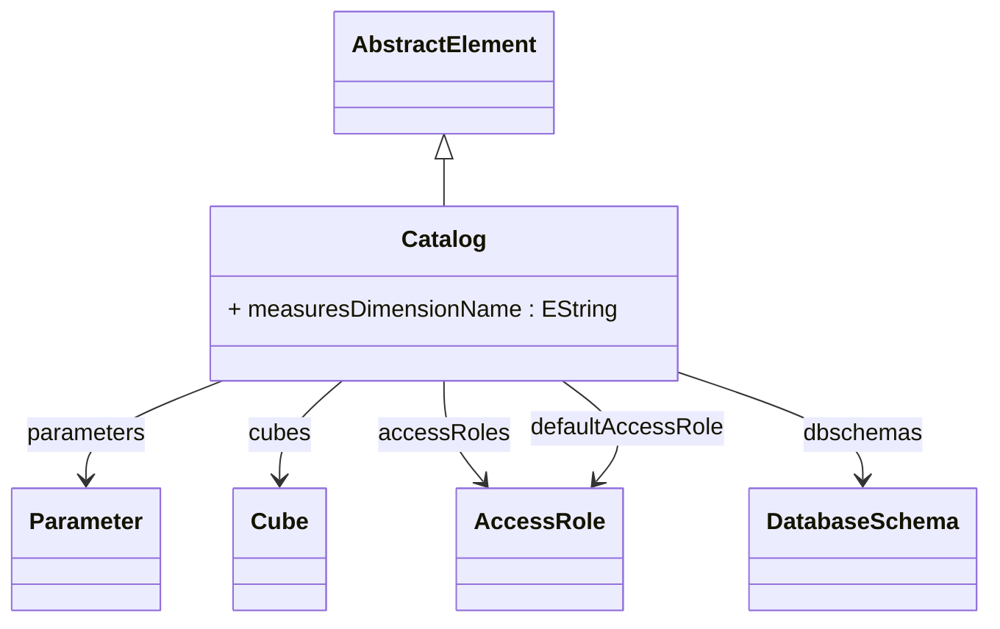

# Catalog

The root container of an OLAP schema that defines a complete analytical database. A Catalog represents a logical grouping of related cubes, dimensions, and data sources that together form a cohesive analytical model for a specific business domain or application. It serves as the top-level entry point for OLAP connections and contains all the metadata necessary to perform multidimensional analysis. The Catalog manages shared resources like dimension hierarchies, access roles, parameters, and database schema references, ensuring consistency and reusability across all contained analytical objects. In XMLA terms, this corresponds to a database or catalog that clients can connect to and browse.
## Extends
- AbstractElement [🔗](./class-AbstractElement)
## Attributes

<table>
  <thead>
    <tr>
      <th>Name</th>
      <th>Id</th>
      <th>Typ</th>
      <th>Lower</th>
      <th>Upper</th>
    </tr>
  </thead>
  <tbody>
    <tr>
      <td><strong>measuresDimensionName</strong></td>
      <td>false</td>
      <td><em>EString</em></td>
      <td>0</td>
      <td>1</td>
    </tr>
    <tr>
      <td colspan="5"><em>Optional custom name for the measures dimension that appears in MDX queries and XMLA metadata. By default, the measures dimension is named 'Measures', but this can be customized for localization or business terminology preferences. The measures dimension is a special system dimension that contains all the measures (metrics) available for analysis in each cube. This name appears in MDX syntax like [CustomMeasuresName].[Sales Amount] and in client tool dimension lists.</em></td>
    </tr>
  </tbody>
</table>

## References

<table>
  <thead>
    <tr>
      <th>Name</th>
      <th>Typ</th>
      <th>Lower</th>
      <th>Upper</th>
      <th>Containment</th>
    </tr>
  </thead>
  <tbody>
    <tr>
      <td><strong>parameters</strong></td>
      <td>Parameter<a href="./class-Parameter">🔗</a></td>
      <td>0</td>
      <td>&infin;</td>
      <td>true</td>
    </tr>
    <tr>
      <td colspan="5"><em>Collection of schema-level parameters that provide dynamic behavior and configuration within the schema. Parameters enable runtime customization of schema elements, user-specific settings, and conditional logic in calculations. These parameters are available throughout the schema for use in calculated members, named sets, security expressions, and custom formatting. Common uses include date ranges for time intelligence, user preferences, locale settings, and business rule toggles.</em></td>
    </tr>
    <tr>
      <td><strong>cubes</strong></td>
      <td>Cube<a href="./class-Cube">🔗</a></td>
      <td>1</td>
      <td>&infin;</td>
      <td>false</td>
    </tr>
    <tr>
      <td colspan="5"><em>Collection of cubes (both physical and virtual) that define the analytical content available in this catalog. Each cube represents a specific analytical perspective on the business data, containing measures for analysis and dimensions for slicing and dicing. Physical cubes map directly to fact tables and provide the foundation for analysis, while virtual cubes combine multiple physical cubes to create unified analytical views. While not strictly required, at least one cube is typically defined to provide analytical functionality.</em></td>
    </tr>
    <tr>
      <td><strong>accessRoles</strong></td>
      <td>AccessRole<a href="./class-AccessRole">🔗</a></td>
      <td>0</td>
      <td>&infin;</td>
      <td>false</td>
    </tr>
    <tr>
      <td colspan="5"><em>Collection of security roles that define access control policies for the schema and its contents. Each role specifies what cubes, dimensions, hierarchies, levels, and members a user or group can access, along with the specific permissions (read, write, drill-through) for each resource. Roles can be combined to create complex security scenarios and support both broad organizational permissions and fine-grained data restrictions. These roles are enforced by the OLAP engine during query execution and metadata discovery.</em></td>
    </tr>
    <tr>
      <td><strong>defaultAccessRole</strong></td>
      <td>AccessRole<a href="./class-AccessRole">🔗</a></td>
      <td>0</td>
      <td>1</td>
      <td>false</td>
    </tr>
    <tr>
      <td colspan="5"><em>Reference to the access role that should be applied by default when users connect without explicit role assignment. This provides a baseline security policy for the schema, typically configured to allow basic read access to public data while restricting sensitive information. If not specified, Daanse does not assign a built-in default role, and access will be denied unless a role is explicitly provided. This setting is particularly useful for public reporting scenarios, shared dashboards, or development environments where default read access is desirable.</em></td>
    </tr>
    <tr>
      <td><strong>dbschemas</strong></td>
      <td>DatabaseSchema<a href="./class-DatabaseSchema">🔗</a></td>
      <td>0</td>
      <td>&infin;</td>
      <td>false</td>
    </tr>
    <tr>
      <td colspan="5"><em>Collection of database schemas that define the physical data model underlying this catalog. Each DatabaseSchema represents a logical grouping of tables, views, and columns from one or more physical databases. The catalog can integrate data from multiple database schemas, enabling cross-database analysis and federated OLAP scenarios. These schemas provide the foundation for all cube queries and define the available tables and columns for fact tables, dimension tables, and lookup tables.</em></td>
    </tr>
  </tbody>
</table>

## Used by

## ClassDiagramm

