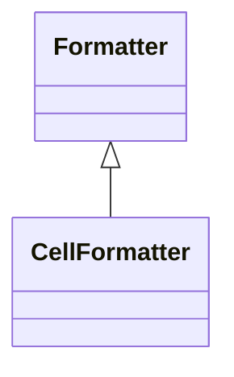

# CellFormatter

Specialized formatter for controlling the presentation of cell values in analytical grids, pivot tables, and other tabular presentations, providing sophisticated capabilities for transforming raw measure values into compelling, contextually appropriate visual displays that enhance user comprehension and support effective business communication.

## Extends
- Formatter [🔗](./class-Formatter)
## Attributes

<table>
  <thead>
    <tr>
      <th>Name</th>
      <th>Id</th>
      <th>Typ</th>
      <th>Lower</th>
      <th>Upper</th>
    </tr>
  </thead>
  <tbody>
  </tbody>
</table>

## References

<table>
  <thead>
    <tr>
      <th>Name</th>
      <th>Typ</th>
      <th>Lower</th>
      <th>Upper</th>
      <th>Containment</th>
    </tr>
  </thead>
  <tbody>
  </tbody>
</table>

## Used by

- Member[🔗](./class-Member) → cellFormatter

## ClassDiagramm

