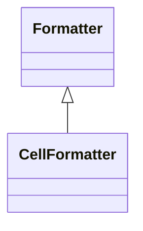

# CellFormatter

Specialized formatter for controlling the presentation of cell values in analytical grids, pivot tables, and other tabular presentations, providing sophisticated capabilities for transforming raw measure values into compelling, contextually appropriate visual displays that enhance user comprehension and support effective business communication. CellFormatter enables advanced presentation scenarios including conditional formatting where cell appearance changes based on value thresholds, performance indicators, or business rules, currency and numeric formatting that respects cultural conventions and business standards, percentage and ratio displays with appropriate precision and scaling, exception highlighting where unusual values are visually emphasized through colors, fonts, or symbols, and trend indicators that can show directional changes or performance status through visual cues. This specialized formatting capability is essential for executive dashboards where quick visual assessment of performance is critical, financial reporting where precise numeric presentation and regulatory compliance are required, operational monitoring where exception conditions need immediate visual identification, and comparative analysis where subtle differences in values need to be clearly communicated through appropriate visual emphasis and scaling.
## Extends
- Formatter [🔗](./class-Formatter)
## Attributes

<table>
  <thead>
    <tr>
      <th>Name</th>
      <th>Id</th>
      <th>Typ</th>
      <th>Lower</th>
      <th>Upper</th>
    </tr>
  </thead>
  <tbody>
  </tbody>
</table>

## References

<table>
  <thead>
    <tr>
      <th>Name</th>
      <th>Typ</th>
      <th>Lower</th>
      <th>Upper</th>
      <th>Containment</th>
    </tr>
  </thead>
  <tbody>
  </tbody>
</table>

## Used by

- Member[🔗](./class-Member) → cellFormatter

## ClassDiagramm

