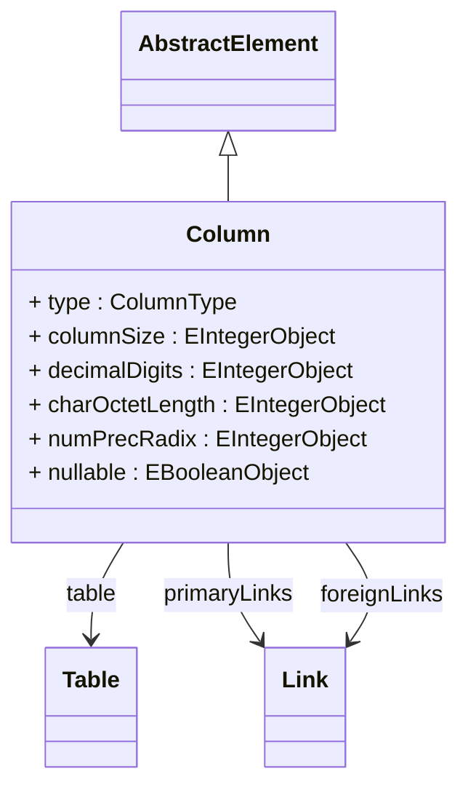

# Column

Abstract base class for database columns that define data structure and metadata for OLAP mappings. Column provides common attributes for data type, size, and constraints used in dimensional modeling and measure definitions.
## Extends
- AbstractElement [🔗](./class-AbstractElement)
## Attributes

<table>
  <thead>
    <tr>
      <th>Name</th>
      <th>Id</th>
      <th>Typ</th>
      <th>Lower</th>
      <th>Upper</th>
    </tr>
  </thead>
  <tbody>
    <tr>
      <td><strong>type</strong></td>
      <td>false</td>
      <td><em>ColumnType<a href="./enum-ColumnType">🔗</a></em></td>
      <td>0</td>
      <td>1</td>
    </tr>
    <tr>
      <td colspan="5"><em>Data type of the column specifying the kind of data stored. Column type determines how data is processed in OLAP operations and dimensional mappings. Defaults to Varchar.</em></td>
    </tr>
    <tr>
      <td><strong>columnSize</strong></td>
      <td>false</td>
      <td><em>EIntegerObject</em></td>
      <td>0</td>
      <td>1</td>
    </tr>
    <tr>
      <td colspan="5"><em>Maximum size or length of data that can be stored in this column. For character types, specifies maximum character count; for numeric types, specifies precision.</em></td>
    </tr>
    <tr>
      <td><strong>decimalDigits</strong></td>
      <td>false</td>
      <td><em>EIntegerObject</em></td>
      <td>0</td>
      <td>1</td>
    </tr>
    <tr>
      <td colspan="5"><em>Number of digits to the right of the decimal point for numeric columns. Specifies the scale for decimal and numeric data types used in measure calculations.</em></td>
    </tr>
    <tr>
      <td><strong>charOctetLength</strong></td>
      <td>false</td>
      <td><em>EIntegerObject</em></td>
      <td>0</td>
      <td>1</td>
    </tr>
    <tr>
      <td colspan="5"><em>Maximum length in bytes for character data types. Specifies the storage space required for variable-length character columns in the database.</em></td>
    </tr>
    <tr>
      <td><strong>numPrecRadix</strong></td>
      <td>false</td>
      <td><em>EIntegerObject</em></td>
      <td>0</td>
      <td>1</td>
    </tr>
    <tr>
      <td colspan="5"><em>Radix for numeric precision, typically 10 for decimal or 2 for binary numeric types. Defines the base for interpreting the precision value of numeric columns.</em></td>
    </tr>
    <tr>
      <td><strong>nullable</strong></td>
      <td>false</td>
      <td><em>EBooleanObject</em></td>
      <td>0</td>
      <td>1</td>
    </tr>
    <tr>
      <td colspan="5"><em>Boolean flag indicating whether the column can contain null values. Critical for OLAP operations as null handling affects aggregation calculations and dimensional member processing.</em></td>
    </tr>
  </tbody>
</table>

## References

<table>
  <thead>
    <tr>
      <th>Name</th>
      <th>Typ</th>
      <th>Lower</th>
      <th>Upper</th>
      <th>Containment</th>
    </tr>
  </thead>
  <tbody>
    <tr>
      <td><strong>table</strong></td>
      <td>Table<a href="./class-Table">🔗</a></td>
      <td>0</td>
      <td>1</td>
      <td>false</td>
    </tr>
    <tr>
      <td colspan="5"><em>Reference to the parent table that contains this column. Establishes the table-column relationship for proper database structure organization.</em></td>
    </tr>
    <tr>
      <td><strong>primaryLinks</strong></td>
      <td>Link<a href="./class-Link">🔗</a></td>
      <td>0</td>
      <td>&infin;</td>
      <td>false</td>
    </tr>
    <tr>
      <td colspan="5"><em>Collection of links where this column serves as the primary key. These links define relationships where this column is the target of foreign key references from other tables.</em></td>
    </tr>
    <tr>
      <td><strong>foreignLinks</strong></td>
      <td>Link<a href="./class-Link">🔗</a></td>
      <td>0</td>
      <td>&infin;</td>
      <td>false</td>
    </tr>
    <tr>
      <td colspan="5"><em>Collection of links where this column acts as a foreign key referencing primary keys in other tables. These links establish dimensional relationships in OLAP schemas.</em></td>
    </tr>
  </tbody>
</table>

## Used by

- CustomMeasure[🔗](./class-CustomMeasure) → columns
- ColumnBaseMeasure[🔗](./class-ColumnBaseMeasure) → column
- DimensionConnector[🔗](./class-DimensionConnector) → foreignKey
- Hierarchy[🔗](./class-Hierarchy) → primaryKey
- Level[🔗](./class-Level) → captionColumn
- Level[🔗](./class-Level) → column
- Level[🔗](./class-Level) → nameColumn
- Level[🔗](./class-Level) → ordinalColumn
- ParentChildHierarchy[🔗](./class-ParentChildHierarchy) → parentColumn
- MemberProperty[🔗](./class-MemberProperty) → column
- ParentChildLink[🔗](./class-ParentChildLink) → childColumn
- ParentChildLink[🔗](./class-ParentChildLink) → parentColumn
- JoinedQueryElement[🔗](./class-JoinedQueryElement) → key
- WritebackAttribute[🔗](./class-WritebackAttribute) → column
- WritebackMeasure[🔗](./class-WritebackMeasure) → column
- AggregationForeignKey[🔗](./class-AggregationForeignKey) → aggregationColumn
- AggregationForeignKey[🔗](./class-AggregationForeignKey) → factColumn
- AggregationLevel[🔗](./class-AggregationLevel) → captionColumn
- AggregationLevel[🔗](./class-AggregationLevel) → column
- AggregationLevel[🔗](./class-AggregationLevel) → nameColumn
- AggregationLevel[🔗](./class-AggregationLevel) → ordinalColumn
- AggregationLevelProperty[🔗](./class-AggregationLevelProperty) → column
- AggregationMeasure[🔗](./class-AggregationMeasure) → column
- AggregationMeasureFactCount[🔗](./class-AggregationMeasureFactCount) → column
- AggregationMeasureFactCount[🔗](./class-AggregationMeasureFactCount) → factColumn
- AggregationColumnName[🔗](./class-AggregationColumnName) → column
- AccessColumnGrant[🔗](./class-AccessColumnGrant) → column
- Table[🔗](./class-Table) → columns
- OrderedColumn[🔗](./class-OrderedColumn) → column
- Link[🔗](./class-Link) → primaryKey
- Link[🔗](./class-Link) → foreignKey
- RowValue[🔗](./class-RowValue) → column

## ClassDiagramm

