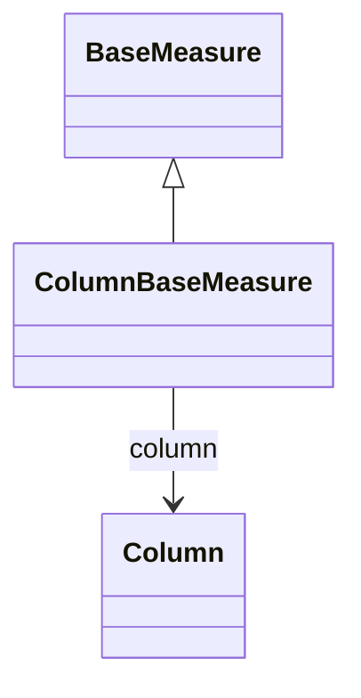

# ColumnBaseMeasure

Abstract base class for measures that derive their values from direct column references in the database. ColumnBaseMeasure represents the most common and highest-performance type of measure where aggregation functions (SUM, COUNT, AVG, etc.) are applied directly to specific table columns. This provides optimal query performance, supports fast aggregation capabilities, and enables efficient use of database indexes and pre-computed aggregation tables.
## Extends
- BaseMeasure [🔗](./class-BaseMeasure)
## Attributes

<table>
  <thead>
    <tr>
      <th>Name</th>
      <th>Id</th>
      <th>Typ</th>
      <th>Lower</th>
      <th>Upper</th>
    </tr>
  </thead>
  <tbody>
  </tbody>
</table>

## References

<table>
  <thead>
    <tr>
      <th>Name</th>
      <th>Typ</th>
      <th>Lower</th>
      <th>Upper</th>
      <th>Containment</th>
    </tr>
  </thead>
  <tbody>
    <tr>
      <td><strong>column</strong></td>
      <td>Column<a href="./class-Column">🔗</a></td>
      <td>1</td>
      <td>1</td>
      <td>false</td>
    </tr>
    <tr>
      <td colspan="5"><em>Reference to the database column that provides the source data for this measure. The column must contain numeric data appropriate for the measure's aggregation function (e.g., numeric columns for SUM, any column for COUNT). This direct column reference enables optimal SQL generation, efficient database query execution, and automatic optimization through indexes and aggregate tables.</em></td>
    </tr>
  </tbody>
</table>

## Used by

## ClassDiagramm

