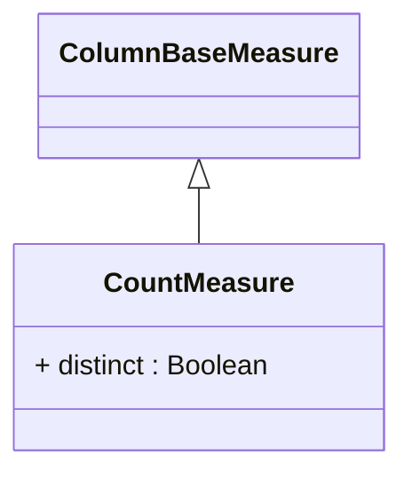

# CountMeasure

A measure that counts the number of non-null values in the referenced column across the aggregated data set. CountMeasure uses the SQL COUNT() aggregate function and is essential for metrics like number of transactions, customer count, product count, or event frequency. The measure provides fully additive behavior - counts can be meaningfully summed across all dimensions. CountMeasure offers excellent performance characteristics and supports fast aggregation, making it ideal for dashboard KPIs and summary statistics in analytical applications.
## Extends
- ColumnBaseMeasure [🔗](./class-ColumnBaseMeasure)
## Attributes

<table>
  <thead>
    <tr>
      <th>Name</th>
      <th>Id</th>
      <th>Typ</th>
      <th>Lower</th>
      <th>Upper</th>
    </tr>
  </thead>
  <tbody>
    <tr>
      <td><strong>distinct</strong></td>
      <td>false</td>
      <td><em>Boolean</em></td>
      <td>0</td>
      <td>1</td>
    </tr>
    <tr>
      <td colspan="5"><em>Boolean flag that determines whether the count operation should only count distinct (unique) values in the column, equivalent to SQL COUNT(DISTINCT column) versus COUNT(column). When set to true (default), duplicate values are counted only once, providing a count of unique values which is essential for metrics like unique customer count, distinct product count, or number of different transaction types. When set to false, all non-null values are counted including duplicates, which is useful for total transaction count, total order count, or frequency-based metrics. The distinct behavior significantly impacts the semantic meaning of the measure - distinct counts answer 'how many different?' questions while non-distinct counts answer 'how many total?' questions. This setting also affects measure additivity patterns and aggregation behavior, as distinct counts are not always meaningfully additive across dimensional hierarchies, requiring careful consideration in cube design and query optimization scenarios where drill-down operations may produce different results based on the distinct setting.</em></td>
    </tr>
  </tbody>
</table>

## References

<table>
  <thead>
    <tr>
      <th>Name</th>
      <th>Typ</th>
      <th>Lower</th>
      <th>Upper</th>
      <th>Containment</th>
    </tr>
  </thead>
  <tbody>
  </tbody>
</table>

## Used by

## ClassDiagramm

