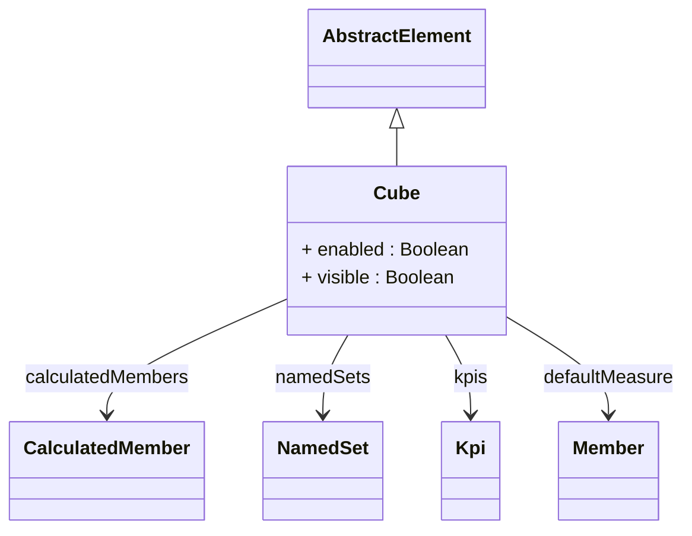

# Cube

Abstract base class for all cube types in the OLAP model. A cube represents a multidimensional data structure that enables analytical queries across multiple business dimensions. It serves as the primary analytical object that users interact with to perform OLAP operations like slicing, dicing, drilling down, and rolling up. Cubes contain measures (the numeric facts to be analyzed) and are connected to dimensions (the analytical perspectives for viewing the data). The abstract Cube class defines common properties and behaviors shared by both PhysicalCube (backed by fact tables) and VirtualCube (combining multiple physical cubes) implementations.
## Extends
- AbstractElement [🔗](./class-AbstractElement)
## Attributes

<table>
  <thead>
    <tr>
      <th>Name</th>
      <th>Id</th>
      <th>Typ</th>
      <th>Lower</th>
      <th>Upper</th>
    </tr>
  </thead>
  <tbody>
    <tr>
      <td><strong>enabled</strong></td>
      <td>false</td>
      <td><em>Boolean</em></td>
      <td>0</td>
      <td>1</td>
    </tr>
    <tr>
      <td colspan="5"><em>Boolean flag that controls whether this cube is active and available for queries. When set to false, the cube is excluded from XMLA metadata discovery, cannot be queried, and does not appear in client tool cube lists. This provides a way to temporarily disable cubes during maintenance, development, or data loading without removing them from the schema. Disabled cubes remain in the model for administrative purposes but are not accessible to end users.</em></td>
    </tr>
    <tr>
      <td><strong>visible</strong></td>
      <td>false</td>
      <td><em>Boolean</em></td>
      <td>0</td>
      <td>1</td>
    </tr>
    <tr>
      <td colspan="5"><em>Boolean flag that controls whether this cube appears in client tool listings and XMLA metadata discovery. Unlike the enabled flag, invisible cubes can still be queried if the cube name is known, but they don't appear in browse lists or cube explorers. This is useful for creating internal or system cubes, staging cubes for development, or providing advanced cubes only to power users who know the cube names explicitly.</em></td>
    </tr>
  </tbody>
</table>

## References

<table>
  <thead>
    <tr>
      <th>Name</th>
      <th>Typ</th>
      <th>Lower</th>
      <th>Upper</th>
      <th>Containment</th>
    </tr>
  </thead>
  <tbody>
    <tr>
      <td><strong>calculatedMembers</strong></td>
      <td>CalculatedMember<a href="./class-CalculatedMember">🔗</a></td>
      <td>0</td>
      <td>&infin;</td>
      <td>true</td>
    </tr>
    <tr>
      <td colspan="5"><em>Collection of calculated members defined at the cube level. Calculated members are virtual members that are computed using MDX expressions rather than being stored in the database. They can represent complex business calculations (like profit margins, growth rates, or variance analysis), derived measures, or custom dimension members. Each calculated member must belong to a specific dimension — most commonly the Measures dimension for calculated measures. Cube-level calculated members are available in all queries against this cube and provide a way to extend the analytical model without modifying the underlying data structures.</em></td>
    </tr>
    <tr>
      <td><strong>namedSets</strong></td>
      <td>NamedSet<a href="./class-NamedSet">🔗</a></td>
      <td>0</td>
      <td>&infin;</td>
      <td>true</td>
    </tr>
    <tr>
      <td colspan="5"><em>Collection of named sets specific to this cube. Named sets define reusable collections of members that are commonly used in analysis and reporting. Cube-specific named sets might include concepts like 'Top Products for this Sales Territory', 'Budget Items', or 'Key Performance Indicators' that are only meaningful in the context of this particular cube. These named sets provide cube-specific analytical shortcuts and are not shared across cubes.</em></td>
    </tr>
    <tr>
      <td><strong>kpis</strong></td>
      <td>Kpi<a href="./class-Kpi">🔗</a></td>
      <td>0</td>
      <td>&infin;</td>
      <td>true</td>
    </tr>
    <tr>
      <td colspan="5"><em>Collection of Key Performance Indicators (KPIs) defined for this cube. KPIs are business metrics that measure progress toward specific business objectives and typically include target values, status indicators, and trend information. They provide a structured way to define and track important business measurements like sales targets, quality metrics, or operational efficiency indicators. KPIs often include visual elements like traffic light indicators and are commonly used in executive dashboards and scorecards. KPIs are defined using the <Kpi> element and are primarily exposed via XMLA; they do not directly affect MDX query results and may not be supported by all client tools.</em></td>
    </tr>
    <tr>
      <td><strong>defaultMeasure</strong></td>
      <td>Member<a href="./class-Member">🔗</a></td>
      <td>0</td>
      <td>1</td>
      <td>false</td>
    </tr>
    <tr>
      <td colspan="5"><em>Reference to the measure that should be used as the default when queries don't explicitly specify a measure. This provides a sensible default for client tools and ad-hoc queries, typically pointing to the most commonly used or most important measure in the cube (like 'Sales Amount' or 'Quantity'). When users drag dimensions into a pivot table or create a new query, this measure is automatically included to provide immediate meaningful results. defaultMeasure sets the default member of the [Measures] dimension and is used in contexts where no measure is explicitly specified in the MDX query.

</em></td>
    </tr>
  </tbody>
</table>

## Used by

- Catalog[🔗](./class-Catalog) → cubes
- CubeConnector[🔗](./class-CubeConnector) → cube
- AccessCubeGrant[🔗](./class-AccessCubeGrant) → cube

## ClassDiagramm

