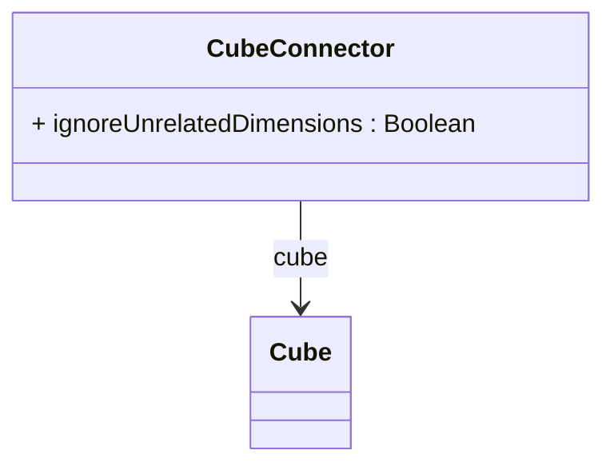

# CubeConnector

A connector that defines how a physical cube is integrated into a virtual cube, specifying the configuration for data aggregation, dimensional handling, and cross-cube analysis rules. CubeConnector serves as the bridge between virtual cubes and their constituent physical cubes, providing fine-grained control over how multiple cubes are combined into unified analytical views. Each connector references a specific physical cube and defines policies for handling dimensional inconsistencies, measure integration, and query processing behavior. This enables virtual cubes to aggregate data from heterogeneous physical cubes while maintaining analytical coherence and performance optimization.
## Extends

## Attributes

<table>
  <thead>
    <tr>
      <th>Name</th>
      <th>Id</th>
      <th>Typ</th>
      <th>Lower</th>
      <th>Upper</th>
    </tr>
  </thead>
  <tbody>
    <tr>
      <td><strong>ignoreUnrelatedDimensions</strong></td>
      <td>false</td>
      <td><em>Boolean</em></td>
      <td>0</td>
      <td>1</td>
    </tr>
    <tr>
      <td colspan="5"><em>Boolean flag that controls how the OLAP engine handles dimensions that don't exist in this physical cube when processing queries in the virtual cube context. When set to true, the virtual cube ignores dimensions that are not present in this referenced physical cube, allowing queries to proceed even if they reference dimensions not available in all constituent cubes. This enables flexible virtual cube designs where physical cubes have different dimensional structures. When false (default), the virtual cube enforces strict dimensional consistency, potentially failing queries that reference dimensions not present in all referenced cubes. This setting is crucial for cross-cube analysis scenarios and affects MDX query validation, aggregation processing, and XMLA metadata exposure.</em></td>
    </tr>
  </tbody>
</table>

## References

<table>
  <thead>
    <tr>
      <th>Name</th>
      <th>Typ</th>
      <th>Lower</th>
      <th>Upper</th>
      <th>Containment</th>
    </tr>
  </thead>
  <tbody>
    <tr>
      <td><strong>cube</strong></td>
      <td>Cube<a href="./class-Cube">🔗</a></td>
      <td>1</td>
      <td>1</td>
      <td>false</td>
    </tr>
    <tr>
      <td colspan="5"><em>Mandatory reference to the physical cube that this connector integrates into the virtual cube. This establishes the binding between the virtual cube and one of its constituent data sources, enabling the virtual cube to access the measures, dimensions, and calculated members defined in the referenced physical cube. The reference is resolved at runtime during virtual cube initialization to create the integrated analytical structure. Each CubeConnector must reference exactly one cube, and virtual cubes typically contain multiple connectors to combine data from several physical cubes.</em></td>
    </tr>
  </tbody>
</table>

## Used by

- VirtualCube[🔗](./class-VirtualCube) → cubeUsages

## ClassDiagramm

