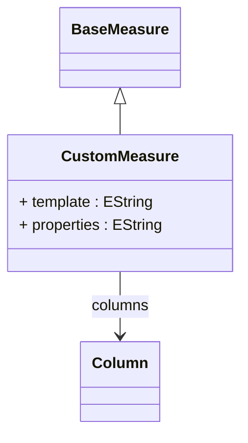

# CustomMeasure

A flexible measure that allows custom aggregation implementations through configurable templates and properties. CustomMeasure enables advanced business logic, complex calculations, or integration with external systems that cannot be achieved through standard aggregation functions. The measure uses templates with placeholders that are populated from referenced columns and custom properties, providing a powerful extension mechanism for specialized analytical requirements while maintaining the standard measure interface.
## Extends
- BaseMeasure [🔗](./class-BaseMeasure)
## Attributes

<table>
  <thead>
    <tr>
      <th>Name</th>
      <th>Id</th>
      <th>Typ</th>
      <th>Lower</th>
      <th>Upper</th>
    </tr>
  </thead>
  <tbody>
    <tr>
      <td><strong>template</strong></td>
      <td>false</td>
      <td><em>EString</em></td>
      <td>0</td>
      <td>1</td>
    </tr>
    <tr>
      <td colspan="5"><em>Template string that defines the custom aggregation logic or SQL expression pattern. The template can contain placeholders that are replaced with actual column references and property values at runtime. This enables dynamic SQL generation, custom function calls, or complex expressions that adapt to different database dialects and business requirements while maintaining a consistent measure definition.</em></td>
    </tr>
    <tr>
      <td><strong>properties</strong></td>
      <td>false</td>
      <td><em>EString</em></td>
      <td>1</td>
      <td>&infin;</td>
    </tr>
    <tr>
      <td colspan="5"><em>Collection of custom property values that parameterize the measure template and provide configuration for the custom aggregation logic. Properties can include constants, configuration values, or dynamic parameters that modify the behavior of the custom measure. At least one property must be defined to configure the custom aggregation appropriately for the specific business requirements.</em></td>
    </tr>
  </tbody>
</table>

## References

<table>
  <thead>
    <tr>
      <th>Name</th>
      <th>Typ</th>
      <th>Lower</th>
      <th>Upper</th>
      <th>Containment</th>
    </tr>
  </thead>
  <tbody>
    <tr>
      <td><strong>columns</strong></td>
      <td>Column<a href="./class-Column">🔗</a></td>
      <td>1</td>
      <td>&infin;</td>
      <td>false</td>
    </tr>
    <tr>
      <td colspan="5"><em>Collection of columns that provide data inputs for the custom measure calculation. These columns supply the raw data values that are processed through the custom template logic. At least one column must be specified to provide meaningful data for the custom aggregation. The columns are referenced in the template through placeholders or positional parameters.</em></td>
    </tr>
  </tbody>
</table>

## Used by

## ClassDiagramm

