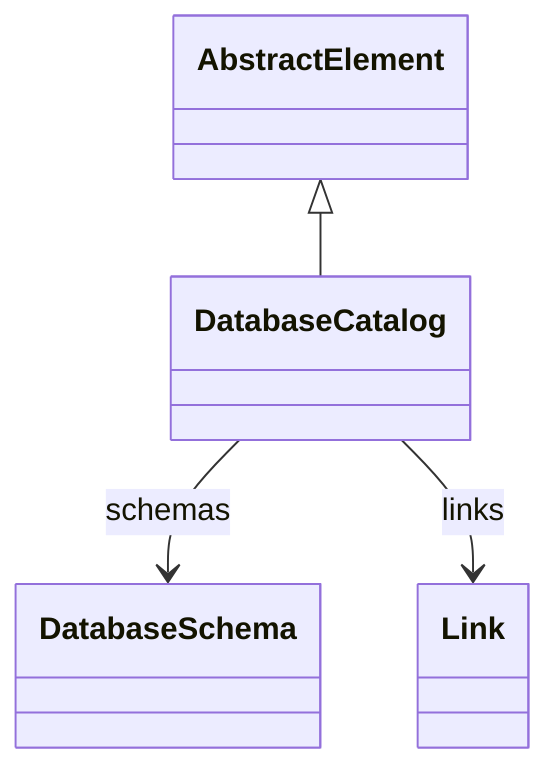

# DatabaseCatalog

Represents a database catalog that organizes database schemas and external data links. DatabaseCatalog serves as the top-level container for database metadata, providing structured access to schema definitions and connection management.
## Extends
- AbstractElement [🔗](./class-AbstractElement)
## Attributes

<table>
  <thead>
    <tr>
      <th>Name</th>
      <th>Id</th>
      <th>Typ</th>
      <th>Lower</th>
      <th>Upper</th>
    </tr>
  </thead>
  <tbody>
  </tbody>
</table>

## References

<table>
  <thead>
    <tr>
      <th>Name</th>
      <th>Typ</th>
      <th>Lower</th>
      <th>Upper</th>
      <th>Containment</th>
    </tr>
  </thead>
  <tbody>
    <tr>
      <td><strong>schemas</strong></td>
      <td>DatabaseSchema<a href="./class-DatabaseSchema">🔗</a></td>
      <td>0</td>
      <td>&infin;</td>
      <td>true</td>
    </tr>
    <tr>
      <td colspan="5"><em>Collection of database schemas contained within this catalog. Each schema defines tables, columns, and relationships that form the physical data foundation for OLAP cubes and dimensions.</em></td>
    </tr>
    <tr>
      <td><strong>links</strong></td>
      <td>Link<a href="./class-Link">🔗</a></td>
      <td>0</td>
      <td>&infin;</td>
      <td>true</td>
    </tr>
    <tr>
      <td colspan="5"><em>Collection of external data links that connect to remote databases or data sources. Links enable distributed OLAP architectures where data can be accessed from multiple database systems.</em></td>
    </tr>
  </tbody>
</table>

## Used by

## ClassDiagramm

