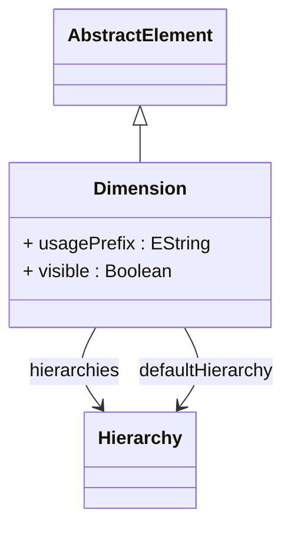

# Dimension

Abstract foundational class for all dimensional structures in OLAP modeling, representing the core concept of analytical dimensions that provide the contextual framework for multidimensional analysis by organizing business entities into hierarchical structures that enable slicing, dicing, drilling, and pivoting operations across different perspectives of business data. Dimension serves as the architectural foundation for the entire dimensional modeling paradigm, encapsulating the essential characteristics and behaviors that all dimensional structures must support including hierarchical organization of members from detailed to aggregated levels, support for multiple alternative hierarchies that provide different analytical perspectives on the same business domain, integration with security frameworks that can restrict access at dimensional and member levels, and compatibility with various analytical operations that form the basis of OLAP functionality. This abstract base class enables polymorphic dimension handling throughout the OLAP framework while ensuring consistent behavior and interface contracts across different specialized dimension implementations including time dimensions for temporal analysis, standard dimensions for general business hierarchies, and any future dimension types that may be added to support emerging analytical requirements. The dimension abstraction is essential for sophisticated OLAP architectures that need to handle diverse dimensional modeling patterns while maintaining consistent analytical behavior, query processing efficiency, and user experience across different types of business contexts and analytical scenarios including financial analysis, operational reporting, marketing analytics, supply chain optimization, and strategic business intelligence applications that require flexible, scalable dimensional modeling capabilities.
## Extends
- AbstractElement [🔗](./class-AbstractElement)
## Attributes

<table>
  <thead>
    <tr>
      <th>Name</th>
      <th>Id</th>
      <th>Typ</th>
      <th>Lower</th>
      <th>Upper</th>
    </tr>
  </thead>
  <tbody>
    <tr>
      <td><strong>usagePrefix</strong></td>
      <td>false</td>
      <td><em>EString</em></td>
      <td>0</td>
      <td>1</td>
    </tr>
    <tr>
      <td colspan="5"><em>Optional prefix that can be applied to this dimension when used in specific contexts or cubes. The usage prefix allows for dimension name customization and disambiguation when the same dimensional concept is used multiple times within a single analytical context. This enables scenarios like having both 'Ship Date' and 'Order Date' dimensions that share the same underlying time dimension structure but have different contextual meanings and display names.</em></td>
    </tr>
    <tr>
      <td><strong>visible</strong></td>
      <td>false</td>
      <td><em>Boolean</em></td>
      <td>0</td>
      <td>1</td>
    </tr>
    <tr>
      <td colspan="5"><em>Boolean flag controlling whether this dimension appears in client tool dimension lists, XMLA metadata discovery, and cube browsers. When set to false, the dimension becomes hidden from normal user interfaces but remains accessible through direct references in MDX queries. This is useful for creating internal system dimensions, intermediate calculation dimensions, or advanced dimensions intended only for power users who know the dimension names explicitly.</em></td>
    </tr>
  </tbody>
</table>

## References

<table>
  <thead>
    <tr>
      <th>Name</th>
      <th>Typ</th>
      <th>Lower</th>
      <th>Upper</th>
      <th>Containment</th>
    </tr>
  </thead>
  <tbody>
    <tr>
      <td><strong>hierarchies</strong></td>
      <td>Hierarchy<a href="./class-Hierarchy">🔗</a></td>
      <td>1</td>
      <td>&infin;</td>
      <td>false</td>
    </tr>
    <tr>
      <td colspan="5"><em>Collection of Hierarchy objects that define the alternative organizational structures and navigation paths available within this dimension, providing multiple perspectives and drill-down patterns for analyzing the same business domain from different analytical viewpoints. Each dimension must contain at least one hierarchy, and many dimensions benefit from multiple hierarchies that offer different ways to organize and navigate the dimensional data based on varying business needs, user preferences, and analytical contexts. This multi-hierarchy capability is essential for sophisticated dimensional modeling where business entities can be organized in multiple meaningful ways, supporting scenarios such as product dimensions that provide both category-based hierarchies (Category → Subcategory → Product) and brand-based hierarchies (Brand → Product Line → Product), geographic dimensions that offer administrative hierarchies (Country → State → City) alongside sales territory hierarchies (Region → Territory → District), time dimensions that provide both calendar hierarchies (Year → Quarter → Month → Day) and fiscal hierarchies (Fiscal Year → Fiscal Quarter → Fiscal Month), and customer dimensions that support both demographic hierarchies (Age Group → Gender → Customer) and value-based hierarchies (Customer Segment → Customer Tier → Individual Customer). The hierarchies collection enables powerful analytical flexibility where users can switch between different organizational perspectives within the same dimension, providing drill-down capabilities that align with different business questions, reporting requirements, and analytical objectives. Advanced implementations support sophisticated hierarchy management including hierarchy inheritance where specialized hierarchies extend base organizational patterns, temporal hierarchies that can change structure over time while maintaining historical consistency, and federated hierarchies that combine data from multiple sources while presenting unified navigation patterns to analytical applications and business users.</em></td>
    </tr>
    <tr>
      <td><strong>defaultHierarchy</strong></td>
      <td>Hierarchy<a href="./class-Hierarchy">🔗</a></td>
      <td>0</td>
      <td>1</td>
      <td>false</td>
    </tr>
    <tr>
      <td colspan="5"><em>Reference to the hierarchy that should be used as the default when queries reference this dimension without specifying a specific hierarchy. This provides a sensible default navigation path for the dimension and simplifies MDX query construction for end users. If not specified, the first hierarchy in the collection is typically used as the default.</em></td>
    </tr>
  </tbody>
</table>

## Used by

- DimensionConnector[🔗](./class-DimensionConnector) → dimension
- DrillThroughAttribute[🔗](./class-DrillThroughAttribute) → dimension
- AccessDimensionGrant[🔗](./class-AccessDimensionGrant) → dimension

## ClassDiagramm

