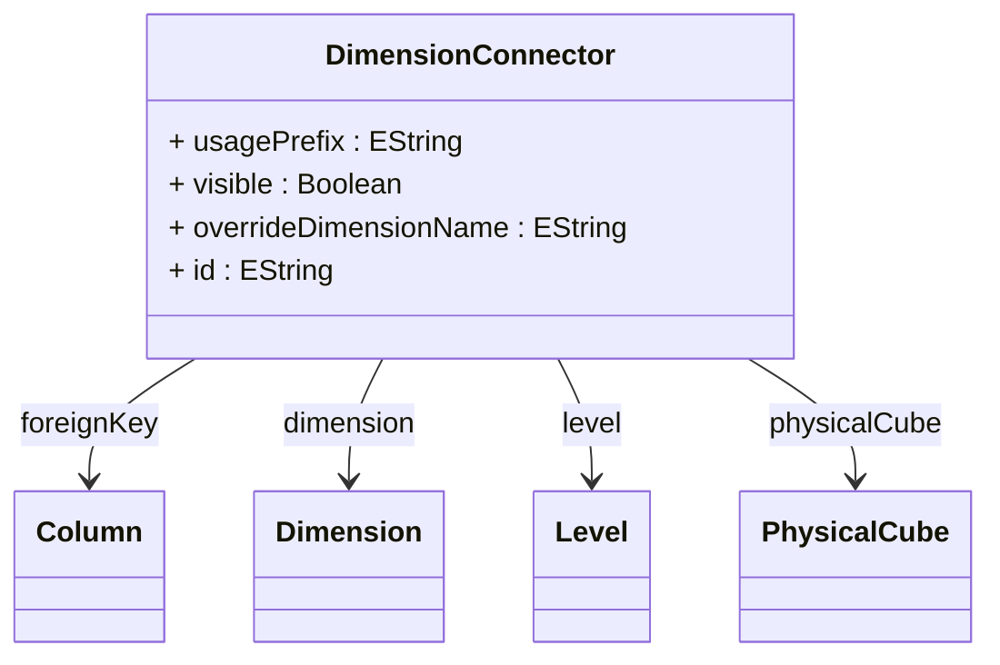

# DimensionConnector

Connects a cube to a dimension, establishing the relationship between fact table and dimensional data through foreign key references and enabling dimensional analysis within the cube's multidimensional space.
## Extends

## Attributes

<table>
  <thead>
    <tr>
      <th>Name</th>
      <th>Id</th>
      <th>Typ</th>
      <th>Lower</th>
      <th>Upper</th>
    </tr>
  </thead>
  <tbody>
    <tr>
      <td><strong>usagePrefix</strong></td>
      <td>false</td>
      <td><em>EString</em></td>
      <td>0</td>
      <td>1</td>
    </tr>
    <tr>
      <td colspan="5"><em>Optional prefix that can be applied to this dimension when used in specific contexts or cubes. The usage prefix allows for dimension name customization and disambiguation when the same dimensional concept is used multiple times within a single analytical context, enabling scenarios like 'Ship Date' and 'Order Date' dimensions that share the same underlying time dimension structure.</em></td>
    </tr>
    <tr>
      <td><strong>visible</strong></td>
      <td>false</td>
      <td><em>Boolean</em></td>
      <td>0</td>
      <td>1</td>
    </tr>
    <tr>
      <td colspan="5"><em>Boolean flag controlling whether this dimension appears in client tool dimension lists, XMLA metadata discovery, and cube browsers. When false, the dimension becomes hidden from normal user interfaces but remains accessible through direct MDX references.</em></td>
    </tr>
    <tr>
      <td><strong>overrideDimensionName</strong></td>
      <td>false</td>
      <td><em>EString</em></td>
      <td>0</td>
      <td>1</td>
    </tr>
    <tr>
      <td colspan="5"><em>Optional custom name for this dimension as it appears in this specific cube context. When specified, this name overrides the dimension's default name for display purposes in this cube, allowing the same dimension to appear with different names in different cubes for contextual clarity.</em></td>
    </tr>
    <tr>
      <td><strong>id</strong></td>
      <td>true</td>
      <td><em>EString</em></td>
      <td>1</td>
      <td>1</td>
    </tr>
    <tr>
      <td colspan="5"><em>Unique identifier for this DimensionConnector within the scope of its containing cube, serving as the primary key for this connector instance and enabling precise referencing in MDX queries, XMLA metadata, client applications, and system administration tools. The ID must be unique within all dimension connectors for a specific cube and should follow consistent naming conventions that support analytical application development and maintenance. This identifier is essential for enterprise OLAP deployments where dimension connectors must be precisely identified for configuration management, security administration, query optimization, and application integration scenarios. The ID supports sophisticated OLAP architecture patterns including programmatic cube construction where dimension connectors are dynamically created and referenced, metadata-driven applications that enumerate and manipulate cube structures, administrative tools that provide fine-grained control over cube configuration, and integration scenarios where external systems need to reference specific dimensional relationships within cube definitions. Advanced implementations use structured ID naming conventions that encode semantic information about the connector's role, source dimension, and relationship context, enabling systematic connector management and automated administrative operations across complex enterprise OLAP environments with hundreds of cubes and thousands of dimensional relationships.</em></td>
    </tr>
  </tbody>
</table>

## References

<table>
  <thead>
    <tr>
      <th>Name</th>
      <th>Typ</th>
      <th>Lower</th>
      <th>Upper</th>
      <th>Containment</th>
    </tr>
  </thead>
  <tbody>
    <tr>
      <td><strong>foreignKey</strong></td>
      <td>Column<a href="./class-Column">🔗</a></td>
      <td>0</td>
      <td>1</td>
      <td>false</td>
    </tr>
    <tr>
      <td colspan="5"><em>Optional reference to  to foreign key column in the fact table that references the primary key of the dimension table, establishing the relational link between fact data and dimensional context for OLAP analysis.</em></td>
    </tr>
    <tr>
      <td><strong>dimension</strong></td>
      <td>Dimension<a href="./class-Dimension">🔗</a></td>
      <td>1</td>
      <td>1</td>
      <td>false</td>
    </tr>
    <tr>
      <td colspan="5"><em>Reference to the dimension that this connector links to the cube. This establishes which analytical dimension (such as Time, Geography, Product, or Customer) is being connected to the cube's fact data through the foreign key relationship.</em></td>
    </tr>
    <tr>
      <td><strong>level</strong></td>
      <td>Level<a href="./class-Level">🔗</a></td>
      <td>0</td>
      <td>1</td>
      <td>false</td>
    </tr>
    <tr>
      <td colspan="5"><em>Optional reference to a specific level within the dimension's hierarchy that should be used as the default level for this dimension connection. When specified, queries against this cube will default to this level rather than the dimension's natural default level.</em></td>
    </tr>
    <tr>
      <td><strong>physicalCube</strong></td>
      <td>PhysicalCube<a href="./class-PhysicalCube">🔗</a></td>
      <td>1</td>
      <td>1</td>
      <td>false</td>
    </tr>
    <tr>
      <td colspan="5"><em>Bidirectional reference to the PhysicalCube that contains this dimension connector, establishing the containment relationship that defines which cube this dimensional connection belongs to and ensuring proper architectural integrity within the OLAP model structure. This required reference creates the fundamental relationship between cubes and their dimensional context, enabling the cube to access and manage its dimensional connections while providing the connector with access to cube-level properties, configuration settings, and metadata that influence dimensional behavior. The bidirectional nature of this relationship ensures model consistency and supports sophisticated OLAP architecture scenarios including cube cloning and templating where dimension connectors are copied along with cube definitions, cube validation and integrity checking where connector relationships are verified against cube structure, cube serialization and deserialization where connector relationships must be preserved across persistence operations, and cube federation scenarios where dimension connectors enable cross-cube dimensional sharing while maintaining proper ownership and containment semantics. This relationship is essential for enterprise OLAP deployments where dimensional connections must be precisely managed within cube contexts, supporting complex cube hierarchies, cube inheritance patterns, and dynamic cube construction scenarios that require reliable connector ownership and lifecycle management across distributed analytical environments and sophisticated business intelligence architectures.</em></td>
    </tr>
  </tbody>
</table>

## Used by

- PhysicalCube[🔗](./class-PhysicalCube) → dimensionConnectors
- VirtualCube[🔗](./class-VirtualCube) → dimensionConnectors
- WritebackAttribute[🔗](./class-WritebackAttribute) → dimensionConnector

## ClassDiagramm

