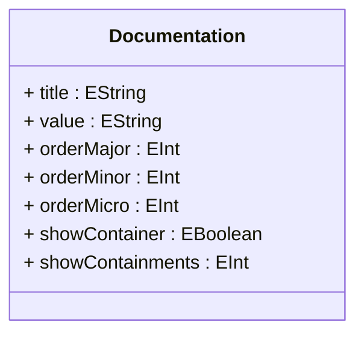

# Documentation

## Attributes

<table>
  <thead>
    <tr>
      <th>Name</th>
      <th>Id</th>
      <th>Typ</th>
      <th>Lower</th>
      <th>Upper</th>
    </tr>
  </thead>
  <tbody>
    <tr>
      <td><strong>title</strong></td>
      <td>false</td>
      <td><em>EString</em></td>
      <td>1</td>
      <td>1</td>
    </tr>
    <tr>
      <td colspan="5"><em></em></td>
    </tr>
    <tr>
      <td><strong>value</strong></td>
      <td>false</td>
      <td><em>EString</em></td>
      <td>1</td>
      <td>1</td>
    </tr>
    <tr>
      <td colspan="5"><em></em></td>
    </tr>
    <tr>
      <td><strong>orderMajor</strong></td>
      <td>false</td>
      <td><em>EInt</em></td>
      <td>0</td>
      <td>1</td>
    </tr>
    <tr>
      <td colspan="5"><em></em></td>
    </tr>
    <tr>
      <td><strong>orderMinor</strong></td>
      <td>false</td>
      <td><em>EInt</em></td>
      <td>0</td>
      <td>1</td>
    </tr>
    <tr>
      <td colspan="5"><em></em></td>
    </tr>
    <tr>
      <td><strong>orderMicro</strong></td>
      <td>false</td>
      <td><em>EInt</em></td>
      <td>0</td>
      <td>1</td>
    </tr>
    <tr>
      <td colspan="5"><em></em></td>
    </tr>
    <tr>
      <td><strong>showContainer</strong></td>
      <td>false</td>
      <td><em>EBoolean</em></td>
      <td>0</td>
      <td>1</td>
    </tr>
    <tr>
      <td colspan="5"><em></em></td>
    </tr>
    <tr>
      <td><strong>showContainments</strong></td>
      <td>false</td>
      <td><em>EInt</em></td>
      <td>0</td>
      <td>1</td>
    </tr>
    <tr>
      <td colspan="5"><em></em></td>
    </tr>
  </tbody>
</table>

## References

<table>
  <thead>
    <tr>
      <th>Name</th>
      <th>Typ</th>
      <th>Lower</th>
      <th>Upper</th>
      <th>Containment</th>
    </tr>
  </thead>
  <tbody>
  </tbody>
</table>

## Used by

- DocumentedElement[🔗](./class-DocumentedElement) → documentations
- Query[🔗](./class-Query) → documentation

## ClassDiagramm

