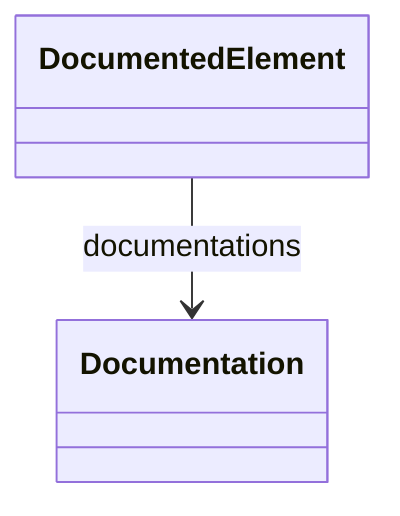

# DocumentedElement

Abstract base class that provides documentation capabilities to all modeling elements in the ROLAP mapping framework. This class establishes the foundation for comprehensive documentation of OLAP schema components, enabling detailed descriptions, structured help content, and API reference generation. All major modeling elements (cubes, dimensions, measures, etc.) inherit from this class either directly or through AbstractElement.

## Attributes

<table>
  <thead>
    <tr>
      <th>Name</th>
      <th>Id</th>
      <th>Typ</th>
      <th>Lower</th>
      <th>Upper</th>
    </tr>
  </thead>
  <tbody>
  </tbody>
</table>

## References

<table>
  <thead>
    <tr>
      <th>Name</th>
      <th>Typ</th>
      <th>Lower</th>
      <th>Upper</th>
      <th>Containment</th>
    </tr>
  </thead>
  <tbody>
    <tr>
      <td><strong>documentations</strong></td>
      <td>Documentation<a href="./class-Documentation">🔗</a></td>
      <td>0</td>
      <td>&infin;</td>
      <td>true</td>
    </tr>
    <tr>
      <td colspan="5"><em>Collection of Documentation objects that provide structured documentation for this element. Each Documentation object contains a title, descriptive content, and ordering information for generating comprehensive help systems, API documentation, and user guides. Multiple documentation entries allow for different types of documentation (user guide, technical reference, examples) to be associated with a single element.</em></td>
    </tr>
  </tbody>
</table>

## Used by

## ClassDiagramm

