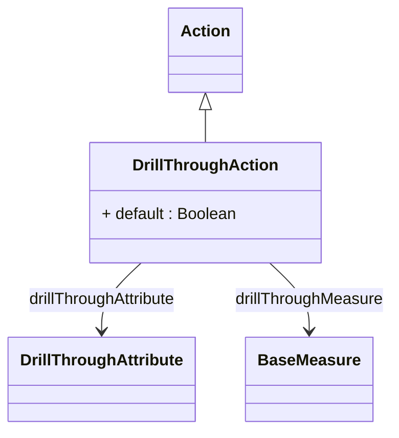

# DrillThroughAction

Specialized action that enables users to drill through from aggregated analytical views to the underlying detailed transaction data that contributed to specific measure values, providing powerful capabilities for data exploration, validation, and detailed investigation of analytical results. DrillThroughAction represents one of the most valuable interactive features in modern OLAP applications, enabling users to seamlessly transition from high-level analytical summaries to detailed operational data without losing analytical context or requiring technical knowledge of underlying data structures. This capability supports critical business scenarios including analytical validation where users need to verify the accuracy of aggregated results by examining source transactions, exception investigation where unusual analytical values require detailed examination to understand root causes, audit and compliance processes where detailed transaction visibility is required for regulatory or governance purposes, and operational follow-up where analytical insights need to be translated into specific operational actions on individual transactions or records. DrillThroughAction provides sophisticated configuration options for controlling which columns are returned, how results are formatted and presented, what filtering and security restrictions are applied, and how the drill-through interface integrates with client tools to provide intuitive user experiences that make detailed data exploration accessible to business users without requiring technical database skills.
## Extends
- Action [🔗](./class-Action)
## Attributes

<table>
  <thead>
    <tr>
      <th>Name</th>
      <th>Id</th>
      <th>Typ</th>
      <th>Lower</th>
      <th>Upper</th>
    </tr>
  </thead>
  <tbody>
    <tr>
      <td><strong>default</strong></td>
      <td>false</td>
      <td><em>Boolean</em></td>
      <td>0</td>
      <td>1</td>
    </tr>
    <tr>
      <td colspan="5"><em>Boolean flag indicating whether this drill-through action serves as the default drill-through operation for the associated analytical context, automatically invoked when users perform standard drill-through gestures without explicitly selecting a specific drill-through action. The default setting enables intuitive user experiences where common drill-through operations are immediately accessible through standard user interface interactions such as double-clicking on measure values, right-click context menus, or dedicated drill-through buttons, while still allowing multiple specialized drill-through actions to be available for advanced scenarios. This capability is essential for enterprise analytical applications where drill-through functionality must balance ease of use with sophisticated customization options, supporting scenarios such as financial analysis where the default drill-through provides standard transaction details while specialized actions offer regulatory compliance views or audit trail information, sales analysis where default drill-through shows standard order details while specialized actions provide customer relationship history or product performance context, and operational analysis where default drill-through presents standard process details while specialized actions offer quality metrics or resource utilization perspectives. The default designation supports sophisticated drill-through architecture including role-based default selection where different user types have different default drill-through behaviors, context-sensitive defaults where the default action adapts to analytical context or dimensional selection, and fallback default mechanisms where system-generated defaults ensure drill-through functionality is always available even when custom actions are not explicitly configured, enabling comprehensive analytical workflows that provide both intuitive user experiences and advanced customization capabilities across complex enterprise business intelligence environments.</em></td>
    </tr>
  </tbody>
</table>

## References

<table>
  <thead>
    <tr>
      <th>Name</th>
      <th>Typ</th>
      <th>Lower</th>
      <th>Upper</th>
      <th>Containment</th>
    </tr>
  </thead>
  <tbody>
    <tr>
      <td><strong>drillThroughAttribute</strong></td>
      <td>DrillThroughAttribute<a href="./class-DrillThroughAttribute">🔗</a></td>
      <td>0</td>
      <td>&infin;</td>
      <td>true</td>
    </tr>
    <tr>
      <td colspan="5"><em>Collection of DrillThroughAttribute objects that specify which dimensional attributes and descriptive columns should be included in drill-through result sets, providing sophisticated control over the detailed data presentation that enables users to access relevant contextual information alongside transactional data. DrillThroughAttributes enable customized drill-through experiences where result sets can be tailored to include specific business-relevant information that provides meaningful context for detailed data analysis, supporting scenarios such as customer analysis where drill-through results include customer demographics, geographic information, and relationship history, product analysis where drill-through results include product specifications, category information, and supplier details, financial analysis where drill-through results include account hierarchies, cost center information, and approval workflow data, and operational analysis where drill-through results include process information, quality metrics, and performance indicators. The attribute collection supports sophisticated drill-through configuration including conditional attribute inclusion where different attributes are displayed based on dimensional context or user roles, hierarchical attribute organization where related attributes are grouped for improved user comprehension, formatted attribute presentation where attributes are displayed with appropriate formatting and labeling, and performance-optimized attribute selection where attribute inclusion is balanced against query performance requirements. Advanced implementations leverage drill-through attributes for comprehensive analytical workflows including drill-through result customization based on user preferences or analytical context, integration with external systems where drill-through results can include data from multiple source systems, and collaborative analysis where drill-through results can be shared, annotated, and used for further analytical investigation while maintaining optimal performance and user experience across complex enterprise analytical environments.</em></td>
    </tr>
    <tr>
      <td><strong>drillThroughMeasure</strong></td>
      <td>BaseMeasure<a href="./class-BaseMeasure">🔗</a></td>
      <td>0</td>
      <td>&infin;</td>
      <td>false</td>
    </tr>
    <tr>
      <td colspan="5"><em>Collection of BaseMeasure references that specify which measures should be included in drill-through result sets, enabling sophisticated control over the quantitative data presentation that provides users with relevant numeric context alongside detailed transactional information. DrillThroughMeasures enable comprehensive analytical experiences where drill-through results can include not only the primary measure that triggered the drill-through operation but also related measures that provide additional business context, supporting scenarios such as sales analysis where drill-through results include revenue, quantity, discount, and margin measures, financial analysis where drill-through results include multiple account balances, budget variances, and performance ratios, operational analysis where drill-through results include efficiency metrics, quality indicators, and resource utilization measures, and customer analysis where drill-through results include transaction values, frequency metrics, and relationship indicators. The measure collection supports sophisticated drill-through configuration including conditional measure inclusion where different measures are displayed based on analytical context or user permissions, calculated measure integration where computed measures are included alongside base measures, formatted measure presentation where measures are displayed with appropriate precision and business terminology, and performance-optimized measure selection where measure inclusion is balanced against query performance and result set complexity. Advanced implementations leverage drill-through measures for comprehensive analytical workflows including multi-perspective drill-through where users can access related measures from different analytical viewpoints, comparative drill-through where measures from different time periods or dimensional contexts are included for side-by-side analysis, and integrated drill-through scenarios where measures from multiple cubes or data sources are combined to provide comprehensive business intelligence while maintaining optimal query performance and intuitive user experiences across complex enterprise analytical environments.</em></td>
    </tr>
  </tbody>
</table>

## Used by

## ClassDiagramm

