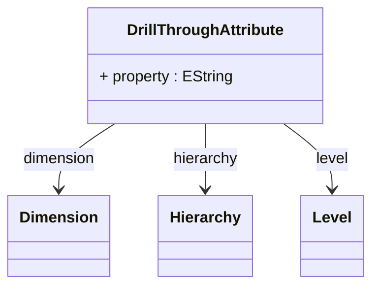

# DrillThroughAttribute

Defines a dimensional attribute or member property that should be included in drill-through result sets, providing sophisticated control over the contextual information that accompanies detailed transactional data when users drill through from aggregated analytical views. DrillThroughAttribute enables rich drill-through experiences where users can access not only the underlying fact data but also relevant dimensional context that provides business meaning and analytical insight into the detailed results.

## Extends

## Attributes

<table>
  <thead>
    <tr>
      <th>Name</th>
      <th>Id</th>
      <th>Typ</th>
      <th>Lower</th>
      <th>Upper</th>
    </tr>
  </thead>
  <tbody>
    <tr>
      <td><strong>property</strong></td>
      <td>false</td>
      <td><em>EString</em></td>
      <td>0</td>
      <td>1</td>
    </tr>
    <tr>
      <td colspan="5"><em>Name of the specific member property within the associated dimension or hierarchy that should be included in drill-through result sets, enabling precise selection of individual attribute values that provide meaningful business context for detailed data analysis. The property specification allows drill-through results to include specific member characteristics such as descriptive names, business codes, category classifications, or other dimensional attributes that help users understand and interpret the underlying transactional data within its proper business context. This property-level granularity is essential for sophisticated drill-through scenarios where different analytical contexts require different levels of dimensional detail, supporting use cases such as product analysis where drill-through might include product names, categories, and supplier codes, customer analysis where drill-through might include customer names, segments, and geographic regions, temporal analysis where drill-through might include fiscal periods, calendar quarters, and seasonal indicators, and organizational analysis where drill-through might include department names, cost centers, and management hierarchies. The property specification supports advanced drill-through configuration including conditional property inclusion where different properties are displayed based on analytical context or user permissions, localized property presentation where property values are displayed in user-appropriate languages and formats, and performance-optimized property selection where property inclusion is balanced against query performance requirements while maintaining comprehensive business context for effective analytical investigation and decision-making across complex enterprise business intelligence environments.</em></td>
    </tr>
  </tbody>
</table>

## References

<table>
  <thead>
    <tr>
      <th>Name</th>
      <th>Typ</th>
      <th>Lower</th>
      <th>Upper</th>
      <th>Containment</th>
    </tr>
  </thead>
  <tbody>
    <tr>
      <td><strong>dimension</strong></td>
      <td>Dimension<a href="./class-Dimension">🔗</a></td>
      <td>1</td>
      <td>1</td>
      <td>false</td>
    </tr>
    <tr>
      <td colspan="5"><em>Required reference to the Dimension that contains the attribute or property to be included in drill-through results, establishing the dimensional context that determines which member attributes are available for inclusion in detailed result sets. The dimension reference defines the analytical domain from which attribute values will be extracted, ensuring that drill-through results can include relevant dimensional context that provides business meaning and interpretive value for the underlying transactional data. This dimensional association is fundamental to meaningful drill-through experiences where users need access to dimensional context that helps them understand the business significance of detailed data, supporting scenarios such as geographic dimensions that provide location context for sales transactions, product dimensions that provide category and specification context for inventory movements, customer dimensions that provide demographic and relationship context for service interactions, and temporal dimensions that provide calendar and fiscal context for financial transactions. The dimension reference enables sophisticated drill-through scenarios including cross-dimensional attribute correlation where attributes from multiple dimensions are combined to provide comprehensive business context, hierarchical attribute navigation where users can access attributes from different levels of dimensional hierarchies, and dynamic attribute selection where available attributes adapt to current dimensional context and user permissions while maintaining optimal query performance and comprehensive analytical capabilities across complex multidimensional business intelligence environments.</em></td>
    </tr>
    <tr>
      <td><strong>hierarchy</strong></td>
      <td>Hierarchy<a href="./class-Hierarchy">🔗</a></td>
      <td>0</td>
      <td>1</td>
      <td>false</td>
    </tr>
    <tr>
      <td colspan="5"><em>Optional reference to a specific Hierarchy within the associated dimension that narrows the scope of attribute selection, enabling precise control over which hierarchical context should be used when including dimensional attributes in drill-through results. The hierarchy specification allows drill-through attributes to be sourced from specific organizational perspectives within multi-hierarchy dimensions, supporting sophisticated scenarios where different hierarchical views provide different business context for the same underlying dimensional data. This hierarchical specificity is valuable for complex dimensional structures where the same dimension may contain multiple hierarchies that organize members according to different business logic, such as product dimensions with both category-based and brand-based hierarchies, geographic dimensions with both administrative and sales territory hierarchies, or organizational dimensions with both functional and reporting hierarchies. The hierarchy reference enables advanced drill-through capabilities including hierarchy-specific attribute selection where different drill-through contexts access attributes from different hierarchical perspectives, level-aware attribute inclusion where attributes are selected based on hierarchical context and user navigation state, and dynamic hierarchy adaptation where drill-through attributes automatically adapt to the active hierarchical view while maintaining analytical consistency and optimal performance across complex enterprise analytical scenarios that require flexible dimensional context and sophisticated business intelligence capabilities.</em></td>
    </tr>
    <tr>
      <td><strong>level</strong></td>
      <td>Level<a href="./class-Level">🔗</a></td>
      <td>0</td>
      <td>1</td>
      <td>false</td>
    </tr>
    <tr>
      <td colspan="5"><em>Optional reference to a specific Level within the associated hierarchy that further refines the granularity of attribute selection, enabling precise control over which hierarchical level should provide the attribute values for drill-through results. The level specification allows drill-through attributes to be sourced from specific aggregation levels within hierarchical structures, supporting sophisticated scenarios where different levels of detail are appropriate for different analytical contexts and user requirements. This level-specific targeting is essential for complex hierarchical dimensions where different levels contain different types of attributes and business information, such as organizational hierarchies where department-level attributes differ from employee-level attributes, product hierarchies where category-level attributes differ from SKU-level attributes, or geographic hierarchies where country-level attributes differ from city-level attributes. The level reference enables advanced drill-through functionality including level-appropriate attribute selection where drill-through results automatically include attributes that are meaningful at the appropriate hierarchical granularity, cross-level attribute correlation where attributes from multiple levels provide comprehensive business context, and dynamic level adaptation where drill-through attributes automatically adjust to the current analytical context and hierarchical navigation state while maintaining analytical coherence and optimal query performance across complex multidimensional business intelligence scenarios that require flexible hierarchical context and sophisticated dimensional attribute management capabilities.</em></td>
    </tr>
  </tbody>
</table>

## Used by

- DrillThroughAction[🔗](./class-DrillThroughAction) → drillThroughAttribute

## ClassDiagramm

