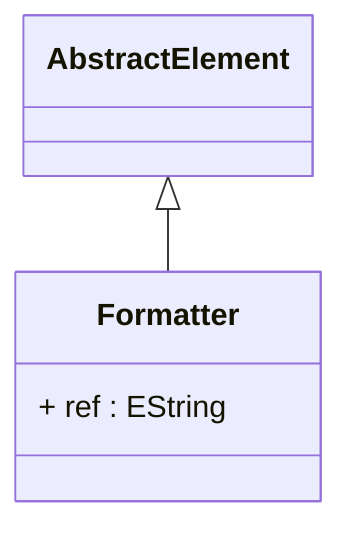

# Formatter

Abstract base class for sophisticated display formatting components that control how analytical values, dimensional members, and other OLAP elements are presented to users in client applications, reports, and dashboards. Formatter provides the foundational framework for implementing rich, context-aware formatting logic that can transform raw analytical data into compelling, professional presentations that enhance user comprehension and support effective business communication. This formatting infrastructure is essential for enterprise-grade OLAP deployments where analytical results must be presented with appropriate visual styling, cultural formatting conventions, business-specific terminology, and contextual information that enables effective decision-making by users with diverse analytical expertise and cultural backgrounds. The formatter framework supports advanced formatting scenarios including conditional formatting where visual presentation adapts based on data values, thresholds, or business rules, cultural localization where number formats, date representations, and currency displays conform to regional conventions, business context formatting where the same underlying data is presented differently depending on the analytical context or user role, and dynamic formatting where presentation logic can adapt to real-time conditions, user preferences, or external business parameters. Formatters integrate seamlessly with client tools and reporting systems to provide consistent formatting experiences across different analytical interfaces, support template-based formatting that enables standardized corporate presentation styles, and enable sophisticated presentation logic that can include conditional colors, fonts, symbols, and other visual elements that enhance the communicative power of analytical presentations. The abstract formatter foundation enables polymorphic formatting behavior where different concrete formatter implementations can be applied to the same analytical elements based on context, user preferences, or business requirements.
## Extends
- AbstractElement [🔗](./class-AbstractElement)
## Attributes

<table>
  <thead>
    <tr>
      <th>Name</th>
      <th>Id</th>
      <th>Typ</th>
      <th>Lower</th>
      <th>Upper</th>
    </tr>
  </thead>
  <tbody>
    <tr>
      <td><strong>ref</strong></td>
      <td>false</td>
      <td><em>EString</em></td>
      <td>0</td>
      <td>1</td>
    </tr>
    <tr>
      <td colspan="5"><em>Reference identifier that enables sharing and reuse of formatter definitions across multiple OLAP elements, supporting efficient formatter management and consistent presentation styling throughout analytical applications. The reference mechanism allows formatter objects to be defined once and applied to multiple elements that require similar formatting behavior, enabling centralized management of presentation logic and ensuring consistent visual styling across complex analytical models. This approach is particularly valuable for large-scale OLAP deployments where standardized formatting policies need to be applied consistently across numerous elements, where corporate presentation standards must be maintained throughout analytical applications, and where formatter maintenance and updates need to be managed efficiently without requiring changes to every individual element that uses the formatting logic.</em></td>
    </tr>
  </tbody>
</table>

## References

<table>
  <thead>
    <tr>
      <th>Name</th>
      <th>Typ</th>
      <th>Lower</th>
      <th>Upper</th>
      <th>Containment</th>
    </tr>
  </thead>
  <tbody>
  </tbody>
</table>

## Used by

## ClassDiagramm

