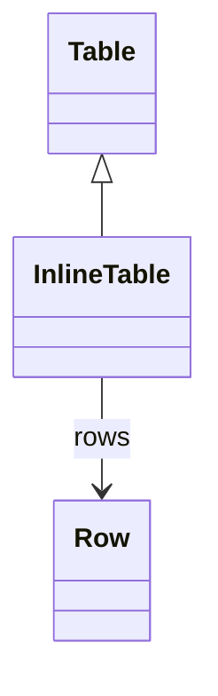

# InlineTable

Represents a table with data embedded directly in the schema definition rather than referencing external database tables. InlineTable allows small lookup tables, dimension data, or test data to be included directly in the OLAP schema, eliminating the need for separate database tables for static reference data.
## Extends
- Table [🔗](./class-Table)
## Attributes

<table>
  <thead>
    <tr>
      <th>Name</th>
      <th>Id</th>
      <th>Typ</th>
      <th>Lower</th>
      <th>Upper</th>
    </tr>
  </thead>
  <tbody>
  </tbody>
</table>

## References

<table>
  <thead>
    <tr>
      <th>Name</th>
      <th>Typ</th>
      <th>Lower</th>
      <th>Upper</th>
      <th>Containment</th>
    </tr>
  </thead>
  <tbody>
    <tr>
      <td><strong>rows</strong></td>
      <td>Row<a href="./class-Row">🔗</a></td>
      <td>0</td>
      <td>&infin;</td>
      <td>true</td>
    </tr>
    <tr>
      <td colspan="5"><em>Collection of data rows that define the actual content of this inline table. Each row contains column values that correspond to the table's column definitions, providing the embedded data directly in the schema.</em></td>
    </tr>
  </tbody>
</table>

## Used by

- InlineTableQuery[🔗](./class-InlineTableQuery) → table

## ClassDiagramm

