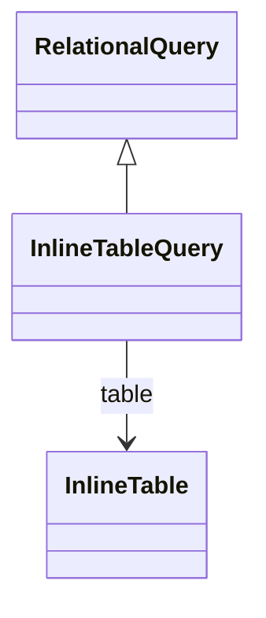

# InlineTableQuery

Provides access to in-memory tabular data that is embedded directly within the OLAP model definition, eliminating the need for external database tables for small, static datasets. InlineTableQuery is ideal for configuration data, lookup tables, reference lists, and small dimensional data that rarely changes and can be efficiently stored within the model itself. This query type enables self-contained OLAP models that don't require external database dependencies for certain data sources, simplifying deployment and maintenance while providing optimal performance for frequently accessed small datasets that can be cached in memory.
## Extends
- RelationalQuery [🔗](./class-RelationalQuery)
## Attributes

<table>
  <thead>
    <tr>
      <th>Name</th>
      <th>Id</th>
      <th>Typ</th>
      <th>Lower</th>
      <th>Upper</th>
    </tr>
  </thead>
  <tbody>
  </tbody>
</table>

## References

<table>
  <thead>
    <tr>
      <th>Name</th>
      <th>Typ</th>
      <th>Lower</th>
      <th>Upper</th>
      <th>Containment</th>
    </tr>
  </thead>
  <tbody>
    <tr>
      <td><strong>table</strong></td>
      <td>InlineTable<a href="./class-InlineTable">🔗</a></td>
      <td>1</td>
      <td>1</td>
      <td>false</td>
    </tr>
    <tr>
      <td colspan="5"><em>Reference to the inline table definition that contains the embedded data rows and column schema. The inline table provides both the structural definition (column names and types) and the actual data content (rows with cell values) needed for query processing. This self-contained approach enables the OLAP engine to access the data without database round-trips, providing optimal performance for small reference datasets and configuration information.</em></td>
    </tr>
  </tbody>
</table>

## Used by

## ClassDiagramm

