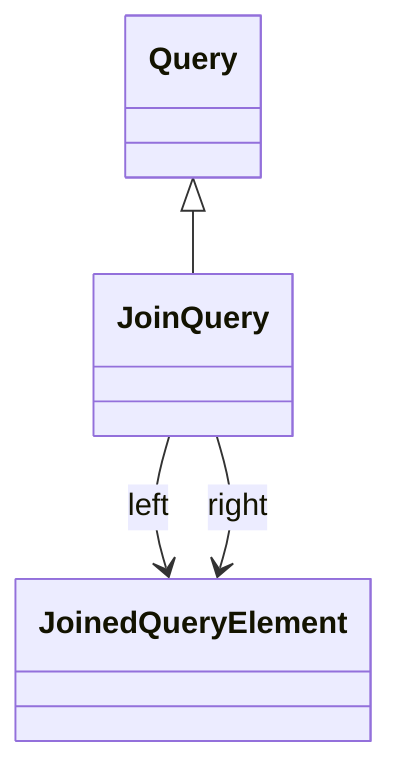

# JoinQuery

Represents a JOIN operation between two queries, enabling the combination of data from multiple sources through relational key-based connections. JoinQuery is essential for implementing snowflake schema patterns, multi-table hierarchies, and complex dimensional relationships where dimension data is normalized across multiple tables. The query supports composable join trees where the left or right side can itself be another JoinQuery, enabling arbitrarily complex multi-table relationships. JoinQuery automatically generates appropriate SQL JOIN syntax (typically INNER JOIN) based on the key columns specified in the left and right query elements, ensuring proper relational connectivity while maintaining optimal query performance through the OLAP engine's SQL generation and optimization capabilities.
## Extends
- Query [🔗](./class-Query)
## Attributes

<table>
  <thead>
    <tr>
      <th>Name</th>
      <th>Id</th>
      <th>Typ</th>
      <th>Lower</th>
      <th>Upper</th>
    </tr>
  </thead>
  <tbody>
  </tbody>
</table>

## References

<table>
  <thead>
    <tr>
      <th>Name</th>
      <th>Typ</th>
      <th>Lower</th>
      <th>Upper</th>
      <th>Containment</th>
    </tr>
  </thead>
  <tbody>
    <tr>
      <td><strong>left</strong></td>
      <td>JoinedQueryElement<a href="./class-JoinedQueryElement">🔗</a></td>
      <td>1</td>
      <td>1</td>
      <td>true</td>
    </tr>
    <tr>
      <td colspan="5"><em>Left side participant in the JOIN operation, specifying the query, join key column, and optional table alias. The left query element typically represents the more detailed or child table in hierarchical relationships, such as a city table in a geography hierarchy or a detailed dimension table in a snowflake schema. The join key column must be compatible with the right side's key column for proper relational connection.</em></td>
    </tr>
    <tr>
      <td><strong>right</strong></td>
      <td>JoinedQueryElement<a href="./class-JoinedQueryElement">🔗</a></td>
      <td>1</td>
      <td>1</td>
      <td>true</td>
    </tr>
    <tr>
      <td colspan="5"><em>Right side participant in the JOIN operation, specifying the query, join key column, and optional table alias. The right query element typically represents the more aggregated or parent table in hierarchical relationships, such as a country table in a geography hierarchy or a lookup table in a snowflake schema. The join key column must be compatible with the left side's key column for proper relational connection.</em></td>
    </tr>
  </tbody>
</table>

## Used by

## ClassDiagramm

