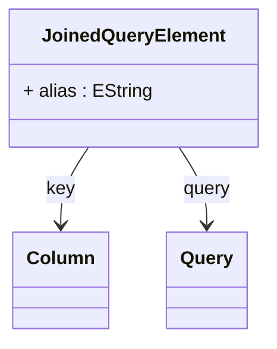

# JoinedQueryElement

Represents one side of a JOIN operation, encapsulating the query source, join key column, and optional table alias needed for proper SQL JOIN generation. JoinedQueryElement serves as the fundamental building block for composing complex multi-table queries in OLAP dimensional modeling, enabling the connection of normalized dimension tables, fact tables, and lookup tables through foreign key relationships. Each element specifies exactly how its query participates in the JOIN operation, including which column serves as the join key and what alias should be used in the generated SQL to avoid naming conflicts and ensure query clarity.
## Extends

## Attributes

<table>
  <thead>
    <tr>
      <th>Name</th>
      <th>Id</th>
      <th>Typ</th>
      <th>Lower</th>
      <th>Upper</th>
    </tr>
  </thead>
  <tbody>
    <tr>
      <td><strong>alias</strong></td>
      <td>false</td>
      <td><em>EString</em></td>
      <td>0</td>
      <td>1</td>
    </tr>
    <tr>
      <td colspan="5"><em>Optional SQL table alias for this query element when used in JOIN operations. The alias provides a unique, short identifier that can be referenced in column expressions, WHERE clauses, and nested join conditions, preventing naming conflicts when the same table appears multiple times in complex queries or when working with long table names. If not specified, the OLAP engine may generate automatic aliases based on query IDs or table names to ensure SQL correctness and readability.</em></td>
    </tr>
  </tbody>
</table>

## References

<table>
  <thead>
    <tr>
      <th>Name</th>
      <th>Typ</th>
      <th>Lower</th>
      <th>Upper</th>
      <th>Containment</th>
    </tr>
  </thead>
  <tbody>
    <tr>
      <td><strong>key</strong></td>
      <td>Column<a href="./class-Column">🔗</a></td>
      <td>1</td>
      <td>1</td>
      <td>false</td>
    </tr>
    <tr>
      <td colspan="5"><em>Column that serves as the join key for connecting this query element to its JOIN partner. The key column must contain values that can be matched with the corresponding key column from the other side of the JOIN operation, typically representing a foreign key to primary key relationship. The column must be accessible within the query's result set and have compatible data types with its JOIN partner to ensure proper relational connectivity and optimal query performance.</em></td>
    </tr>
    <tr>
      <td><strong>query</strong></td>
      <td>Query<a href="./class-Query">🔗</a></td>
      <td>1</td>
      <td>1</td>
      <td>false</td>
    </tr>
    <tr>
      <td colspan="5"><em>Reference to the query that provides the data source for this side of the JOIN operation. The query can be any type from the Query hierarchy including TableQuery for direct table access, JoinQuery for nested join operations, SqlSelectQuery for custom SQL views, or InlineTableQuery for in-memory data. This composable design enables complex query trees where joins can be nested and combined to create sophisticated data access patterns for advanced dimensional modeling scenarios.</em></td>
    </tr>
  </tbody>
</table>

## Used by

- JoinQuery[🔗](./class-JoinQuery) → left
- JoinQuery[🔗](./class-JoinQuery) → right

## ClassDiagramm

