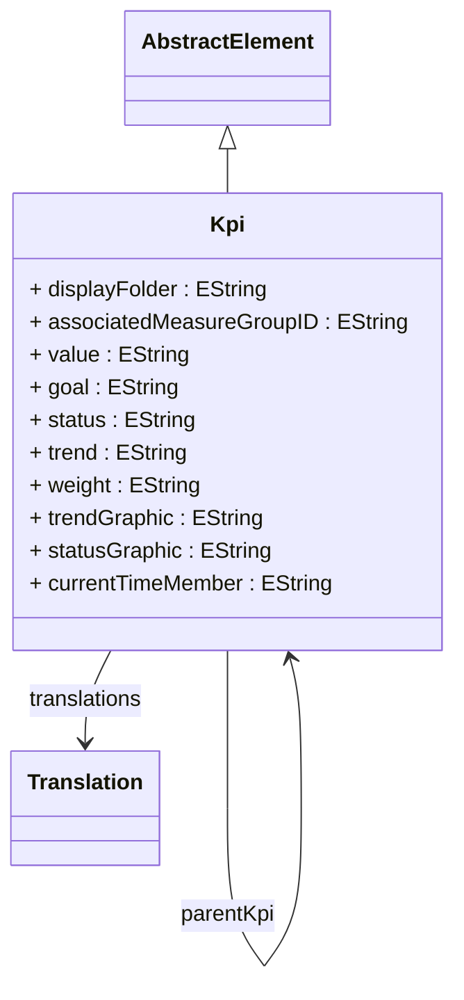

# Kpi

Defines a Key Performance Indicator (KPI) that provides sophisticated business performance monitoring capabilities by combining multiple analytical expressions with visual indicators, targets, and trend analysis to deliver executive-level business intelligence insights. KPI represents a high-level business monitoring construct that transforms raw analytical data into actionable business intelligence by evaluating performance against strategic goals, visualizing trends and status through graphical indicators, and providing contextual information that enables rapid decision-making at executive and management levels.

## Extends
- AbstractElement [🔗](./class-AbstractElement)
## Attributes

<table>
  <thead>
    <tr>
      <th>Name</th>
      <th>Id</th>
      <th>Typ</th>
      <th>Lower</th>
      <th>Upper</th>
    </tr>
  </thead>
  <tbody>
    <tr>
      <td><strong>displayFolder</strong></td>
      <td>false</td>
      <td><em>EString</em></td>
      <td>0</td>
      <td>1</td>
    </tr>
    <tr>
      <td colspan="5"><em>Organizational folder path that controls the hierarchical display and categorization of this KPI within business intelligence client tools, OLAP browsers, and executive dashboard applications. The display folder enables sophisticated KPI organization schemes where executives and business users can navigate through logically structured KPI hierarchies that reflect business priorities, organizational structures, and functional areas. This organizational capability supports complex enterprise scenarios such as balanced scorecard implementations where KPIs are organized into strategic themes like Financial Performance, Customer Satisfaction, Internal Process Excellence, and Learning and Growth, executive dashboard categorization where KPIs are grouped by business functions such as Sales Performance, Marketing Effectiveness, Operations Efficiency, and Human Resources Metrics, regulatory compliance monitoring where KPIs are organized by regulatory domains like Risk Management, Compliance Monitoring, and Audit Controls, and multi-level performance management where KPIs are structured in hierarchical folders that mirror organizational reporting relationships from corporate level through divisions, business units, and functional departments. The display folder path supports nested folder structures using forward slash separators (e.g., 'Financial/Revenue/Sales Performance') that create intuitive navigation experiences in business intelligence tools, enable consistent KPI categorization across different analytical applications, and provide contextual organization that helps executives quickly locate relevant performance indicators within complex enterprise KPI landscapes.</em></td>
    </tr>
    <tr>
      <td><strong>associatedMeasureGroupID</strong></td>
      <td>false</td>
      <td><em>EString</em></td>
      <td>0</td>
      <td>1</td>
    </tr>
    <tr>
      <td colspan="5"><em>Identifier reference to the MeasureGroup that provides the primary analytical context and data foundation for this KPI's calculations, establishing the logical connection between the high-level performance indicator and the underlying measures that drive its evaluation. The associated measure group relationship ensures that KPI calculations have access to the appropriate fact data, aggregation tables, and dimensional context necessary for accurate performance evaluation. This association is crucial for enterprise KPI implementations where performance indicators must be grounded in verified analytical data and calculation methodologies, supporting scenarios such as financial KPIs that derive from revenue, cost, and profit measures within financial measure groups, operational KPIs that are calculated from production, efficiency, and quality measures within operational measure groups, customer satisfaction KPIs that utilize survey scores, retention rates, and service quality measures within customer experience measure groups, and compliance KPIs that leverage risk metrics, audit scores, and regulatory measures within governance measure groups. The measure group association also enables sophisticated KPI optimization scenarios where the KPI calculation engine can leverage aggregation tables, partitioning strategies, and query optimization techniques specific to the associated measure group, ensuring optimal performance for executive dashboard applications that require real-time or near-real-time KPI updates across large data volumes and complex analytical hierarchies.</em></td>
    </tr>
    <tr>
      <td><strong>value</strong></td>
      <td>false</td>
      <td><em>EString</em></td>
      <td>1</td>
      <td>1</td>
    </tr>
    <tr>
      <td colspan="5"><em>MDX expression or measure reference that defines the primary calculation logic for this KPI's actual performance value, representing the core analytical computation that transforms raw data into meaningful business performance metrics. The value expression must return a numeric result that represents the current state or achievement level of the key performance indicator, serving as the foundation for all KPI evaluations, comparisons, and trend analysis. This expression supports sophisticated business intelligence scenarios including complex financial calculations that combine multiple revenue streams, cost centers, and profitability factors, operational metrics that aggregate efficiency measures across production lines, facilities, and time periods, customer satisfaction indices that synthesize survey data, retention rates, and service quality scores, and strategic performance indicators that evaluate progress toward long-term business objectives through composite metrics. The value expression can reference underlying measures, calculated members, dimensional context, and temporal functions to create dynamic KPI calculations that adapt to different analytical contexts, time periods, and business scenarios. Advanced implementations support complex mathematical formulations including weighted averages that consider varying importance factors, statistical calculations that provide variance and standard deviation analysis, trend calculations that incorporate time-based patterns and seasonal adjustments, and conditional logic that applies different calculation methodologies based on dimensional attributes or business rules, enabling sophisticated performance management systems that provide accurate, contextual, and actionable business intelligence insights.</em></td>
    </tr>
    <tr>
      <td><strong>goal</strong></td>
      <td>false</td>
      <td><em>EString</em></td>
      <td>0</td>
      <td>1</td>
    </tr>
    <tr>
      <td colspan="5"><em>MDX expression or static value that defines the target or desired performance level for this KPI, establishing the benchmark against which actual performance is evaluated to determine success, variance, and performance status indicators. The goal expression provides the critical reference point that enables meaningful KPI analysis by defining what constitutes successful performance, acceptable thresholds, and strategic objectives that drive business decision-making and performance management initiatives. This target-setting capability supports sophisticated performance management scenarios including strategic planning where long-term business objectives are translated into measurable KPI targets, budgeting and forecasting where financial targets are established for revenue, profitability, and cost management KPIs, operational excellence programs where efficiency, quality, and productivity targets drive continuous improvement initiatives, and competitive benchmarking where industry standards and competitor performance levels define aspirational KPI goals. The goal expression can be static numeric values for fixed targets, dynamic MDX calculations that adapt targets based on contextual factors like seasonality or market conditions, time-based expressions that implement growing or declining target patterns over business cycles, and conditional logic that establishes different goals for different organizational levels, geographical regions, or product categories. Advanced goal implementations support sophisticated target management including cascading goals where corporate objectives are decomposed into divisional and departmental targets, stretch goals that establish ambitious performance levels to drive organizational excellence, and adaptive goals that automatically adjust based on external market conditions, economic indicators, or competitive landscape changes, enabling comprehensive performance management systems that align individual and organizational performance with strategic business objectives.</em></td>
    </tr>
    <tr>
      <td><strong>status</strong></td>
      <td>false</td>
      <td><em>EString</em></td>
      <td>0</td>
      <td>1</td>
    </tr>
    <tr>
      <td colspan="5"><em>MDX expression that evaluates the current performance status of this KPI by comparing the actual value against the goal and returning a status indicator that can be used to drive visual representations such as traffic light indicators, performance gauges, and dashboard alerts. The status expression typically returns numeric values that correspond to predefined status levels (e.g., -1 for poor, 0 for acceptable, 1 for good) that can be mapped to visual indicators like red, yellow, and green colors in dashboard displays. This status evaluation capability is essential for executive dashboard applications where business leaders need immediate visual feedback about performance against targets, supporting scenarios such as executive scorecard displays where KPI status indicators provide instant performance assessment, operational dashboards where real-time status monitoring enables rapid response to performance issues, strategic planning reviews where status evaluation helps identify areas requiring management attention, and automated alert systems where status changes trigger notifications to relevant stakeholders. The status expression can implement sophisticated evaluation logic including multi-threshold status levels that provide granular performance assessment, conditional status calculations that apply different evaluation criteria based on dimensional context or business cycles, trend-aware status evaluation that considers performance trajectories alongside current values, and composite status assessments that combine multiple performance factors into unified status indicators. Advanced status implementations support complex performance management scenarios including cascading status evaluation where organizational unit status rolls up to higher-level status indicators, exception-based status monitoring where only performance deviations trigger status changes, and predictive status assessment where forecasting algorithms anticipate future status based on current trends and leading indicators.</em></td>
    </tr>
    <tr>
      <td><strong>trend</strong></td>
      <td>false</td>
      <td><em>EString</em></td>
      <td>0</td>
      <td>1</td>
    </tr>
    <tr>
      <td colspan="5"><em>MDX expression that evaluates the directional trend of this KPI's performance over time, providing analytical insight into whether performance is improving, declining, or remaining stable relative to historical patterns and business cycles. The trend expression typically returns numeric values that represent trend direction and magnitude (e.g., -1 for declining, 0 for stable, 1 for improving) that can be visualized through trend arrows, slope indicators, and momentum gauges in executive dashboards and performance monitoring applications. This trend analysis capability is essential for sophisticated performance management where understanding performance trajectory is as important as current status, supporting scenarios such as strategic performance monitoring where trend analysis identifies long-term business momentum and competitive positioning, operational management where trend detection enables proactive response to emerging performance issues before they become critical, forecasting and planning where historical trend patterns inform future performance projections, and continuous improvement programs where trend analysis validates the effectiveness of process improvements and strategic initiatives. The trend expression can implement complex temporal analysis including time-series calculations that compare current performance against multiple historical periods, seasonal trend adjustment that accounts for cyclical business patterns and market conditions, momentum analysis that evaluates the rate and acceleration of performance changes, and comparative trend evaluation that benchmarks performance trajectory against industry standards, competitor performance, or internal best practices. Advanced trend implementations support sophisticated analytical scenarios including predictive trend modeling where statistical algorithms forecast future performance based on historical patterns and leading indicators, multi-dimensional trend analysis where trends are evaluated across different business dimensions simultaneously, and cascading trend evaluation where local trends aggregate into organizational and strategic trend indicators.</em></td>
    </tr>
    <tr>
      <td><strong>weight</strong></td>
      <td>false</td>
      <td><em>EString</em></td>
      <td>0</td>
      <td>1</td>
    </tr>
    <tr>
      <td colspan="5"><em>Numeric expression that defines the relative importance or weighting factor of this KPI within composite performance assessments, balanced scorecards, and hierarchical KPI structures where multiple performance indicators are combined into unified performance evaluations. The weight value determines how much influence this specific KPI has on overall performance calculations, enabling sophisticated performance management scenarios where strategic priorities, business objectives, and organizational focus areas are reflected through appropriate KPI weighting schemes. This weighting capability supports complex enterprise performance management including balanced scorecard implementations where financial, customer, internal process, and learning and growth KPIs are weighted according to strategic priorities, composite performance indices where multiple operational KPIs are combined with appropriate weights to create unified performance scores, executive dashboard summaries where key performance indicators are weighted to reflect their relative importance to business success, and organizational performance evaluation where individual, team, and departmental KPIs are weighted according to their contribution to enterprise objectives. The weight expression can be static numeric values for fixed weighting schemes, dynamic calculations that adjust weights based on business cycles or strategic priorities, conditional weighting that applies different weights based on organizational level or functional area, and collaborative weighting where stakeholder input determines appropriate weight assignments. Advanced weighting implementations support sophisticated performance architecture including cascading weight structures where enterprise weights decompose into business unit and functional weights, adaptive weighting systems where weights automatically adjust based on performance patterns and business conditions, and multi-criteria weighting where different weight schemes can be applied for different analytical contexts, reporting audiences, and decision-making scenarios.</em></td>
    </tr>
    <tr>
      <td><strong>trendGraphic</strong></td>
      <td>false</td>
      <td><em>EString</em></td>
      <td>0</td>
      <td>1</td>
    </tr>
    <tr>
      <td colspan="5"><em>Reference to the visual graphic or icon set that represents trend indicators for this KPI in dashboard displays, executive reports, and business intelligence applications. The trend graphic specification enables consistent and intuitive visual representation of KPI trend analysis across different reporting tools and dashboard platforms, supporting user experience consistency and executive comprehension of performance trajectories. This visual specification capability is essential for professional business intelligence deployments where standardized iconography ensures immediate recognition and interpretation of trend information, supporting scenarios such as executive dashboard standardization where consistent trend graphics enable rapid performance assessment across multiple KPIs, multi-application integration where trend graphics provide visual continuity across different business intelligence tools, brand compliance where trend graphics align with corporate visual identity and design standards, and accessibility requirements where trend graphics support diverse user needs including color-blind accessibility and mobile device optimization. The trend graphic specification can reference standard icon libraries, custom graphic assets, unicode symbols, or specialized business intelligence graphic sets that provide professional-quality trend visualization. Advanced implementations support dynamic graphic selection where trend graphics automatically adapt based on trend magnitude or significance, contextual graphics where trend visualization changes based on dimensional context or business domain, and responsive graphics that optimize display quality across different devices, screen resolutions, and presentation contexts while maintaining visual clarity and professional appearance standards that enhance executive decision-making and performance monitoring effectiveness.</em></td>
    </tr>
    <tr>
      <td><strong>statusGraphic</strong></td>
      <td>false</td>
      <td><em>EString</em></td>
      <td>0</td>
      <td>1</td>
    </tr>
    <tr>
      <td colspan="5"><em>Reference to the visual graphic or icon set that represents status indicators for this KPI in dashboard displays, performance scorecards, and executive reporting applications. The status graphic specification enables consistent and professional visual representation of KPI performance status across different analytical tools and business intelligence platforms, ensuring immediate recognition and interpretation of performance against targets and goals. This visual standardization capability is essential for enterprise business intelligence deployments where consistent iconography enables rapid status assessment and decision-making, supporting scenarios such as executive scorecard displays where standardized status graphics provide instant performance evaluation across organizational hierarchies, operational dashboard monitoring where status graphics enable immediate identification of performance issues requiring attention, regulatory compliance reporting where status graphics provide clear visual communication of compliance performance against regulatory requirements, and multi-stakeholder reporting where status graphics ensure consistent interpretation of performance status across diverse audiences. The status graphic specification can reference industry-standard traffic light systems (red, yellow, green), gauge indicators, arrow symbols, or custom business intelligence icon sets that align with organizational branding and user experience standards. Advanced implementations support conditional graphic selection where status graphics automatically adapt based on status severity or organizational context, accessibility-compliant graphics that provide alternative representations for users with visual impairments, and responsive graphic rendering that optimizes display quality across desktop dashboards, mobile applications, and printed reports while maintaining visual clarity and professional presentation standards that enhance executive communication and strategic decision-making effectiveness.</em></td>
    </tr>
    <tr>
      <td><strong>currentTimeMember</strong></td>
      <td>false</td>
      <td><em>EString</em></td>
      <td>0</td>
      <td>1</td>
    </tr>
    <tr>
      <td colspan="5"><em>Reference to the specific time dimension member that represents the temporal context for evaluating KPI calculations and temporal analysis scenarios. This attribute enables time-aware KPI evaluation where calculations are performed relative to a specific point in time or temporal context, supporting sophisticated time-based performance analysis and temporal comparative reporting across different time periods, business cycles, and strategic planning horizons.</em></td>
    </tr>
  </tbody>
</table>

## References

<table>
  <thead>
    <tr>
      <th>Name</th>
      <th>Typ</th>
      <th>Lower</th>
      <th>Upper</th>
      <th>Containment</th>
    </tr>
  </thead>
  <tbody>
    <tr>
      <td><strong>translations</strong></td>
      <td>Translation<a href="./class-Translation">🔗</a></td>
      <td>0</td>
      <td>&infin;</td>
      <td>true</td>
    </tr>
    <tr>
      <td colspan="5"><em>Collection of Translation objects that provide localized names, descriptions, and captions for this KPI across different languages and cultural contexts, enabling global deployment of business intelligence dashboards with culturally appropriate KPI representations. KPI translations are essential for multinational organizations where executive dashboards and performance monitoring systems must be presented in local languages, supporting scenarios such as global executive reporting where board members and senior leadership require KPI displays in their native languages, regional performance management where local managers need performance indicators presented in regional languages, regulatory compliance reporting where KPIs must be documented in official local languages, and customer-facing analytics where KPI displays must match customer locale preferences. The translations collection ensures that KPI names, descriptions, goal descriptions, and status indicators are appropriately localized while maintaining consistent underlying analytical logic and calculation methodologies. This internationalization capability supports sophisticated globalization scenarios including regional executive dashboards with localized KPI presentations, multi-language business intelligence applications that adapt to user locale settings, compliance reporting systems that generate KPI documentation in regulatory languages, and cross-cultural performance management systems where KPI semantics are preserved across cultural and linguistic boundaries while ensuring optimal user experience and business comprehension for executives and decision-makers operating in diverse international contexts.</em></td>
    </tr>
    <tr>
      <td><strong>parentKpi</strong></td>
      <td>Kpi<a href="./class-Kpi">🔗</a></td>
      <td>0</td>
      <td>1</td>
      <td>false</td>
    </tr>
    <tr>
      <td colspan="5"><em>Reference to the parent KPI in hierarchical KPI structures that enables composite performance measurement through nested KPI relationships. This association supports sophisticated performance management scenarios where complex business objectives are decomposed into hierarchical performance indicators, enabling drill-down analysis from strategic organizational KPIs to tactical departmental metrics and operational performance measures.</em></td>
    </tr>
  </tbody>
</table>

## Used by

- Cube[🔗](./class-Cube) → kpis

## ClassDiagramm

