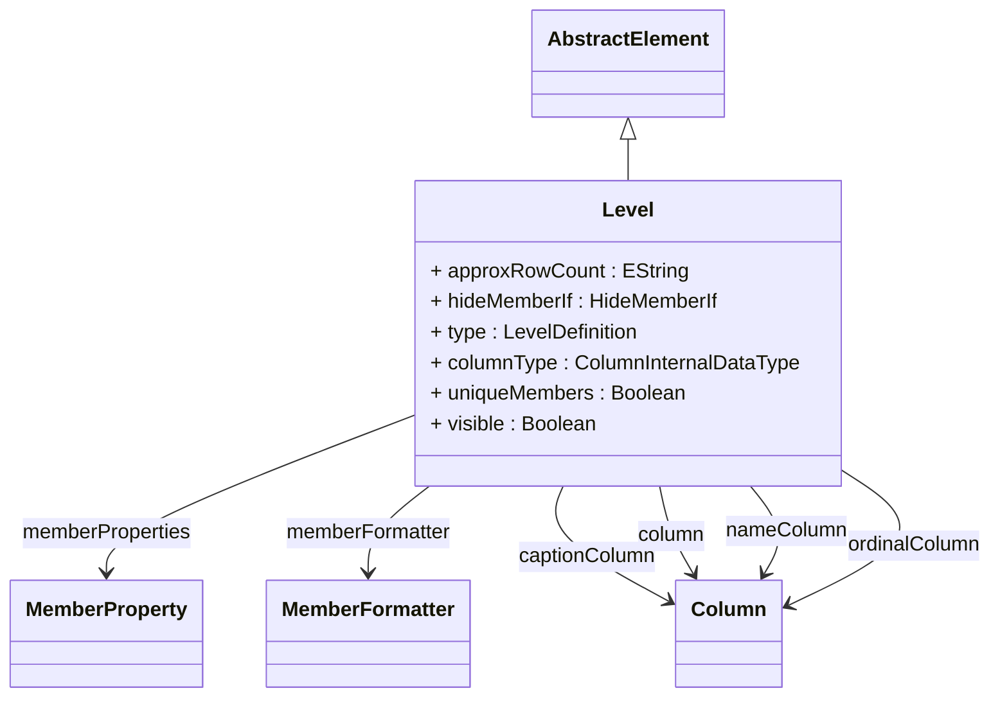

# Level

Represents a group of members in a hierarchy, all at the same depth and sharing the same attributes and behavior patterns. Levels define the fundamental granularity layers within a dimension hierarchy that enable multidimensional analysis and navigation. For example, a Time dimension might contain levels like Year-Quarter-Month-Day, while a Geography dimension could have Country-State-City-ZipCode levels. Each level maps to specific database columns that provide member identification (key column), human-readable display (name column), localized captions (caption column), and custom sorting (ordinal column). Levels support various advanced features including member properties for additional attributes, custom formatters for display logic, data type specifications for proper SQL generation, uniqueness constraints for optimization, visibility controls for user interface management, and hiding conditions for handling ragged hierarchies and data quality issues. The level type attribute provides semantic meaning for specialized processing in time intelligence, geographic analysis, and business domain-specific operations.
## Extends
- AbstractElement [🔗](./class-AbstractElement)
## Attributes

<table>
  <thead>
    <tr>
      <th>Name</th>
      <th>Id</th>
      <th>Typ</th>
      <th>Lower</th>
      <th>Upper</th>
    </tr>
  </thead>
  <tbody>
    <tr>
      <td><strong>approxRowCount</strong></td>
      <td>false</td>
      <td><em>EString</em></td>
      <td>0</td>
      <td>1</td>
    </tr>
    <tr>
      <td colspan="5"><em>Approximate number of members expected at this level, used for query optimization and performance tuning. This hint helps the OLAP engine choose appropriate caching strategies, index usage, and memory allocation for efficient member loading and query execution.</em></td>
    </tr>
    <tr>
      <td><strong>hideMemberIf</strong></td>
      <td>false</td>
      <td><em>HideMemberIf<a href="./enum-HideMemberIf">🔗</a></em></td>
      <td>0</td>
      <td>1</td>
    </tr>
    <tr>
      <td colspan="5"><em>Condition for hiding members from client tools and queries, useful for handling ragged hierarchies and data quality issues. Options include NEVER (all members visible), IF_BLANK_NAME (hide members with null/empty names), and IF_PARENTS_NAME (hide members whose name matches their parent's name).</em></td>
    </tr>
    <tr>
      <td><strong>type</strong></td>
      <td>false</td>
      <td><em>LevelDefinition<a href="./enum-LevelDefinition">🔗</a></em></td>
      <td>0</td>
      <td>1</td>
    </tr>
    <tr>
      <td colspan="5"><em>Semantic type of this level indicating its role in business analysis. Types include temporal levels (TIME_YEARS, TIME_MONTHS, TIME_DAYS), geographic levels (GEO_COUNTRY, GEO_STATE, GEO_CITY), business levels (CUSTOMER, PRODUCT, ACCOUNT), and general REGULAR type. This metadata enables specialized behavior, validation, and client tool integration.</em></td>
    </tr>
    <tr>
      <td><strong>columnType</strong></td>
      <td>false</td>
      <td><em>ColumnInternalDataType<a href="./enum-ColumnInternalDataType">🔗</a></em></td>
      <td>0</td>
      <td>1</td>
    </tr>
    <tr>
      <td colspan="5"><em>Data type of the primary column values, used for appropriate SQL generation, comparison operations, and display formatting. Supported types include STRING, INTEGER, NUMERIC, BOOLEAN, DATE, and others. This type information ensures proper handling of member keys in queries and aggregations.</em></td>
    </tr>
    <tr>
      <td><strong>uniqueMembers</strong></td>
      <td>false</td>
      <td><em>Boolean</em></td>
      <td>0</td>
      <td>1</td>
    </tr>
    <tr>
      <td colspan="5"><em>Boolean flag indicating whether member names are globally unique across the entire hierarchy or only unique within their parent context. When true, enables query optimizations and simplified member referencing. Required for parent-child hierarchies where name uniqueness cannot be guaranteed within parent scope.</em></td>
    </tr>
    <tr>
      <td><strong>visible</strong></td>
      <td>false</td>
      <td><em>Boolean</em></td>
      <td>0</td>
      <td>1</td>
    </tr>
    <tr>
      <td colspan="5"><em>Controls whether this level appears in client tool level browsers, dimension trees, and metadata discovery. When false, the level becomes hidden from normal user interfaces but remains accessible for programmatic queries and advanced users who know the level name explicitly.</em></td>
    </tr>
  </tbody>
</table>

## References

<table>
  <thead>
    <tr>
      <th>Name</th>
      <th>Typ</th>
      <th>Lower</th>
      <th>Upper</th>
      <th>Containment</th>
    </tr>
  </thead>
  <tbody>
    <tr>
      <td><strong>memberProperties</strong></td>
      <td>MemberProperty<a href="./class-MemberProperty">🔗</a></td>
      <td>0</td>
      <td>&infin;</td>
      <td>true</td>
    </tr>
    <tr>
      <td colspan="5"><em>Collection of additional properties that can be associated with members at this level, providing supplementary attributes beyond the basic key, name, and caption for enhanced analytical capabilities. Member properties enable rich dimensional analysis by exposing additional member characteristics such as demographic information (age, gender, income), geographic data (coordinates, postal codes, regions), financial attributes (account types, credit ratings, balances), temporal properties (start dates, durations, fiscal periods), or any domain-specific descriptive attributes. These properties are fully accessible in MDX queries through property functions, appear in client tool member browsers, support filtering and sorting operations, can be used in calculated members and measures, and enable advanced analytical scenarios like property-based aggregations, conditional formatting, and drill-through operations. Properties support various data types including strings, numbers, dates, and booleans, with optional custom formatters for display logic and functional dependency flags for query optimization.</em></td>
    </tr>
    <tr>
      <td><strong>memberFormatter</strong></td>
      <td>MemberFormatter<a href="./class-MemberFormatter">🔗</a></td>
      <td>0</td>
      <td>1</td>
      <td>false</td>
    </tr>
    <tr>
      <td colspan="5"><em>Optional custom formatter for controlling how members at this level are displayed in client tools and reports. The formatter can implement complex formatting logic, conditional styling, or custom string transformations based on member values and context.</em></td>
    </tr>
    <tr>
      <td><strong>captionColumn</strong></td>
      <td>Column<a href="./class-Column">🔗</a></td>
      <td>0</td>
      <td>1</td>
      <td>false</td>
    </tr>
    <tr>
      <td colspan="5"><em>Optional column providing display captions for level members that may differ from the name column. Captions are typically used for localized or business-friendly display names while preserving technical names for internal processing. When not specified, the nameColumn or column value is used for display purposes.</em></td>
    </tr>
    <tr>
      <td><strong>column</strong></td>
      <td>Column<a href="./class-Column">🔗</a></td>
      <td>1</td>
      <td>1</td>
      <td>false</td>
    </tr>
    <tr>
      <td colspan="5"><em>Primary key column that uniquely identifies members at this level. This column provides the essential identity for each member and is used for joins, grouping, and member references in queries. It serves as both the key and default display value when nameColumn is not specified.</em></td>
    </tr>
    <tr>
      <td><strong>nameColumn</strong></td>
      <td>Column<a href="./class-Column">🔗</a></td>
      <td>0</td>
      <td>1</td>
      <td>false</td>
    </tr>
    <tr>
      <td colspan="5"><em>Optional column providing human-readable names for level members. When specified, this column supplies the display names used in client tools and reports, while the main column serves as the key. If not specified, the main column value is used for both key and display purposes.</em></td>
    </tr>
    <tr>
      <td><strong>ordinalColumn</strong></td>
      <td>Column<a href="./class-Column">🔗</a></td>
      <td>0</td>
      <td>1</td>
      <td>false</td>
    </tr>
    <tr>
      <td colspan="5"><em>Optional column providing sort order values for level members, overriding alphabetical sorting based on names. This enables custom member ordering such as chronological sequences, business hierarchies, or priority-based arrangements that don't follow natural string sorting.</em></td>
    </tr>
  </tbody>
</table>

## Used by

- DimensionConnector[🔗](./class-DimensionConnector) → level
- ExplicitHierarchy[🔗](./class-ExplicitHierarchy) → levels
- ParentChildHierarchy[🔗](./class-ParentChildHierarchy) → level
- DrillThroughAttribute[🔗](./class-DrillThroughAttribute) → level
- AccessHierarchyGrant[🔗](./class-AccessHierarchyGrant) → bottomLevel
- AccessHierarchyGrant[🔗](./class-AccessHierarchyGrant) → topLevel

## ClassDiagramm

